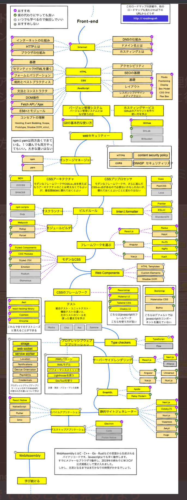
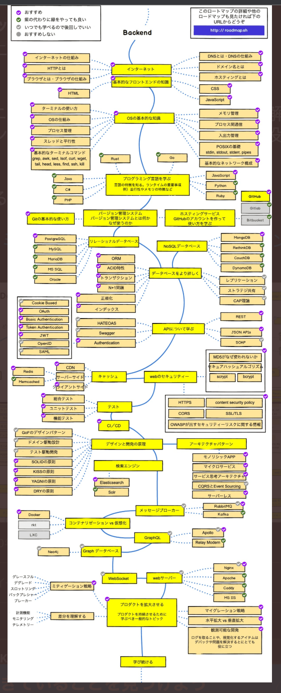
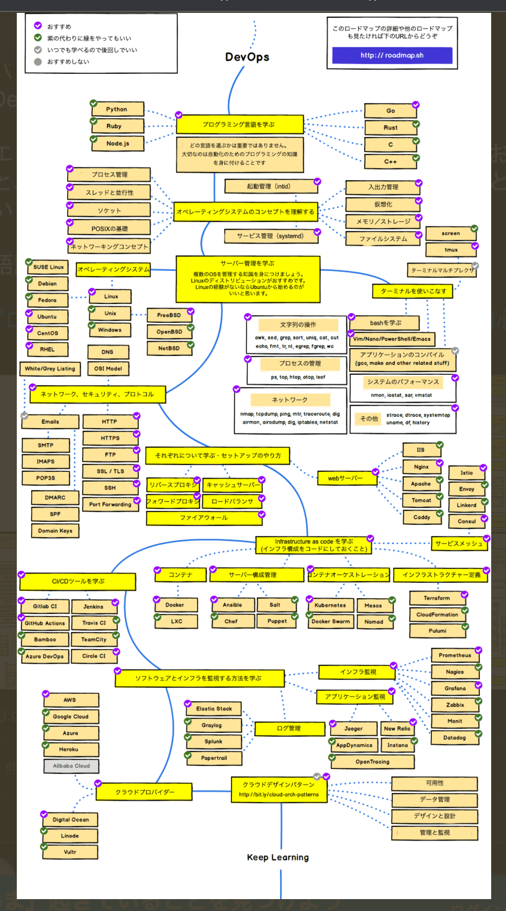

# Introduction

## 知識の蓄え

個人で学習するときに Excel やスプレッドシートでまとめて手順書を作成したりなどをしており、分散されているのが気になっていた
book 形式でまとめる方が良いと思い、プログラマーとしての知見、経験を踏まえて作成していく。

[Googleエンジニアメンバー](https://github.com/orgs/google/people)
[Googleエンジニア](https://jp.quora.com/gu-guru-no-sofutouea-enjinia-ha-sugoi-desu-ka)
[Google落ちた](https://note.com/grouse324/n/n1f329de5ee50)

## ディレクトリ及びファイル命名規則

Google の Cloud API を参考にしている
[リファレンス URL](https://cloud.google.com/apis/design/naming_convention?hl=ja)

## blog記事案

CSS vs JS
[参考URL](https://developers.google.com/web/fundamentals/design-and-ux/animations/animations-and-performance?hl=ja#css-vs-javascript-performance)

CSS vs Jsをfpsの観点から、またパフォーマンスの観点からをブログにする

## システム開発でよく使われる英単語

[参考URL](https://hnavi.co.jp/knowledge/blog/english/)

## これをportfolioに使用する

[参考URL](https://coliss.com/articles/build-websites/operation/javascript/native-like-animations-for-page-transitions.html)

## Node.jsのdebugをできるようにする(typescript版で)

[参考URL](https://casualdevelopers.com/tech-school/how-to-debug-nodejs/)

そのためには開発環境の準備(以下の2つで)

## Web、ネイティブアプリなど区別がそれぞれ記載されている
[とてもいい](https://ops-in.com/knowledge/application/app-development-language/)

## GitHub参考

[あさみどい](https://github.com/d0iasm)

## セキュリティ

[毎週セキュリティのインシデントが発表されるサイト](https://www.jpcert.or.jp/)

## いつかfont管理や画像管理のために入れようかな

[参考URL](https://coliss.com/articles/build-websites/operation/work/eagle-ver2.html)

---

ここからは仕事用のmac
## Docker Ci/CD

[参考URL](https://circleci.com/ja/blog/docker-and-cicd-tutorial-a-deep-dive-into-containers/)

## サーバーレスアーキテクチャ

[参考URL](https://service.plan-b.co.jp/blog/tech/30863/)

## Laravel環境のDocker

[参考URL](https://qiita.com/ucan-lab/items/5fc1281cd8076c8ac9f4#%E4%BD%BF%E3%81%84%E6%96%B9)

## nuxtでlambda

[lambda](https://qiita.com/kobayashi-m42/items/fbacb46f7603e5a014d7)

## Redis

## netfilx

## OSS活動をする。  

[OSS活動](https://knqyf263.hatenablog.com/entry/2020/08/28/074749)

1~2月 portfolio作成
この間にdockerを本番環境に反映する方法を覚える。
家引っ越し
3~5月 ブログ作成
6月~ 英語習い始める
6月~ 並行してgithubを高める(OSS活動)

## 各ロードマップ一覧

- frontend

- backend

- devops
