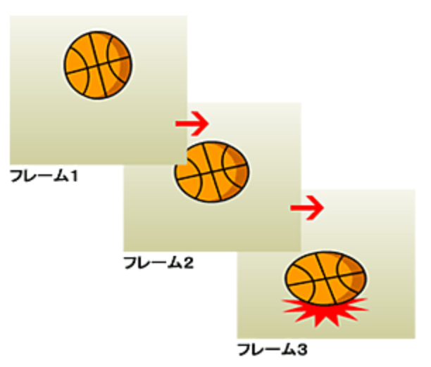

# animation

[参考](https://ics.media/entry/7162/)

HTML5でモーションを作成するときにトゥイーンライブラリを使用する

アニメーションを作るときには**アニメーションライブラリ**を使用する

Google規約より
アニメーションを使用する際は、必ず60fpsを維持してください。
アニメーションがスムーズに動かなかったり途中で止まったりすると、ユーザの目に留まりやすくネガティブな印象を与える。

## ユビキタス

fps(frame per second) : アニメーション1秒あたりのコマ数のこと

## 歴史

過去はFlashが全盛期だった

## 現在

Flashはなくなった。

## GSAP(グリーン・ソック・アニメーション・プラットフォーム)

Flash全盛の時代から存在する歴史あるトゥイーンライブラリ
GSAPはCSS/HTML5 Canvas/WebGLなどさまざまなアニメーション作成に利用できる。
類似トゥイーンライブラリよりも高機能であり、かつ実行パフォーマンスも優れているのが魅力的。
「GSAP」はかつてのTweenMax（高機能なトゥイーンライブラリ）やTweenLite（機能をシンプルした軽量なライブラリ）を統合したJSライブラリ
ウェブの古い記事では「TweenMax」で紹介されていることがありますが、「GSAP」は同じJSライブラリです。


## HTML5 Canvas

これはCanvasだけで作成するのは冗長でかなり大変となるため
現在はcreateJSで作成するらしい

HTML5のCanvas要素(JavaScriptではcanvasRenderingContext2Dオブジェクト)は従来Flashで制作してきたようなコンテンツの作成を可能にした。

HTML5 Canvas(Context2D)についてはCreateJSを使用するといい。

## HTML5 CanvasとWebGLの使い分け

[参考URL](https://ics.media/entry/5140/)
## WebGL

[WebGL入(MDN Web Docs)](https://developer.mozilla.org/ja/docs/Web/API/WebGL_API/Tutorial/Getting_started_with_WebGL)

これは勘違いWebGL=3D表現というわけではない。
WebGLが一番効果的に使える場面は3D表現であることは間違いないが、必ずしもWebGLは3D表現だけに利用されているとは限らず、WebGLは2D表現にも利用できる。

WebGLは互換性のある任意のウェブブラウザ上でプラグインを使用せずにインタラクティブな2次元および3次元のコンピューターグラフィックをレンダリングするためのJavaScript APIである。

WebGLのプログラムはJavaScriptで記述する制御コードと、コンピューターのGraphics Processing Unit(GPU)で実行する特殊効果コードで構成される。

WebGLについてはJSライブラリPixi.jsなど、使うといい。
## WebGPU

>WebGLを先に知らないといけない。

WebGPUは画像処理と計算処理のアクセラレーション(処理を高める)のための将来のウェブ標準およびJavaScript APIのためのワーキングネームa

## なぜカクつきが起こるのか

FlashのStage3Dや、WebGLの登場によってブラウザ上でも高度な3D表現ができるようになり、ウェブコンテンツの表現の幅が広がった。
しかし高速といってもコンテンツの内容によっては処理負荷が高くなりカックつきが生じる場合がある。
カクつきはコンテンツの見栄えを損なわせ、作り手の想定とは異なる体験を与えてしまう可能性がある。

- カクつきが起こる理由
1コマ毎の描画処理が重く、fpsを一定に保つことができないため。
コマ数が多くなるほど滑らかなアニメーションとして見える。
一般的にコンシューマゲームやPCゲームなどは60fps、つまり1秒あたり60コマでアニメーションされるように作られている。
最近のVRでは120fpsが必要とも言われており、滑らかに再生させる重要性は高まっている。

>中でも3D表現をする場合はとくに処理負荷が高く、凝った表現をしようとするとfpsを保つ事が難しくなります。WebGLでの3D表現にも同様の事が言えます。

- カクつきを減らす
1描画にかかる処理時間を減らし安定した間隔で描画できることがカクつき解消において非常に重要になる。

## カクつき対策

1. fpsをわざと下げる
2. canvas要素の解像度を下げる
3. カクつきによる動きの遅れをなくす
4. CPUの種類によって処理負荷を減らす


## アニメーション種類

[参考URL](http://juen-cs.dl.juen.ac.jp/html/flash/04/01/explanation.html)

>トゥイーン（tween）とは、between（中間）に由来する言葉で、2つのイラストが変化しながら繋がるアニメーションのことを「トゥイーンアニメーション」といいます。トゥイーンアニメーションには「モーションアニメーション」と「シェイプアニメーション」の2種類があります。トゥイーンアニメーションを使用することで、前章のフレームアニメーションよりも滑らかな動きのアニメーションを作ることができます。


1. フレームアクション

フレームアクションとは、フレームと呼ばれる静止画を複数組み合わせることで作るアニメーションのことをいう。


2. トゥイーンアニメーション

トゥイーンと言われるアニメーションは、始めと終わりの状態を指定することで、中間の状態を自動的に補完しアニメーションさせる技術


## アニメーションの基本的な仕組みと考え方

[参考URL](https://ics.media/entry/17183/)

アニメーションの仕組みは時間経過とともにある値を0(0%)~1(100%)の間で連続して変化をさせるということ。

具体的には**始点・時間・変化量**の3つの概念で考える。

たとえば画像をX座標100pxから500pxまで2秒で移動させたいといった場合、X座標を100（始点）から、2秒かけて（時間）、+400する（変化量）」と考えます。

- 値を変化させるための計算式

アニメーションさせる値は、時間経過に合わせた計算が必要となる。

1. まず、**変化にかける時間**と**経過した時間**から進捗率を算出する。
2. つぎに**変化量に進捗率をかけ、始点に加える**ことでアニメーションの中の値が計算できる。

これがアニメーションさせるための心臓部ともいえる計算式
```js
// アニメーションの進捗率 = 経過した時間 / 変化にかける時間;
// アニメーション中の値 = 始点 + 変化量 * アニメーションの進捗率;
```

---

- 後半

[参考URL](https://ics.media/entry/17470/)

イージング：動きに深みを出す
エフェクト：演出にエフェクトを加えるCSSフィルター

## イージングとは

[イージング早見表](https://ics.media/entry/17470/)

最初はゆっくりで、徐々に早く変化させるといった具合に時間経過に応じて変化の速度を調整するのがイージング
>イージングには色々な種類がありますが、一般的には「easeIn~」（徐々に加速）、「easeOut~」（徐々に減速）、「easeInOut~」（加速してから減速）という名前が一般的
>このイージングはFlashやJavaScriptのトゥイーンエンジンで広く採用され、いまやデファクトスタンダードとなっています。


## アニメーション負荷対策

例としてmouse moveイベントはマウスの座標が動くたびにすごい頻度で発生する。
これに応じて画面を同期させたり、サーバに問い合わせしてしまうと大変なため一般的には0.2秒とかマウスが止まったら同期や問い合わせが走るように実装するかと思われる

別の例としては
テキストボックスのインクリメンタルサーチ実装で、文字を打つたびにサーバ問い合わせしたら大変のため入力がある程度留まった時点で問い合わせするのが一般的。


- スクロールイベント
[参考URL](https://www.webprofessional.jp/throttle-scroll-events/)


## アニメーション単語

### パララックス(paralax)

パララックスは英語で視差という意味がある。
ざっくり理解すると、部分ごとに動くスピードや動く方向に差をつける。
Webデザインではスクロール効果としてパララックスがよく取り入れられる。

[パララックス参考URL](https://saruwakakun.com/html-css/reference/parallax)

パララックスを取り入れると、差をつけることにより奥行き感を出したり、目を引くようなデザインにすることができる。

## CSS vs JavaScript

[参考URL](https://developers.google.com/web/fundamentals/design-and-ux/animations/css-vs-javascript?hl=ja)

**簡潔に言うと**

>- UI 要素の状態がシンプルで自己完結的な場合は、CSS を使用します。サイドからナビゲーション メニューをスライドさせたり、ツールチップを表示したりする場合は、CSS 遷移とアニメーションが理想的です。状態を制御するために最終的に JavaScript を使用することになっても、アニメーション自身は CSS 内にあります。
>- アニメーションを細かく制御する必要がある場合は、JavaScript を使用します。Web Animations API は、現在 Chrome と Opera で利用できる標準ベースのアプローチです。実際のオブジェクトを使用できるため、複雑なオブジェクト指向のアプリケーションにとっては理想的です。停止、一時停止、スローダウン、逆再生が必要な場合は、JavaScript も便利です。
>- シーン全体を手動で調整する場合は、requestAnimationFrame を直接使用します。これは JavaScript の高度なアプローチですが、ゲームを作成する場合や HTML キャンバスに描画する場合に役立ちます。


ウェブ上でアニメーションを作成するには主に2通りの方法がある
CSSの使用及びJsの使用。

- CSSによるアニメーション
画面上で何かを動かすには、CSSによるアニメーションを使用するのが最も単純な方法。


## アニメーションとパフォーマンス

[参考URL(googleリファレンス。やばい)](https://developers.google.com/web/fundamentals/design-and-ux/animations/animations-and-performance?hl=ja#css-vs-javascript-performance)

アニメーションを使用する際は、必ず60fpsを維持する。
→アニメーションがスムーズに動かなかったり途中で止まったりすると、ユーザの目に留まりやすくネガティブな印象を与える。

- 任意のCSSプロパティをアニメーション化するときの影響を把握し、アニメーションによってパフォーマンスが下がらないように注意する
- ページ(レイアウト)の形状変化や描画処理を伴うプロパティのアニメーション化はリソースを多く消費する。
- 可能な限り、形状と不透明度を変更するようにする
- will-changeを使用して、ブラウザにアニメーション化する対策を通知する。

**アニメーションプロパティ(CSS)はリソースを消費し、その程度はプロパティによって異なる。**たとえば、要素のwidthおよびheightをアニメーション化すると、要素の形状を変化させることになるため**ページ上の他の要素の移動やサイズ変更が必要になる場合がある。**この処理はレイアウトと呼ばれ、ページに多くの要素が含まれていると、リソースを多く消費する可能性がある。
レイアウトがトリガーされるたびに、通常はページまたはその一部をペイント(スクショ?)する必要がある。この処理は一般的にレイアウト操作そのものよりもリソースを消費する。

可能な限りレイアウトやペイントをトリガーするプロパティのアニメーション化は避けてください。
つまり、**大半の最新のブラウザではopacityまたはtransformにのみ**アニメーションを適用するようにしてください。


## CSSとJavaScriptのパフォーマンス比較

以下は絶対に覚えていないといけない

- CSSベースのアニメーション、およびネイティブでサポートされているウェブアニメーションは一般的に**コンポジタスレッド**と呼ばれるスレッドで処理される。、これはスタイリングやレイアウト、描画処理、JaaScriptが実行されるブラウザのメインスレッドとは異なる。
つまり、ブラウザがメインスレッド上で負荷の高いタスクをいくつか実行している場合でもこれらのアニメーションは中断されることなく続行できる。

形状と不透明度に対するその他の変更も、多くの場合はコンポジタ スレッドで処理されます。

アニメーションがペイント、レイアウト、またはその両方をトリガーする場合は、「メイン スレッド」で処理する必要があります。これは、CSS ベースと JavaScript ベースの両方のアニメーションに当てはまります。その結果、レイアウトやペイントのオーバーヘッドにより、CSS や JavaScript の実行に関連するあらゆる作業が妨げられるという問題が発生する場合があります。

## animation 単語

スクロールに連動したアニメーション（スクラブアニメーション）
スクロールに連動して、少しずつ動くアニメーションです。 こちらは発火するアニメーションの例とは違い、ユーザーがスクロールをやめるとアニメーションも止まります。

## タイムリマップ Timelimap

タイムリマップは映像や音声の再生速度を徐々に遅くしたり速くしたりできる効果です。 編集点を入れてスピード調整すると、急にゆっくりになったり早回しになったりしますが、タイムリマップを使用することによって滑らかな速度変更が可能になります。