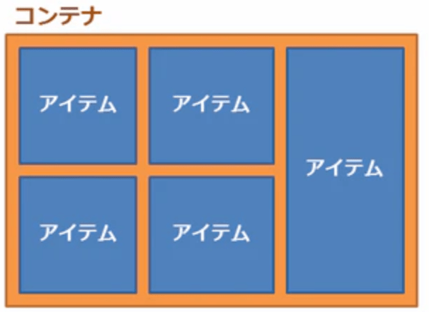
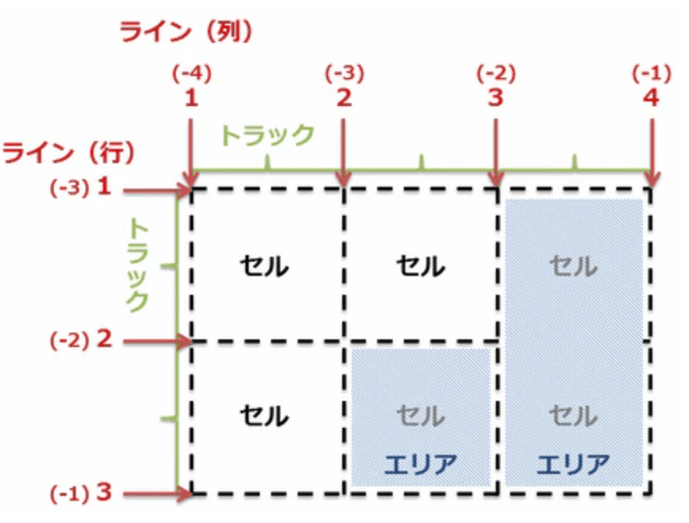

# css

flexbox: IE対応?
grid layout: IE対応していないのであれば積極的に使う

## ユビキタス

HEX形式: プログラムイメージ（コードとデータを表すの 16 進数列）をテキストで表現したもの

```css
/* HEX6桁 */
color: #e0e0e0;
/* HEX8桁 最後は透過 */
color: #E0E0E0E0;
```

## width

- 100% と auto の違い

> 【width:auto】の場合は、左右の余白 10px を含んで横幅 100%になります。 【width:100%】の場合は、左右の余白 10px を含まずに横幅 100%になるため、実際の横幅は 100%+20px（左右の余白分）になります。
例えば PC 版のコーディングから行うとして、width を px 指定したときなどはブレイクポイントを設けて SP 版用に幅を上書きする。この流れはよくあります。共に、親要素の幅に合わせるとういう意味では同じですが、padding や border を指定する場合にちょっと違ってきます。

Media Queries をつかって width を上書きする場合はこちらが便利です。
上の図を使って説明すると...boxA に padding:20px;があたっていて内側に boxb がある、と。
boxB に width:auto;を付与すると、boxB の幅は、以下になります。

width auto だと flex の justify がきく

- vw, vh, vmin, vmaxについて
[参考URL(一番わかりやすい)](https://coliss.com/articles/build-websites/operation/css/css-viewport-units.html)

>どんなシーンで使えるか
>画像を例にすれば、ページいっぱいの背景画像などでしょうか。モバイル端末は向きによってタテ・ヨコの長さが変わるので、JavaScript で向きの判定処理をして動的にサイズを調整するといったことを自前で作る必要がなくなるかと思います。

vw(viewport width) ビューポートの幅に対する割合
vh(viewport height) ビューポートの高さに対する割合
vmin(viewport minimum) ビューポートの幅と高さのうち、値が小さい方に対する割合
vmax(viewport max) ビューポートの幅と高さのうち、値が大きい方に対する割合

## プロパティ一覧

flex-basic

## flexbox

[一番わかりやすいflexbox](https://www.webcreatorbox.com/tech/css-flexbox-cheat-sheet)

### 親要素にFlexコンテナに指定するプロパティ

- flex-direction
row（初期値）… 子要素を左から右に配置
row-reverse … 子要素を右から左に配置
column … 子要素を上から下に配置
column-reverse … 子要素を下から上に配置

子要素の


## cssで動的に値を変更する方法 var()

基本、webなどでCSSを動的に使用するにはJSなどを使用する
しかし、CSSでも変数が使用できるとのこと

CSS変数を呼び出す var()関数は

>var() 関数は、プロパティ名、セレクター、またはプロパティ値以外のところでは使用できません。(使用してしまうと、無効な構文が生成されるか、もしくはその変数に接続していない値が生成されてしまいます。)


## 疑似クラス

`:root`
>CSS の :root 疑似クラスは、文書を表すツリーのルート要素を選択します。 HTML では、 :root は `<html>` 要素を表し、詳細度が高いことを除けば html セレクターと同等です。
詳細度は:rootのほうが高い

## CSS変数(CSSカスタムプロパティ)

- 定義
カスタムプロパティの宣言には--からはじめる。カスタムプロパティの名前(好きなものでOK)

- 定義のコツ
CSS上でグローバル変数として使用するために:rootに定義してグローバルに使用する。

- 呼び出す
var(--変数名)

```css
/* カスタムプロパティの宣言 */
--変数名: 値;

```

## CSS Grid Layout

[参考URL](https://ics.media/entry/15649/)

Grid Layout ModuleとはWebサイトのレイアウトを構築する新しい手法
**今までは、ウェブサイトのレイアウトを実現するためにfloatやflexboxを使っていた**

Grid Layoutを使えば
**HTML要素の構造を汚さず、従来の手法に比べてウェブサイトのレイアウトが作りやすくなる。**
例として
floatだと、親要素にdivを増やす必要があったのが、Grid Layoutを使えばそのようなムダなHTML要素を増やさなくて構わなくなる

- 作り方
Grid Layoutはレイアウトを囲むコンテナーの要素に、その子要素の配置の仕方を指定する。Flexboxと違い、要素を並べる行・列コンテナーとなる要素を用意する必要はない。

## link tag

- 外部font読み込み

次にレンダリング中にフォントデータ本体が読み込まれます。各 font-face 定義内の src 属性の url(https://fonts.gstatic.com/s/...) の部分
ここで問題になるのが、**フォントデータの読み込みが始まるタイミングがレンダリングの後半になること**
ブラウザが CSS を認識し、フォントデータが必要だと判断した時点でロードが始まる。
実際には初めから fonts.gstatic.com のロードが必要なことは分かっている。
そのためpreconnectヒントを指定することで読み込みの一部を事前にスタートさせる。
preconnect ヒントは指定した URL の DNS 名前解決と TCP のハンドシェイク、TLS のネゴシエーションなどを事前に行います。リンクの読み込み時間の多くはこれらの事前処理に割かれているため、この部分を先行して行うことで高速化が実現できます

```html
<link rel="preconnect" href="https://fonts.gstatic.com/" crossorigin>
```

## CSS GridとCSS Flexboxの認識

[参考URL](https://coliss.com/articles/build-websites/operation/css/css-grid-vs-flexbox-which-should-you-choose.html)

>CSS GridとFlexboxは、CSSで現在主流となるレイアウトのテクノロジーです。
>CSS GridとFlexboxは表面的には似ているように感じるかもしれません。しかし、実際には異なるタスクに使用され、それぞれ異なるレイアウトの問題を解決します。

**CSS Gridはコンテナベースで、Flexboxはコンテンツベースです。Flexboxのレイアウトではセル（Flexアイテム）のサイズはFlexアイテム自身で定義され、CSS Gridではセル（Gridアイテム）のサイズはGridコンテナで定義されます。**

- リロード時間の違い
**Flexboxのレイアウトではコンテンツがロードされた後に計算されるのに対して、Gridのレイアウトではコンテンツに関係なく計算されることを示している。**
Flexboxでページ全体のレイアウトを構築することは表示が遅くなるため、避けた方がよいということです。**


## gapで対応する。

[参考URL](https://ics.media/entry/210628/)

**margin で余白を作っていたのが、gap になる点が地味に便利。**


## Grid Layoutを極める

[勉強用URL](https://qiita.com/kura07/items/e633b35e33e43240d363)
[基本レイアウト構成URL](https://www.webcreatorbox.com/tech/css-grid-basic-layout)
[CSSグリッドレイアウトでサイズが違う復数のボックスをタイル上に配置する](https://www.webcreatorbox.com/tech/css-grid-layout)

CSS Grid Layout（グリッドレイアウト）は、**2次元レイアウト** を、HTML/CSS を使って簡単・自由に操作できる機能

**gridの大きさを決めるfr(fraction(分数の意味)」)**

## Grid Layoutの用語

- コンテナ
`display: grid;`または`display: inline-grid;`を指定することでその要素は**Grid Layoutのコンテナになる。**

- アイテム
コンテナの子要素。**コンテナの直接の子要素は基本的にすべてアイテムとなる。**

- ライン
グリッドを分ける垂直および水平の線のことです。グリッドの上下左右それぞれの両端にも存在します。
ラインには、上あるいは左から1から順に正の番号が振られています。同時に、下あるいは右からは-1から順に負の番号が振られています。（0という番号のラインはないのです）

- トラック
グリッドの行および列のことです。言い換えればトラックとは、隣接する2本のラインの間を表しています。

- セル
隣接する垂直および水平方向のラインが作る、アイテムを配置できる最小の単位です。

- エリア
一つあるいは複数のセルが結合してできるセルの集まりです。
エリアには名前を付けることができ、アイテムを配置できます。

---

チートシート



---

- 作成手順

1. HTMLと必須のCSS(display: grid;)

2. CSSで各トラックの大きさを指定する
縦横それぞれのトラックの大きさを指定する。以下プロパティを使う。
grid-template-rows: 行のトラックの高さを半角スペースで区切って指定
grid-template-columns: 列のトラックの幅を半角スペースで区切って指定

3. CSSでアイテムの配置を指定する
最後にそれぞれのアイテムをグリッドのどのエリアに配置するのかを指定する。
**アイテムを配置するのには2通りの方法がある。**
