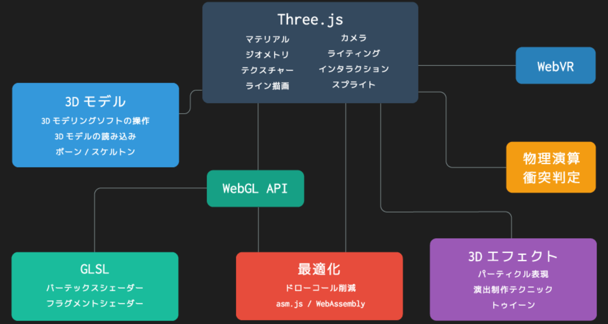

# デザイン

[世界中のサイトを評価しているやばいサイト](https://www.awwwards.com/)
[コリスサイト(web design)](https://coliss.com/articles/build-websites/operation/css/css-tricks-dark-futuristic-web3-look.html)
[モーション周期表を視覚化しておりそれを見れるもの](http://foxcodex.html.xdomain.jp/index.html)
[新しいサイトを作成する時に参考とすべきUX(google)](https://developers.google.com/web/fundamentals/design-and-ux/ux-basics?hl=ja)

## インタラクションデザインとは

[参考URL](https://pantograph.co.jp/blog/uiux/interaction_design.html)
Webサイトやアプリのデザインにおいて、インタラクションデザインという言葉が台頭するようになった。
>インタラクション （interaction）とは、日本語で「相互作用」と訳されます
>IT用語としてはuserが特定の操作を行ったとき、システムがその操作に応じた反応を返すことという意味で使用される

つまり
**インタラクションデザインは機器やソフトウェアなどが使われる際のユーザ側の操作やシステム側の反応などをデザインすることといえる。**

## インタラクションデザインとUXデザインの違い

>インタラクションデザインと同じく、Webサイトやアプリのデザインに関して最近よく聞く言葉に、UXデザインがあります。
>この2つの違いは概念の大きさであり、インタラクションデザインのほうが、より狭い意味を持ちます。
>UXデザインは、ユーザー エクスペリエンス（User Experience）の略で、ユーザーが製品やサービスを通じて得られる体験をデザインすることです。
>一方、インタラクションデザインは、最終的にユーザーの体験に関わるものの、あくまでユーザーが知覚して操作することに関わる範囲のデザインに限定されます。
>つまり、インタラクションデザインはUXデザインの一部といえます。

- インタラクションデザインの原則

1. 説明がなくても操作できること

>いちいち説明文を読まなくても、直感的に操作できるものは優れたデザインです。これを**「アフォーダンス」**といいます。
>日常生活で身近なデザインは、多くの人が直感的に使用できる形になっているため、そのままアプリやwebサイトでのデザインに応用できます。
>例えば、代表的なものに「ボタン」があります。
>ほとんどの人は「ボタン＝押す」という認識を持っているため、画面上にボタンを設置すれば、ユーザーは悩まずに「押す」という行動をとってくれる、というわけです。

1. 操作がしやすいこと

アプリやwebサイトのデザインでは、ユーザーの行動やデバイスの種類に応じて、機能や配置などを考える必要があります。

2. レスポンスにかかる時間が適切であること
3. 定型パターンを活用すること


## designを学ぶ順番




## Webでのパフォーマンス

HTML,CSSで実装できるか考える。JSはもちろん重い。
そのWebアプリによってユーザが表示にかけられる時間が変わる。意識しないといけない。
CADがブラウザでできます。とかなら目的があり待てるが、ネットサーフィンとかの目的だと待てる時間は小さくなる。

## Webでの画像の取り扱い

JPGはCPU上でデコードされてフルサイズでGPUに乗る(pngも)
→つまりJPGをPNGに変えたことでWebのパフォーマンスなんて上がらない。
いくつかのフォーマットは圧縮されたままVRAMに乗せることができる(これ知りたい)

## Webのデザインの重要性

ユーザがホームページを訪れた際に、このサイトは自分の求めていたものではないと判断されるとすぐに検索画面に戻ってしまう。

**そこで重要なのがヘッダーを含むファーストビューのデザイン**

ロゴやナビゲーションを含むヘッダー、メインイメージなどユーザの最初の視界に入る**フォーストビューで注意を惹き付け検索画面に戻らずにホームページに長く滞在してもらえるような工夫が必要**

そこで意識したいのがグーテンベルク ダイアグラム、Zパターン、Fパターンという3つの目線のパターン

- グーテンベルク ダイアグラム
グーテンベルク ダイアグラムとは、**視線は左上から右下に流れていくように習慣付けられる**というもので、活版印刷技術の発明者であるグーテンベルク ダイアグラムが提唱したことによりこの名がつけられた。

この理論がWebよりも印刷物に当てはまることが多いためWebではZパターンとFのパターンを用いることが多い。

- Zパターン
左上から始まった視線が右上→左下→右下というパターンを描き、アルファベットのZのような動きを取る
**※初めてサイトを訪れた初見ユーザに多く見られる視線の動きと言われている。**

>Web上ではユーザーは、最初にざっとページの全体を見るため、このような動きをとっているとされています。そのため、初見ユーザーが多く訪れるTOPページなどはこの視線を意識してデザインすることが大切です。


- Fパターン
左上から始まった視線が右上→下に下がってまた左→ 右というパターンを描き、まるでアルファベットのFのような動きをとることから「Fパターン（Fの法則）」と呼ばれています。

**Fパターンはリピーターに多く見られる視線の動きと言われています。商品ページや記事ページはこちらのFパターンを意識したデザインが有効とされている。**


## headerの重要性

上記を踏まえて、ユーザーがサイトを訪れた際に一番最初に視界に入る部分がヘッダー

**固定ヘッダーは常にお問い合わせができる状態であることがポイント**
>お問い合わせを増やしたいというホームページの場合は、ヘッダーにお問い合わせページへのリンクを設置し、固定ヘッダーにすることをオススメします。

## ダークモードを際立たせるテクニック

[参考URL](https://coliss.com/articles/build-websites/operation/css/css-tricks-dark-futuristic-web3-look.html)

- テキスト
グローエフェクトにする。
テキストを白にし、テキストの外枠をわずかに光らせる。

```html
<h1 class="text-glow">text glow effect</h1>
```

```css
.text-glow {
  text-shadow: 0 0 80px rgb(192 219 255 / 75%), 0 0 32px rgb(65 120 255 / 24%);
}
```

- 背景(background: color)
[参考URL](https://coliss.com/articles/build-websites/operation/css/the-new-responsive-2021.html)
ダークテーマ用にデザインする場合、背景色と文字色を反転させるだけでいいというわけではありません。
意外と知られていない注意点があります。例えば、ダークテーマの背景では視覚的な振動を抑えるために暗い背景の色の彩度を下げる必要があります。

- ダークモードの背景を使う必要がある理由

1. ダークテーマは、スクリーンの寿命を大幅に改善する
ダークテーマに関するAndroidの調査では、スクリーンの明るさと全体的なユーザーインターフェイスに応じて最大60%の消費電力の削減が見られました。この60%というのは、アプリのUIにダークテーマとライトテーマを使用して、YouTubeの再生画面と100％の画面の明るさで一時停止した動画を比較した結果です。
可能な限り、ダークテーマのエクスペリエンスを提供する必要があります。


## レスポンシブ

レスポンシブをどう切り分けるかが重要
userAgentだと、昨今のデバイスが増えていく事情により現実味がでない。
そのためwindow幅を取得するのが現実


[レスポンシブ](https://coliss.com/articles/build-websites/operation/css/the-new-responsive-2021.html)


