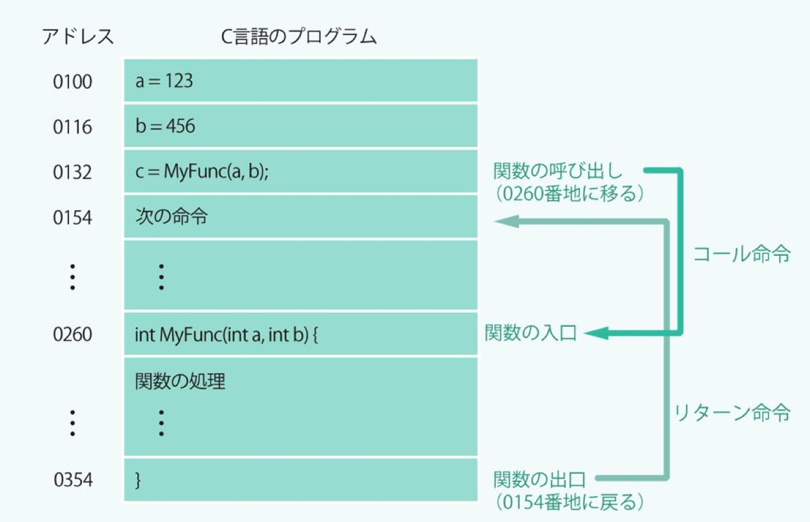
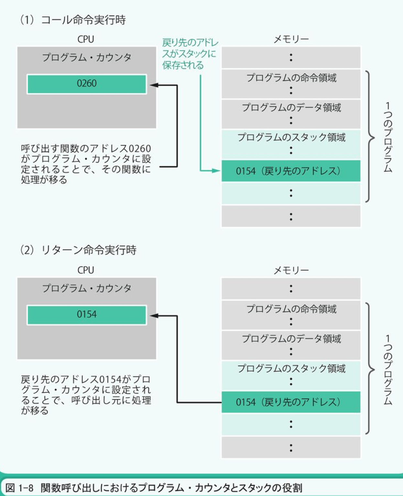
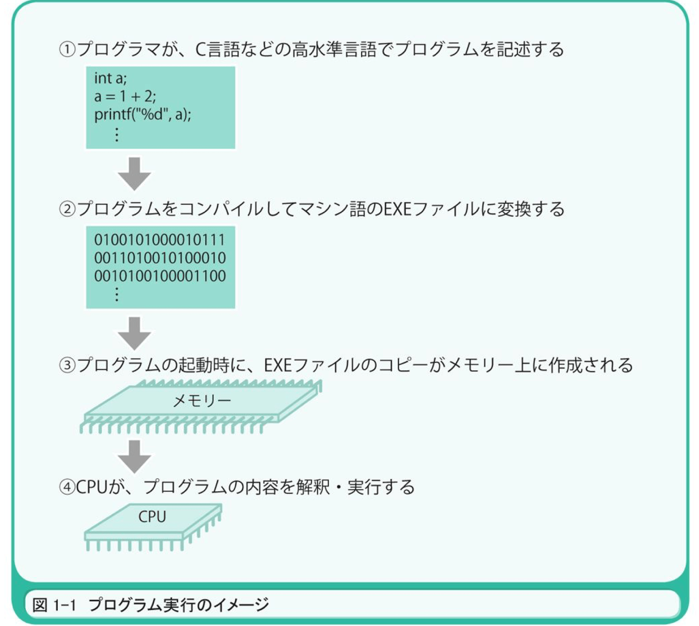
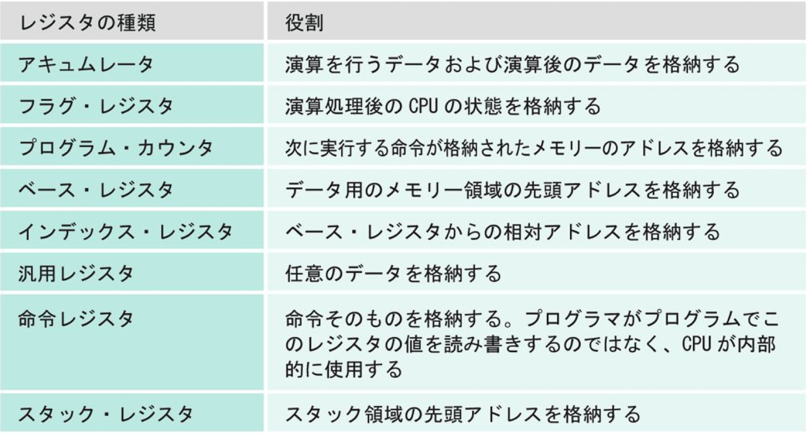
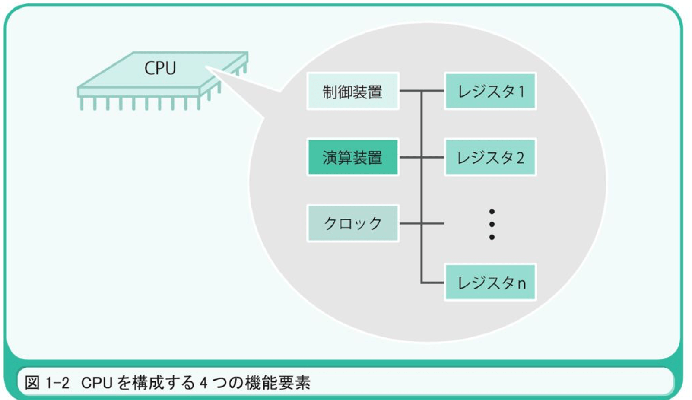
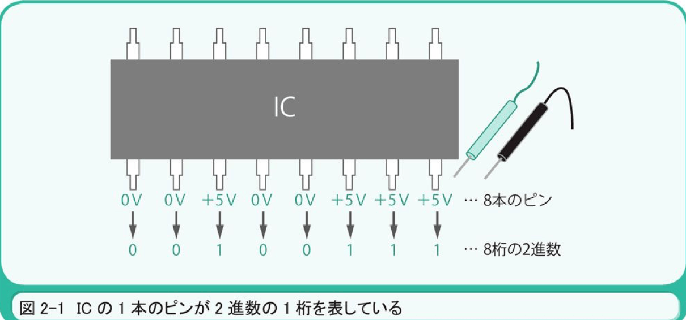
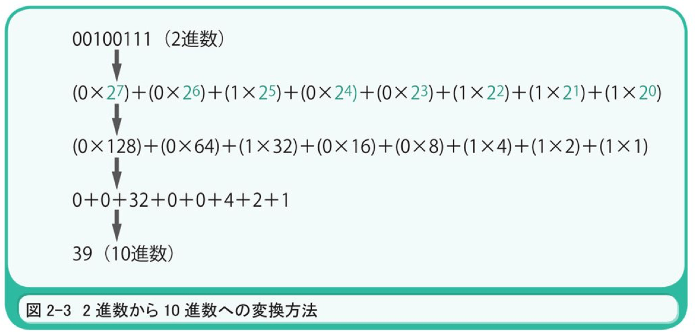

# プログラムはなぜ動くのか

1ビット = 8バイト
8ビット＝1バイトなので、32ビットは32÷8＝4バイトになります。
2進数の各桁に重みを掛けた結果を足すことで、10進数に変換できます。2進数を1桁左シフトすると、元の値が2倍されます。2桁左シフトすると、2倍の2倍で4倍されます。
すべての桁が1である2進数は、10進数の－｜1を表していることになります。元の数の最上位桁である1で、上位桁を埋めます。
XOR演算は、1に対応する桁だけを反転させます。NOT演算なら、すべての桁を反転させます。

---
**処理概要**
プログラムファイルがある。
↓
ハード・ディスクからメモリにコピー
↓
高水準言語
↓
コンパイル
↓
マシン語
↓
CPUの内部でレジスタをつかって処理

---

プログラムの流れには順次進行・条件分岐・繰り返しの3種類がある。

**順次進行**
メモリアドレスの値の順に命令を実行すること。
プログラムカウントの値は1増加する

**条件分岐**
条件に応じて任意のアドレスの命令を実行する。
ジャンプ命令の前の何らかの比較演算が行なわれる。
ジャンプ命令を実行するかどうかは、CPUがフラグ・レジスタの値を参照することで判断されます。

**繰り返し**
同じアドレスの命令を何度か繰り替し実行すること。

プログラムの中に条件分岐や繰り返しがある場合は、それらのマシン語命令が、プログラム・カウンタの値を任意のアドレスに（＋1でない値に）設定することになります。これによって、前のアドレスに戻って同じ命令を繰り返したり、任意のアドレスにジャンプして分岐することができるのです

## 関数呼び出しの仕組み

プログラムカウンタの値を関数が格納されたアドレスに設定することで実現される。
条件分岐や繰り返しとは、仕組みが異なります。単純なジャンプ命令では、関数呼び出しを実現できないからです。関数呼び出しは、関数内部の処理が完了したら、関数の呼び出し元（関数を呼び出した命令の次のアドレス）に処理の流れが戻ってこなければなりません。関数の入り口のアドレスにジャンプしただけでは、どこに戻ればよいかがわかりません。

呼び出しもとと、呼ばれた関数の間のデータの受け渡しはメモリーやレジスタを使って行える。

関数呼び出しはジャンプ命令を使用しない。
**コール命令**
関数の入口のアドレスをプログラム・カウンタに設定する前に、関数呼び出しの次に実行すべき命令のアドレス(154)をスタックと呼ばれるメイン・メモリー上の領域に保存します。
関数の処理が終了したら、関数の最後（出口）でリターン命令を実行します。

**リターン命令**
スタックに保存されたアドレスをプログラム・カウンタに設定する機能を持っています。図17の場合は、MyFunc関数が呼び出される前に0154という値がスタックに保存されます。MyFunc関数が処理を終了すると、スタックから0154という値が読み出され、それがプログラム・カウンタに設定されるのです

## 条件分岐や繰り返しで使われるジェンプ命令

直前に行われた演算の結果を参照して、ジャンプするかどうかを判断する。

---

**プログラムは命令とデータの集合体**

**プログラマーにとって必要なCPUの知識はCPUがどんな働きをするかを理解すること**
→CPUを理解するポイントは命令やデータを格納するレジスタの仕組みを知ること。

なぜレジスタを理解するべきなのか？
**プログラムはレジスタを対象として記述されるため。またマシン語レベルになったプログラムがレジスタを使って処理を行っているため**

プログラム実行の順

- トランジスタ

[参考URL(intel)](https://www.intel.co.jp/content/www/jp/ja/innovation/transworks.html)

簡潔にいうと
弱い電気信号を強い信号に変える増幅機としての役割や、電気信号の流れを高速にon/ofするスイッチとしての役割を果たす小さな電子素子。

---

## CPU

CPUはレジスタの集合体。制御装置、演算装置、クロックは存在だけ知っていたらOK
CPUやメモリーの実体は多くのトランジスタから構成されたIC(Integrated Circuit: 集積回路)と呼ばれる電子部品

CPUが何らかの値を演算するたび、その結果に応じてフラグレジスタの値が自動的に設定される。

フラグレジスタは直前に実行した演算の結果として、アキュムレータの値が負・ゼロ・正のいずれかになったかを記憶する役割を持つもの(オーバーフロー・パリティチェック)の結果なども記憶している。

## レジスタ

**処理対象となる命令やデータを格納する領域。**
一種のメモリーのようなもの。
種類によって異なるが、1つのCPUの内部には20 ~ 100個ほどのレジスタがある。

CPUの種類が異なれば、その内部にあるレジスタの数、種類、レジスタに格納できる値のサイズも異なる。
大雑把にいうと
レジスタに格納される値は、命令を表している場合と、データを表している場合

データには演算につかわれる値と、メモリーのアドレスを表す値の2種類

## 制御装置

メモリー上の命令やデータをレジスタに読み出し、命令の実行結果に応じてコンピューター全体を制御する。

## 演算装置

メモリーからレジスタに呼び出されたデータを演算する役目を持つ。

## クロック

CPUが動作するタイミングとなるクロック信号を発生。

---

## メモリ

PCで通常メモリと呼ぶのはメイン・メモリ(主記憶)のこと
CPUと制御用チップなどを介してつながっていて、ここに命令とデータを格納する。

メインメモリは読み書き可能なメモリ素子で構成されており、1バイト(=8ビット)ずつにアドレス(番地)と呼ぶ番号がついてる
→CPUは￥このアドレスを指定してメインメモリに格納された命令やデータを読み出したり、逆にデータを書き出す。
**メインメモリに格納されている命令やデータはパソコンの電源を切ると消える。**

>CPUの構造がわかると、プログラムが実行される仕組みが、何となく見えてきませんか。プログラムが動き出すと、クロック信号に合わせて、制御装置がメモリーから命令やデータを読み出します。その命令を解釈・実行することで、演算装置でデータが演算され、その結果に応じて制御装置がコンピュータを動かします。「制御」という言葉を使うと、むずかしいことのように感じてしまうかもしれませんが、データの演算以外の処理（主にデータの入出力のタイミング合わせ）のことを制御と呼んでいるだけです。メモリーやディスク媒体との入出力、キーボードやマウスからの入力、ディスプレイやプリンタへの出力なども、制御なのです。

## プログラムカウンタ

プログラムが記述通りに実行できる流れを作る
WindowsなどのOSは、プログラムをハード・ディスクからメモリにコピーしたあとで、レジスタのひとつである
複数のメモリアドレスを占める命令を実行した場合は、プログラム・カウンタの値が命令のサイズ分だけ増加する。

---

2章

## コンピューターが2進数を扱う理由

PCの内部がICと呼ばれる電子部品が構成されていること、ICは黒いボディの両側に数本~数百本のピンがついたムカデのような形状や、ボディの背面に剣山のような形状をしている。
ICのピンは直流電圧が0Vか5Vのいずれかの状態となっている。

## 4章

PCはデータを処理する機会であり、その処理手順や構造を示したのがプログラム。
処理の対象となるデータは、メモリーやディスクを自由自在に使いこなせなければいけない。
そのために必要なのは、メモリーやディスクの構造を物理的にも論理的にもイメージできること。

- 変数とは
メモリー領域を占有するサイズと、そこに格納されるデータの形式

- メモリーの実態は？
メモリーICと呼ばれる電子部品。
メモリーICにはDRAM, SRAM, ROMなど様々な種類があるが外部から見た基本的な仕組みは同じ。

書き込みにはアドレス番地を指定してデータを読み書きするようになっている。
