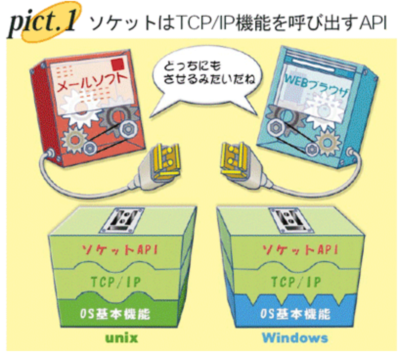

# OS

## OSとは

コンピューターシステムにおいてハードウェアとアプリケーションの橋渡しを行う。
より学問的に言うと
- ハードウェアを抽象化してアプリケーションのインターフェースを提供する

>たとえば、外部記憶装置にファイルを書き込む場合、その外部記憶装置はSATA接続のハードディスクかもしれませんし、NVMe接続のSSDかもしれませんし、はたまたUSBメモリかもしれません。しかも、各ディスクのファイルシステムは全部違うかもしれません。そんな状況でもアプリケーションは書き込み先のファイルをfopenしてwriteするだけで、書き込み先のデバイスが一体何なのかを気にせず書き込むことができます。これが「ハードウエアを抽象化して、アプリケーションにインターフェイスを提供する」ということなのです

- 計算資源を複数のアプリケーションに分配する
>また、CPUは一般的に1コアで1つのアプリケーションしか動作させることができません。それでも、私たちはCPUのコア数より多くのアプリケーションを起動し、まるで同時に動いているかのように感じることができます。これは、OSがCPUの時間を細かい単位に分割し、各アプリケーションを切り替えつつ実行するよう調整しているからなのです。これが「計算資源を複数のアプリケーションに分配する」という機能の例です。

## OSの基本構造

- コマンドやライブラリ
- カーネル

カーネルはコンピューターの基本的な操作を行う機能を格納したライブラリ群のようなもので、**コマンドやライブラリはこのカーネルの中にあるライブラリ(システムコール)を呼び出す。**
例としてlsコマンドはC言語で書かれているが、その中でgetdentsというシステムコールを呼びファイルのリストを取得している。
つまりプロセスはOS内のコマンドやライブラリを呼び出し、そのコマンドやライブラリはカーネル内のシステムコールを呼び出している。

---

ここからはオペレーティングシステムのコンセプトを理解する。

1. プロセス管理

プロセス
プログラムの実行単位であり、CPU時間単位で割り振られる
状態(ステート)があり、現在処理中であるRunning状態だったり、実行可能状態であるReadyなどが存在。
CPUがプロセスを実行する場合、そのプロセスが持つメモリデータに対して演算を行う。
プロセスはテキストセグメントとデータセグメントからなる構造データをメモリ上に持っている。
**テキストセグメント**
プログラムの命令列
**データセグメント**
PDA (Processor Data Area)と呼ばれる、プロセッサの情報やプロセス管理用のデータ領域
データ領域と呼ばれる、定数等が置かれる静的領域と、通常の変数等が置かれるヒープ領域からなる領域
スタック領域と呼ばれる、一時的なデータ保管領域

---

2. スレッドと並行性

スレッド
CPUを利用するための実行単位で、最小処理単位の概念。

---

1. ソケット
[ソケットとポート番号のそれぞれの役割を知る](https://xtech.nikkei.com/it/pc/article/NPC/20070130/260044/)

コンピューターがTCP/IPを使って通信をするとき、IPプロトコルやTCPプロトコルの機能は大抵、OSの機能として実現される。
一般にWebブラウザやメーラーといったアプリケーションプログラムはAPIと呼ばれる仕組みでOSの機能を呼び出している。
**ソケット(socket)はTCP/IPの機能を利用する時に使う標準的なAPIでポート番号はそこで使われる識別子**

- ソケットの経緯
>BSD UNIXはTCP/IPを使ったネットワーク機能を搭載していたうえに、プログラムのソースコードを無料で公開したので、BSD UNIXとソケットAPIはTCP/IPを使う通信ソフトを開発する際のリファレンス（基本となる手法）になりました。TCP/IPの普及に伴い、ソケットは通信ソフトがOSのTCP/IP機能を利用するAPIとしてデファクト・スタンダードの地位を確立しました。

---
1. POSIXの基礎
2. ネットワーキングコンセプト

---

## 標準入力/標準出力/

あらゆるプロセスには、stdin、stdout、stderrという3つの標準ストリームがあることをしる

[別の記事だけど参考になる(Node.jsでログを記録する方法)](https://www.twilio.com/blog/a-guide-to-node-js-logging-jp)

### 標準入力 [standard input] stdin

コンピュータの入力装置やOSが提供する**データ入力機能・経路**などを指し、多くのシステムではキーボード装置による利用者の文字入力が標準入力に設定されている。 システム上では “stdin” の略号で表されることが多い。

## 標準出力 [standard output] stdout

コンピュータの出力装置やOSが提供するデータ出力機能・経路などを指し、多くのシステムではディスプレイ装置による利用者への文字表示が標準出力に設定されている。 システム上では “stdout” の略号で表されることが多い。

topic
JSのconsole.logはこれにあたる

## 標準エラー出力

UNIXの命令やGMTの命令の多くは，エラーメッセージを出力することがあります． これは普通は，標準出力（stdout）とは違う書き出し先に書き込まれます． これを標準エラー出力（stderr）といいます．

topic
JSのconsole.errorはこれにあたる

---

## 改行コード

対応OSと改行コードが違うということは、**プログラムを読み込めなくなることを意味する**

[参考URL](https://cprogram.net/line-feed-code/)

### 種類

改行コードには以下のものがある。

– **CR（Carriage Return キャリッジ・リターン）**
左端へ移動する・同じ行の先頭へ移動するという意味
実際には、「次の先頭行」に行くことで間違いではないのですが、あくまで操作としては「カーソルを左端の位置に移動する」ということです。
コードで書く場合は`\r`と記述します。
対応OS：Mac OS 9以前（現在ではあまり一般的でない）

– **LF（Line Feed ラインフィード）**
カーソルを次の行へ移動する
コードで書く場合は`\n`

対応OS : LinuxやUNIX(MacOS X以降)

– **CR + LF （Carriage Return キャリッジ・リターン + Line Feed ラインフィード）**
意味としては、カーソルを左端に移動し、次の行へ移動するという、後述のCRとLFの組み合わせ。
コードで書く場合は`\r\n`と記述する

対応OS：Windows OS

