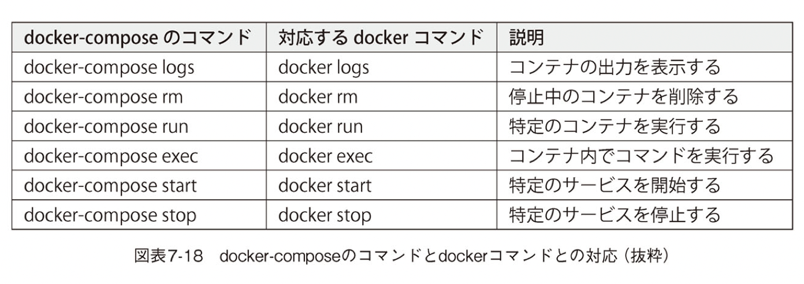

# docker-compose

Docker操作の補佐をするPython製のツール。
Docker Engineの一部ではない。
**docker-compose.yml内ではホスト側のシェルの環境変数が使える。**
→つまり、host側で環境変数が設定されているためdirenvなどで読み込ませるのが良いのではないか？
設定した環境変数にどのような値が挿入されるかは、 `docker-compose config`コマンドで確認ができる。

## docker-compose コマンド

**docker-composeで作成したコンテナはdockerコマンドではなく、docker-composeを使った管理に一元化すべき**

`$docker-compose down`はコンテナやネットワークを停止するだけではなく、それらを破棄する。
**※規定ではボリュームは削除しない。**

dockerとの対比コマンド
docker-composeで管理しているとこにdockerコマンドで対応していると反故が生じる恐れがあるためdocker-composeコマンドを使用すること。




## docker-compose とは

> docker-compose はローカルで Docker のオーケストレーションを行うためのツールです。Docker のビルドから Network や Volume の管理をコードベースで定義して行ってくれます。

docker-compose.ymlをdocker-compose.ymlというツールで読み込ませて実行すると**ボリュームやネットワークが作られ**、まとめてコンテナが起動する。

## docker-compose で解決できるもの

Docker Composeを使えば、今までdocker runの引数で1つひとつ指定したり、起動後にdocker execでコマンドを実行していたりしたものをdocker-compose.ymlという1つの設定ファイルに集約できる。

## docker-coomposeで住む場合

なるべく Dockerfile を書きたくない
特殊なことをやってないないなら docker-compose から設定できるもので基本十分。

## docker-compose.yaml を読む

```yaml
version: "3.7" # docker-composeのversionを指定。特にこだわりがなければ最新のものを記述する。

services: # 起動するコンテナの定義を行う。
  nginx:
    build:
      context: .
      dockerfile: docker/nginx/Dockerfile
    volumes:
      - ./public:/var/www/html/public:ro
    ports:
      - 8080:80
    environment:
      PHP_HOST: app

  app:
    build:
      context: .
      dockerfile: Dockerfile
    env_file:
      - .env.example
    # volumes:
    #   - .:/var/www/html:cached

  mysql:
    image: mysql:5.7 # コンテナを起動するDocker imageを指定する。
    volumes:
      - ./mysql:/var/lib/mysql:delegated
    command: mysqld --character-set-server=utf8mb4 --collation-server=utf8mb4_general_ci
    environment:
      MYSQL_ALLOW_EMPTY_PASSWORD: "yes"
    ports:
      - 13306:3306
```

すべて3系として記載する。

- version
  versionによって書き方が変わる。3系が最新。2系だと書き方が変わる。

- services
  docker-composeでは、アプリケーションを動かすための各要素をサービスと読んでいる
  ComposeFile内の各サービス名は、わかりやすければなんでもいい。
  **ただ、ここで定義した名前は、dockerのログに表示されるので、わかりやすい名前にした方がいい**

- build
  docker build の実行情報を記述する。ここで定義された情報を元に Docker をビルドし、そのビルドしたイメージを使用してコンテナを起動するコーナー。image もしくは build どちらかを記述する必要がある。

  > コマンドの場合、 `$ docker build -f docker/nginx/Dockerfile` . と同一です。

  [以下参考URL](https://qiita.com/sam8helloworld/items/e7fffa9afc82aea68a7a)
  - context
  docker build コマンドを実行したときの、カレントなワーキングディレクトリのことを ビルドコンテキスト（build context）と呼ぶ。

  - dockerfile

- volumes
  ボリュームのマウントを行う。
  volumesではパスを指定するとDockerエンジンはボリュームを作成する。

  > コマンドの場合、`sh -v $(pwd)/public:/var/www/html/public:ro <IMAGE ID>`オプションと同一です。

- ports
  ポートの開放を行う。
  左にホストのポートを、右にコンテナのポートを指定する。

  > コマンドの場合、 -p 8080:80 オプションと同一です。

- environment
  起動するコンテナへ環境変数を定義する。

  > コマンドの場合、 -e PHP_HOST=app オプションと同一で

  DBについての環境変数設定(パスワード)だが、cfcのnuxtでもやっていたからそのコンテナの環境変数を設定できそう。

- env_file
  ファイルに定義された環境変数を読み取り、コンテナへ定義する。

- command
  Dockerfile で定義されている CMD の上書きを行う。

- depends_on
  service同士の依存関係を記す
  docker-compose up を実行したら、依存関係のほうが先に実行していなければいけない。

- external
  Docker compose管理外のネットワークやボリュームであることを示す。
  これらのオプションが指定されたネットワークやボリュームはdocker-compose downによって削除されることはない。

## docker-compose のコマンド

- up
  カレントディレクトリに存在する docker-compose.yaml を参照して docker-compose の起動
  `sh $docker-compose up`

- down
  カレントディレクトリの docker-compose.yaml に紐づいてる Container と Network を削除
  `sh $ docker-compose down`

image も削除する。
`sh $ docker-compose down --rmi all`

- rm
  Volume を削除
  `sh $ docker-compose rm`

[ここまで記載した](https://y-ohgi.com/introduction-docker/3_production/docker-compose/)

