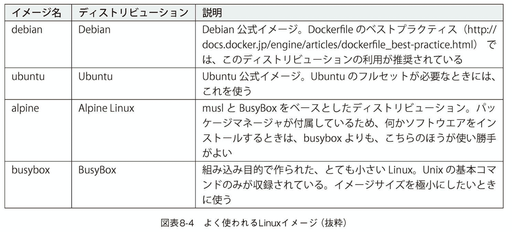
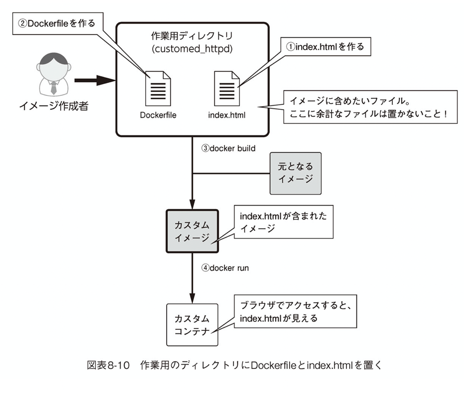
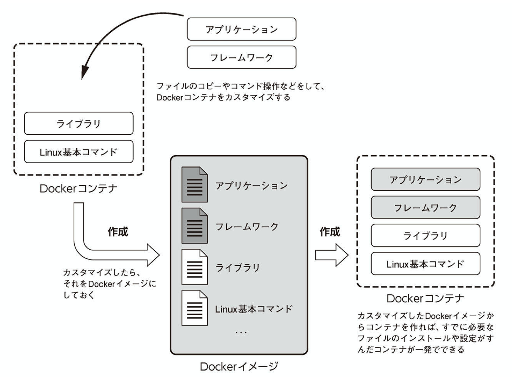
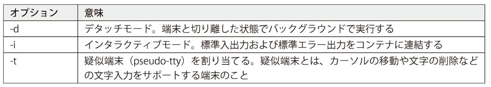
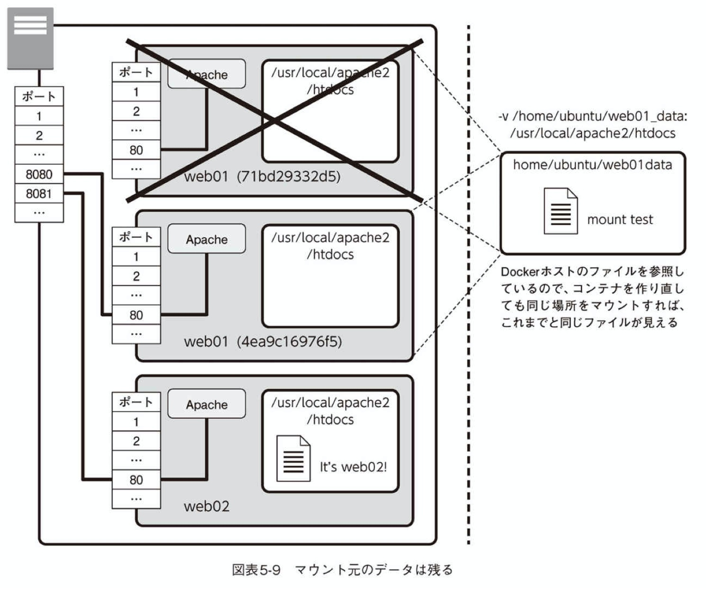
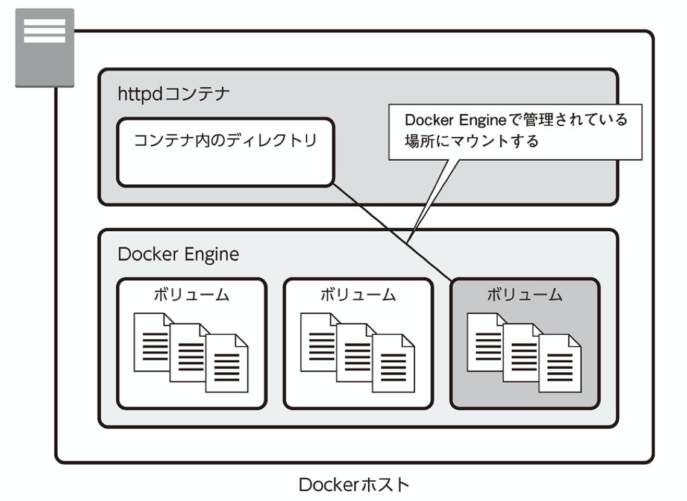
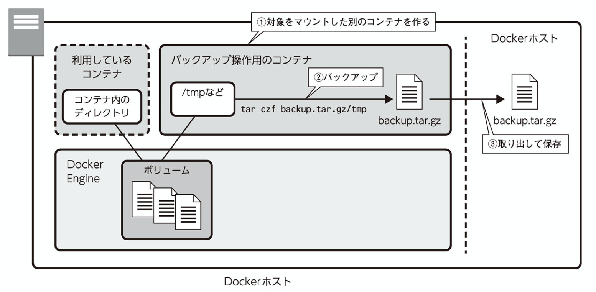
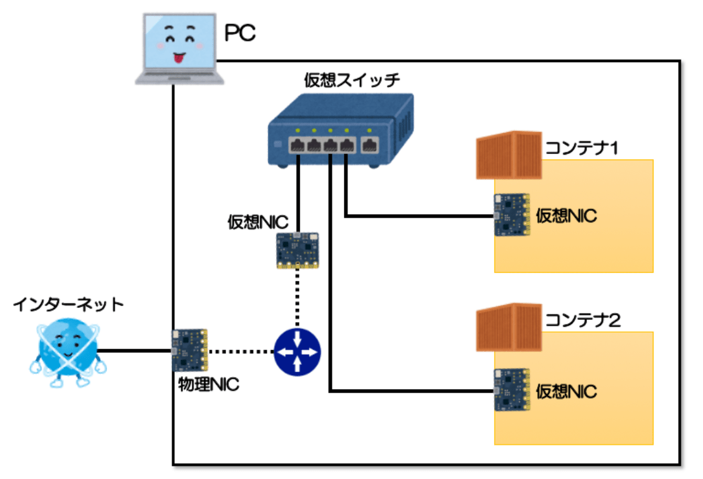
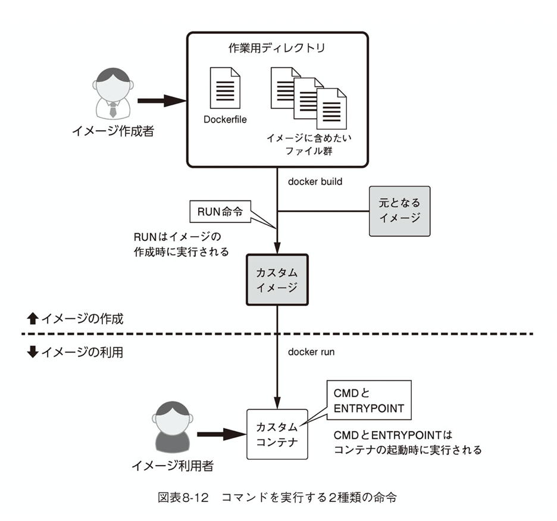

# Docker

## Docker 参考文献

[お前らのDockerfileは重い。](https://speakerdeck.com/stormcat24/oqian-falsedockerimezihamadazhong-i?slide=13)
[世界一わかりみが深いコンテナ](https://tech-lab.sios.jp/archives/18811)
[Docker での Node 環境構築](https://www.creationline.com/lab/29422)
[Docker 環境構築best practice](https://www.forcia.com/blog/002273.html)

## Dockerコンテナ内のアプリケーションport

Dockerコンテナ内のアプリケーションは、デフォルトでネットワークトラフィックを受け入れていますhttp://127.0.0.1:3000。このインターフェースは外部トラフィックを受け入れないため、機能しないのも不思議ではありません。これを機能させるには、nuxtアプリのHOST環境変数を0.0.0.0（すべてのIPアドレス）に設定する必要があります。これは、次のようにDockerfileで実行できます。

container中のサーバがlocalhostでlistenしていると、ホストマシンからアクセスした際にエラーが起きることを確認しました。
この原因はホストマシンのlocalhostとcontainerのlocalhostが異なることが原因です。

ホストマシンとcontainerはnamespaceで区切られていて別のマシンと捉えて構わないため、containerのloopback interfaceにはホストマシンからはアクセスできない。

---

## イメージをビルドするタイミングとは？

1. Dockerfileを書き換えた時。
2. パッケージ管理を行うファイルを書き換えた時


---

## Dockerを軽くする方法

1. RUNはチェーンする(&&)とにかくつなげる。RUN毎にレイヤーが作成されてしまうため
2. 産業廃棄物(docker build)時に生じた、アプリケーション実行には不要なツールやファイルを削除する
3. yumやapt-getのゴミ
4. ビルドに使用したソース
5. gitですら産業廃棄物
6. 成果物を残すことを意識する


---

## Dockerの環境変数

### docker-compose.yml => Dockerfileへ環境変数を渡す方法(1)

渡す側（docker-compose.yml）と
受け取る側（Dockerfile）**双方の設定が必要。**

1. docker-compose.ymlから渡す
args ... Dockerイメージをビルド（作成）する際に引数を渡すために使用します。

この仕組みを使ってDockerfileへ環境変数を渡します。

```yml
services:
  api:
    build:
      context: ./api
      args:
				# キー: 値
        WORKDIR: $WORKDIR
        # この書き方でもOK
        - WORKDIR=$WORKDIR
```

2. Dockerfileで受け取る

ARG命令を使います。
指定する値はdocker-compose.ymlで渡したキーの名前です。
受け取った後はDockerfile内で変数として扱うことができます

```Dockerfile
ARG WORKDIR

ENV HOME=/${WORKDIR}
```

## docker-compose.yml => コンテナへ環境変数を渡す方法

1. environment

environmentを使用する場合は<キー: 値>形式で環境変数を指定する。
**※これは扱う環境変数が少ない場合に使用する。**

```yml
services:
  api:
    environment:
      POSTGRES_PASSWORD: $POSTGRES_PASSWORD
      # この書き方でもOK
      - POSTGRES_PASSWORD=$POSTGRES_PASSWORD
```

2. env_file

env_fileを使用する場合は、環境変数を格納したファイルパスを指定します。
相対パス、絶対パスどちらでも構いません。
これは扱う環境変数が多い場合に使用します。

```yml
services:
  api:
    env_file: ./.env
```

---
## ベースイメージを調べる方法

**重いイメージは本当にいいことがない。**
[参考URL](https://qiita.com/pottava/items/970d7b5cda565b995fe7)

>ベースイメージのRubyバージョンを調べる手順
>ちょっと豆知識。これからのプログラミング人生のために。

Rubyのバージョンは**開発時点の安定版**を使用するようにしましょう。

以下の手順でバージョンを調べます。
1. まず、Rails6に必要なRubyのバージョンを知る。
2. Railsガイド => Ruby 2.5.0以降が必要
3. 次にRuby 2.5.0以上の安定版を知る。
4. Ruby => 安定版は 2.7.1
5. 最後にRuby 2.7.1のベースイメージを調べる。
6. Docker Hub => 2.7.1-alpineを採用

最近はオフィシャルでもAlpine版が存在している。

[Alphine参考URL](https://qiita.com/pottava/items/970d7b5cda565b995fe7)

---

## こうしたいんだぜという時の逆引きdocker

[参考URL](https://beyondjapan.com/blog/2016/08/docker-command-reverse-resolutions/)

## コマンド

近年Dockerコマンドはできるだけ次の書式に統一しようとしている

`$docker コマンド 操作 オプション`

## docker word

デタッチモード: コンテナ内に入らずバックグラウンドで動作する状態のこと。

## dockerの基本運用概念

バインドマウントやボリュームマウントは別の場所に置き、コンテナ自体は破棄されても問題ないような運用を心がけるべき方針

---

## 開発におけるdocker導入のメリット

[参考URL](https://qiita.com/minodisk/items/5ffd20588b995523756f)


**メリット**

- 同一性
複数人で開発する際に、環境の差が生まれない。

- カプセル化
**アプリケーション込みの環境をコンテナというカプセルに隠蔽することができる。**
コンテナという単位に対するテストが可能に。
コンテナを捨てる・再生成するのが容易。

- ポータビリティ（一貫性とも）
開発に使ったコンテナをCIでテストできる。
**CIでテストしたコンテナをサーバーにデプロイできる。**
デプロイしたコンテナをスケールできる。

- 一つのサーバにwebサーバを同居できる(apache)
1台のDockerホストに2台のWebサーバを同居させることができるなど。
>ここまでの操作では、「http://Dockerホスト:8080/」「http://Dockerホスト:8081/」･･･のように、明示的なポート番号の指定での切り替えが必要です。実運用では、きっと、それぞれ、「http://www.example.co.jp/」「http://www.example.com/」など、アクセスするドメイン名で切り替えたいことでしょう。それは可能ですが、少し工夫が必要で、Dockerの力だけではできず、リバースプロキシとして構成します。

**メリットで防げる消耗**

1. おれの環境では動いた。
はい。
複数の開発者で同一の環境で開発できるので防げる。

2. ローカルで通ったテストがCIでコケる。
開発と同一の環境でテストできるので防げる。
bundle install, npm install に失敗してテストがコケる。

3. 依存ライブラリのフェッチに成功したイメージでテストすることで防げる。
コードを変更していないのにアプリケーションの挙動が変わった。go getしてるライブラリの挙動がいつの間にか変わってたぽい。

4. 依存ライブラリをフェッチしたイメージを共有することで、バージョンを固定できる。
nginxの設定を変更したい。サーバにログインするためのSSHキーどれだっけ。
手元で設定して動作を確認しDockerイメージをデプロイすることができるので、設定変更のためにサーバーにログインする必要がなくなる。
さらに、正しく設定できているかブラックボックステストすることも可能に。

**デメリット**

- 学習コスト
コンテナを立ち上げるあたりまではコスト低めだが、実際に開発環境としてDockerを使うあたりから「これどうやってやるんだろう」「どちらの方法で設定するのが良いのだろう」のノウハウが出てくる感じになる。
開発者全員に深い知識が必要かというとそうではないが、問題解決できる知識を持った人間が開発陣に最低一人は必要。

- ローカルでの開発とほぼ遜色ない環境でコードを書くことができるということを周知するためのコスト

- 完全な分離ではない。

---
## DockerFile とは(カスタムイメージを作成した時)

docker build で**カスタムimage**を作成するファイル
**公開されている Docker イメージをそのまま使う場合は必要なく、カスタマイズしたい場合に作成する。**

必要な理由
ベースとなるイメージとそのイメージに対して、どのような操作をするのかを記したDockerfileと呼ばれるファイルを用意しそのDockerfile通りにコンテナに対して変更やファイルコピーを加えることによってイメージを作成する。

## カスタムイメージの作り方

2つある。

1. コンテナから作る
ベースとなるイメージからコンテナを起動し、そのコンテナに対して、`docker exec`でシェルで入って操作したり`dokcer cp`でファイルをコピーしたりし調整を加える。
その後`docker commit`コマンドを使いイメージ化する。
**デメリットが存在する**


2. Dockerfileから作る
ベースとなるイメージとそのイメージに対して、どのような操作をするのかを記したDockerfileと呼ばれるファイルを用意しそのDockerfile通りにコンテナに対して変更やファイルコピーを加えることによってイメージを作成する。
イメージの作成には`docker build`を実行する。
**メリット**
- Dockerfileは、ベースとなるイメージに対する変更指示をまとめたファイル。これを見れば悪意ある操作や間違った操作が加えられていないかが一目瞭然
- Dockerfileは改良しやすいメリットがある。

---

## Dockerfileでカスタムを利用した理由

ある程度なんでもしたいときはdebianイメージを使用することが多い。



## コンテナからイメージを作る(docker cpやexecで中に入ったあと)

以前のhttpdコンテナを作ったあと、`docker cp`コマンドをつかってindex.htmlをコンテナ内にコピーしhttp://でアクセスした時に、そのファイルの内容を見れるようにした。
これと同様の方法で作成したコンテナをイメージ化する。
そしてそのイメージからコンテナを作り直すことでindex.htmlがすでに入ったコンテナが起動することを確認する。

コンテナをイメージ化する
`docker commit`

## コンテナからイメージを作る(Dockerfile)

- イメージに含めるファイル群とDockerfileの用意
イメージに含めたいファイルとDockerfileを1つのディレクトリに置き、それを`docker build`して作るという方法
※このディレクトリに含めているファイルはイメージを作成したとき、利用していないものであっても含まれてしまうため余計なものは置かない。
※ただし、同ディレクトリに.dockerignoreを置くと、除外ファイルを指定できる。しかしこの機能はファイル名のマッチングで除外をするためファイル数が多いと、イメージの作成に時間がかかってしまう恐れがある。



---

## レイヤー

どのようなレイヤーで構成されているかは`docker history`で確認できる。


---
## docker-compose.yml 覚書

コンテナの定義やマッピングするポートなどコンテナに関する設定を記述するファイル

```yml
version: "3"
services:
  app:
    # 起動イメージ
    image: node:16
    # 環境変数
    environment:
      - DEBUG=app:*
    tty: true
    # ホスト側のポート：コンテナのポート
    ports:
      - "3000:3000"
    # ホスト側のsrcをコンテナのappにマウント
    volumes:
      - ./src:/app
    # 起動時のカレントフォルダ
    working_dir: /app
    # 起動後に実行するコマンド
    command: npm start
```

> 重要な箇所は # ホスト側の src をコンテナの app にマウントの部分で、通常 Docker コンテナを停止するとコンテナ上で作成した各種ファイルは削除されますが、上記の記述を行うことでコンテナ起動時に再度ファイルがマウント（反映）されます。
> また Docker コンテナ上で作成・変更したファイルもこちらに記述した場所に反映される。
> 基本ホスト上とコンテナ上でファイルの同期をとるための記述と考えれば OK

## Docker compose 起動 (docker-compose コマンドについて)

`$ docker-compose run --rm app /bin/bash`

※rm オプションは Docker コンテナ停止時にコンテナを削除する機能で、停止したコンテナが残り続ける問題を解決するためのオプション

## Docker コンテナの軽量化

[軽量化参考 URL](https://qiita.com/Canon11/items/da3a7795d894030865f7)

- コンテナイメージサイズが大きいことによる弊害
  イメージのビルド時間が長い
  イメージを Docker Registory にプッシュする時間が長い
  イメージを Pull する時間が長い

それらが起因して下記の弊害が起こる

トライアンドエラーに時間がかかり、生産性が低下
ビルド時間,CI 時間の増大
オートスケールでコンテナがサービスインされるまでの時間が長くなる。
Kubernetes クラスタを構成する Node ディスクの消費

- 軽量化のアプローチ

1. RUN 命令をまとめる
   基本中の基本

※RUN 命令が走る度にイメージレイヤーが生成されてしまうため、ちょっと重くなる。

```dockerfile
# npm installの後のパッケージを羅列
RUN npm install -g gulp@3.9.1 \
    && npm install gulp-load-plugins \
    gulp-plumber \
    gulp-sass \
    gulp-pleeease \
    gulp-uglify \
    gulp-rename \
    && npm init -y
```

> このように、複数の RUN コマンドを「連続で実行する 1 つのコマンド」として扱うことで、イメージレイヤーをまとめて軽量化できます。

2. RUN で apt コマンドを走らせた場合はインストール時に使った apt キャッシュ(ゴミファイル)が残ってしまうため削除する。

3. 使用したい image に slim version があるか DockerHub で探す。
   ※デフォルトの NOde がかなり色々入っている。そのため slim イメージを探す。

---

## dokcer Script関連
## Docker コンテナの動作に必要な設定を起動時に渡す

Dockerコンテナを起動するタイミングで、コンテナの動作に必要な設定を受け渡す方法は2つある。

1. 環境変数を通して渡す
2. コマンドライン引数を渡して渡す。

**どちらの場合も docker run で実行するコマンドの中に設定を含めることになる。**

## docker-entrypoint.sh

dockerで初回起動時のみ特定の処理を行うヘルパースクリプト

>docker run とか docker-compose up -d とかの 初回起動時のみ 処理したいことがある時はどうすればいいんだろう？
>docker restart とか docker-compose restart とか systemctl restart docker の時には動いてほしくないんだ。
>やってみた結果 mariadb + zabbix で初回起動時のみ、構成用の .sql を流し込む。という動作ができるようになりました。

## wait.sh

dbの起動とかを待ってくれる。
>内容はただのシェルスクリプトでポートが LISTEN しているかをチェックしてくれます

---
## ローカル上にLocalStackをDockerで実行

開発用にAWSのサービスをローカル環境に構築できる、LocalStackというプロジェクトがある。素晴らしい。

[参考URL](https://qiita.com/mmclsntr/items/709863ba98a4855988f3)

## Dockerのコンテキストとは

>docker build コマンドを実行したときの、カレントなワーキングディレクトリのことを ビルドコンテキスト（build context）と呼びます。 デフォルトで Dockerfile は、カレントなワーキングディレクトリにあるものとみなされます。 ただしファイルフラグ（-f）を使って別のディレクトリとすることもできます。 Dockerfile が実際にどこにあったとしても、カレントディレクトリ配下にあるファイルやディレクトリの内容がすべて、ビルドコンテキストとして Docker デーモンに送られることになります。

要は**docker buildコマンドを実行した場所**

- 制約
**Dockerはコンテキスト(カレントディレクトリ)の外のファイルにはアクセスできない仕様。**

- ではディレクトリごとにわけた
ルートディレクトリをDockerのコンテキストにすることで、Dockerfileはどんなファイルにもアクセスできるようになりました。
一方で、build時はその分Dockerデーモンという奴にそれだけ多くのファイルを送ることになるので遅くなることがあるようです。

構築時、ビルドコンテキストとして現在のディレクトリ以下にある全てのファイルやディレクトリをDocker deamonに送信してしまいます。ビルドコンテキストに余分なディレクトリ・ファイルがあると、build時に時間がかかる、メモリを消費する原因となります。例えば、ビルドコンテキストに100MBのファイルがあるとimageのサイズが100MBプラスとなってしまいます。このような事態を防ぐためにも**Dokcerfile用のディレクトリを作成し、そのディレクトリには無駄なファイルは配置しないようにすべきです。**

## docker ignore the

.dockerignoreを使ったファイル除外の指定
Dockerfile用のディレクトリを作ったがそのディレクトリ内にビルドコンテキストとして含みたくないファイルが存在する、もしくはDockerfileをアプリのソースファイルが配置されているディレクトリと同じにしたいということもあると思います。

**そんなときに .dockerignore を用いると、ビルドコンテキストとして無視します。**

## docker network

コンテナ内の/etc/hostファイルで定義されているそう。以外に簡単

## マルチステージビルド

[参考URL](https://qiita.com/carimatics/items/01663d32bf9983cfbcfe)

- マルチステージビルド以前
サイズを小さく保ちながらDockerイメージをビルドすることは、最もやりがいのあることの一つ　。
**Dockerfile内の各々の命令ではイメージにレイヤが追加される。**
**したがって、次のレイヤを作成する(次の命令に移る)前に、不要な生成物のクリーンアップする必要があります。**
本当に効率的なDockerfileを作成するには、レイヤをできる限り小さく保ち、各レイヤが前のレイヤの生成物から必要なものを確保するために、シェルのトリックやその他のロジックを採用する必要がありました。
実際に、開発用にはアプリケーションのビルドに必要なすべてが含まれるDockerfileを使用し、プロダクト用にはアプリケーションおよび実行に必要なもののみが含まれるスリム化されたDockerfileを使用することは非常に一般的でした。
これがいわゆる"ビルダーパターン"です。
2つのDockerfilesを保守することは、理想的ではありません。

---

## ここからはさわって学ぶクラウドインフラ本

- コンテナ
コンテナはシステムの実行環境を隔離した空間のこと。
アプリケーションの実行に必要なプログラムやライブラリ、**各種設定ファイルなどをワンパッケージにし隔離して実行するための仕組み。**
コンテナのメリットはそれをコピーして別のコンピューターで動かすのが容易なこと。

システム開発・運用の現場では、「開発者が作ったプログラム一式を検証機にコピーする」「検証機で動作確認して問題なければ本番機にコピーする」「冗長性や負荷分散のために、同じ構成のものコピーして多数台用意する」というように、そのコピーを作りたいことが、よくある。
コンテナ技術を使えば操作が容易になり、コピーや設定漏れを防げます。またシステムのアップデートも、コンテナを差し替えるだけで済むようになります。

## Docker イメージ

2種類
Dockerイメージには基本的なディストリビューションとアプリケーション入りのがある。
**カスタマイズするには基本的なディストリビューション入り(Linuxのみ)を使う**

Dockerイメージに手を加える時は、アプリケーション入りDockerイメージではなく、LinuxのみDockerイメージをベースとするほうがやりやすい。
→ただ、そうしたカスタムは手間がかかり、1つひとつ手作業していると作業漏れが起こる可能性が少なくない。そこでコンテナに手を加えたあと、**そのコンテナをカスタムDockerイメージに変換する。**



- ではカスタムのDockerイメージを作るのは？
カスタムのDockerイメージを作るときは、手作業でファイルコピーやコマンドを実行するのではなく、Dockerfileにファイルコピーや実行したいコマンドなど一連の設定を記述し、そのファイルを適用して作るのが一般的。
**カスタムDockerイメージはDocker HubのようなDockerレジストリに登録できる。**

## Docker desctop

Docker Desctopの内部にはLinuxカーネルが含まれており、WindowsやmacOSでありながらもLinuxを実行することで、その上でDockerを使えるようにしたもの。

## 仮想サーバとコンテナの違い

仮想サーバは1台の物理的なサーバの中に復数の仮想的なサーバを作り、**物理的なサーバを仮想的なサーバが分割して使う**

コンテナはサーバをブナkつする技術ではない。**サーバはあくまでも1台で、その中にたくさんのアプリケーションが隔離して実行されているのにすぎない。**

## コンテナの破棄

docker stopしてもコンテナはずっと残り続けるということ。
**これは明らかにディスクを圧迫する。もう使わない場合は停止ではなく明示的に破棄にするべき**
docker rm で完全削除できる。

## イメージの破棄

Dockerイメージが消費する容量も馬鹿にならない。
**ダウンロードしたイメージはコンテナを破棄しても残ったまま。**
※これはもう一度、同じDockerイメージからコンテナを作ろうとした時に、再ダウンロードしなくても済むようにするため。

`$docker image ls`
`$docker image rm` → `$docker rmi`とかける。


## docker runについて

`$docker run`というコマンドは

`$docker pull`,`$docker create`,`$docker start`という3つの一連のコマンドをまとめて実行している。

## タグ

イメージ名のタグ(tag)はDockerイメージの製作者が名付けた分類名のこと。
**※タグはリソース版や、開発版、バージョン番号などを示すのに使われる。**

タグ名を省略する時は、最新版を意味する**latest**というタグが指定されたものとみなされる。

## オプション

### -pオプション(略称 publish)

ポート番号をマッピングするもの
`-p ホストのポート番号:コンテナのポート番号`
udpを選択する場合には、ポート番号を`ポート番号/udp`とする。
**※Dockerでは、pオプションを指定しない限り、DockerホストとDockerコンテナとの通信は繋がらない。**
**※マッピングの状態は`docker port `コマンドで確認ができる。**

### -vオプション

コンテナの特定のディレクトリにホストのディレクトリをマウントする設定。
**-mountオプションを同様**

`-v ホストのディレクトリ:コンテナのディレクトリ`

## -ditオプション

-ditは` -d, -i, -t`の3つのオプションの組み合わせ。

-dが端末から切り離してバックグラウンドで実行
-iと-tはコンテナを端末(キーボードとディスプレイ)から操作するためのオプション

アタッチの場合(-dを指定しない時)は端末と接続された状態のため、端末からの操作は、そのままコンテナ内で実行中の既定のコマンドに流されます。だからこそ、［Ctrl］＋［C］を押すことで、そのコマンドが終了する。
デタッチのときは、端末とは切り離されているので、コンテナ内で実行されているコマンドに対して、何かキー操作することはできません。デタッチの状態とアタッチの状態は、実行中に切り替えることができる。



## -iオプション

標準入出力およびエラー出力をコンテナに対して結びつけます。その結果、キー入力した文字はコンテナに渡され、コンテナからの出力が画面に表示されるようになります。iオプションを指定しないと、キー入力はコンテナに伝わりませんからこうしたキーが効きません。そしてコンテナからの出力が届きませんから、httpdコンテナの例で言えば、いま見てきたように、画面に各種ログが表示されることもありません。

## -tオプション

-tオプションは、pseudottyと呼ばれる疑似端末を有効にする設定です。疑似端末は、カーソルキーやエスケープキー、［Ctrl］キーなどで操作するためのものです。このオプションを指定せず、iオプションのみだと、これらのキーが使えません。つまり、［Ctrl］＋［P］、［Ctrl］＋［Q］キーが効きません。

デタッチで起動後、操作の必要がないのであれば-iや-tのオプションは必要ない。
しかし、後でアタッチするなどして端末から操作したいときは-iや-tを指定する必要がある。

---

## docker コンテナ内のファイルと永続化

Dockerコンテナは、それぞれが隔離された実行環境。**コンテナを破棄すればその中にあるファイルは自ずと失われる。**
`$docker rm`このコマンドをして再度`docker run`をするとコンテナIDが変わるとおもう。前のコンテナとは別のものとなっている証拠。

## ホストからファイルをコピーする

コンテナの中のファイルを変更するにはどのようにすればいいか

docker execで、/bin/bashを起動しそこでnanoエディタなどを起動して、編集する方法。
しかしapacheなどではファイルサイズを小さくするためnanoエディタなどが入っていないおそれ

そこで便利なのが`docker cp`コマンド
※docker cpはパーミッションをそのままコピーする。ディレクトリも再帰的にコピーする。
※docker cpは/prop, /sys, /dev, tmpfs配下のようなシステムファイルはコピーできない。**こうしたファイルをコピーしたい時には標準入出力経由でコピーする。**

## 上記を含めると、コンテナは一度起動したら破棄してはいけないのか？

違う。そうではなく**コンテナは失ってはいけないデータは外に出すように設計する。**

- ではどうすればいいか？

**マウントする。**
コンテナは実行するシステムと扱うデータは別に管理することが推奨されている。
またコンテナの設計として**実行するシステムと扱うデータは別に管理することが推奨されている。**

`docker run -v`でマウントをする。

ボリュームのマウントにはバインドマウントと同様にvオプションを使う。
**違うのはディレクトリ名ではなくボリューム名を使うという点だけ**

注意
**ただしボリュームのマウントにはvオプションではなく、mountオプションを使うことが推奨されている。**vオプションだとボリュームが作られていない時に新規にボリュームが作成されてしまい、意図しない結果になるため。

つまりデータをコンテナの外に出す。
**Dockerホストのディレクトリをマウントしているのは(外に出しているのと同意)そのためコンテナを削除しても消えないのは当たり前**



---

## mountオプションを使ったマウントの設定

バインドマウントやボリュームマウントするのに-vオプションを使っていたがもう1つ--mountというオプションを使う方法もある。

`--mount type=マウントの種類, src=マウント元, dst=マウント先`

マウントの種類は、バインドマウントのときはbind, ボリュームマウントのときはvolumeを指定する。
srcはマウント元、dstはマウント先(srcはsource, dstはdestinationやtargetとも書ける。)

--mountはDocker17.06からサポートされたオプション。--mountのほうが推奨されている。

1. バインドマウントかボリュームマウントかわかりにく。
-vオプションではマウント元が [ / ]から始まる時はバインドマウント、そうではないときはボリュームマウント。

2. ボリュームが存在しない時はエラーを吐く。


---
## コンテナ間のデータ共有にも利用できる。

マウントする手法はデータを失わないようにするだけではなく、別の方法もある。
**それはコンテナ間でのデータ共有。1つの場所を2以上のコンテナで同時にマウントすることもできる。**

そのため./docker/nginx/nginx.confなど、設定ファイルをプロジェクトに用意しているのは、コンテナ内のnginxの設定ディレクトリにマウントし本来のnginx.confを上書きしている。
この方法であれば、Dockerホストに設定ファイルが残るため設定のバックアップが容易。

※マウントはディレクトリに対して設定するのがほとんどだが、設定ファイルだけをマウントすることも可能。

Dockerホストにあらかじめディレクトリを作っておき、それをマウントする方法を**バインドマウントという**

- マウント種類

**バインドマウント**
Dockerホストにあらかじめディレクトリを作っておき、それをマウントする方法を**バインドマウントという**
設定ファイルとかをバインドする(./docker/nginx/nginx.conf)

**ボリュームマウント**
ボリュームマウントは、ホスト上のディレクトリではなく、**DockerEngine上で確保した領域をマウントする方法。**
確保した場所のことを、データボリュームもしくは略してボリュームと言う。

>ボリュームを使う利点は、ボリュームの保存場所がDockerEngineで管理されるため、その物理的な位置を意識する必要がなくなるという点。ディレクトリ構造はDockerホストの構成によって違うので、ディレクトリ名で指定する場合（dockerrunやdockercreateのvオプションでディレクトリを指定する場合）は、Dockerホストに合わせた場所を指定しなければならず、汎用的ではありません（例えば、ある管理者は/home以下を使うように構成したかもしれませんし、別の管理者は/var以下を使うように構成したかもしれません）。それに対して、ボリュームを扱う方法は汎用的で、どのDockerホストでも同じです。すぐあとに見るように、dockercreateでボリュームを作るコマンド、そしてそのボリュームをdockerrunやdockercreateで指定するためのオプションは、どのDockerホストでも同じです。

ボリュームマウントはブラックボックス。そのためDockerホストから変更できない。



汎用性という目でいうと、ボリュームマウントが推奨されるが、バインドマウントを完全に置き換えるわけではない。
バインドマウントのほうが優れている場面もある。

## バインドマウントのがよい場面

1. 設定ファイルの受け渡し
Dockerホスト上に設定ファイルを置いたディレクトリを用意して、それをコンテナに渡したい場合です。

2. 作業ディレクトリの変更を即座にDockerコンテナから参照したいとき
Dockerホスト上のファイルを変更したとき、それをDockerコンテナにすぐに反映させたいときです。例えば、httpdコンテナを動かして、そのドキュメントルート（/usr/local/apache/htdocs）を、これまでのように、Dockerホストの適当なディレクトリにバインドした場合、Dockerホスト側でそのディレクトリ内のファイルを変更すれば、それはすぐにDockerコンテナに反映されます。

3. 各自のPCでDockerを使う場合はバインドマウントが便利

## ボリュームマウントのほうがよい場面

ボリュームマウントが向く場面、Dockerコンテナが扱うデータをブラックボックスとして扱い、**コンテナを破棄してもデータが残るようにしたいだけの場面。**

データベースのデータは、通常ひとまとめのブラックボックスとして扱い、**それぞれのファイルをDockerホストから編集することはないはず。**もしそんなことをしたら、データベースは壊れてしまうことでしょう。**このようにDockerホストから不用意にデータを書き換えたくない場面では、ボリュームマウントが向きます**
※ボリュームはデフォルトでは、Dockerホスト上のストレージですが、**ボリュームプラグインをインストールすることで、AWSのS3ストレージやNFSなどのネットワークストレージを用いることもできます。**


## ボリューム作成手順(MySQL)

1. ボリュームを作成する(mysqlvolumeという名前)
`$docker volume create mysqlvolume`

2. 作成したボリュームを確認する
`$docker volume ls`
DRIVER   VOLUME NAME
local    mysqlvolume

※dockervolumelsの結果として表示される「DRIVER」は、ボリュームを構成するドライバです。既定は「local」であり、Dockerホスト上のディスク上に作成される。それ以外にボリュームプラグインをインストールすることでAmazon S3のストレージやNFSなどのネットワークストレージを利用できる。

## tmpfs

`$docker run --mount type=tmpfs, dst=マウント先`

tmpfsはディスクではなく、メモリーを特定のマウント先に指定するものでメモリーディスクを利用することで読み書きを高速化する目的で使う。
tmpfsはメモリーのため揮発性。コンテナを破棄することでなくなる。

## データのバックアップ

バインドマウントの場合はDockerホスト上のファイルのためDockerホストで別のディレクトリにコピーするか、tarコマンドでまとめて保存するなどでバックアップができる。

- ボリュームの場合は？
ボリュームの詳細情報は`$docker volume inspect ボリューム名`で見れる。
この場所をtarで固めても意味がない

## ボリュームのバックアップの考え方

ボリュームの場合は適当なコンテナに割り当てて、そのコンテナを使ってバックアップを取るようにする。



## Docker のネットワーク

Dockerのネットワークは大別するとnone, host, bridghという3つの構成を取ることができる。

[参考URL](https://tech-lab.sios.jp/archives/20179)




## 本番運用

本番の安全運用は、Dockerホストをマネージドサービスにしてある程度、任せてしまうのが無難。
AWSにはAmazon ECSというコンテナを運用するマネージドサービスがある。

- マネージドサービス
管理されたManagedサービスという意味で、**運用管理をクラウドに任せることができるサービスのことを言う。**
仮想サーバのEC2は自分で管理するサービスのためアンマネージドサービスという。

- さらなるスケーリングや堅牢性がほしいときはKubernetesを使う。

- どのイメージをダウンロードすればいいのか
納品にあたっては、動作検証するはず、動作検証後にコンテナのバージョンが変わるということはシステムが変わること。
本番環境でDockerを利用するのであれば、タグ名を省略せずに明示的に指定して、特定のイメージの版に利用する(それよりも新しい版ができたとしても使わないようにする。)
**もちろん、その特定イメージの版のまま使い続けるという意味ではありません。**ある程度の期間が経ったら、そのときの最新版で再度動作検証し、問題なければ、その版に差し替えるというように、コンテナの定期的なアップデートは必須です（そうしなければ、脆弱性などに対応できない。

- Dockerイメージを使う場合
そのイメージの製作者が**どのような使い方を想定して作っているのか、各種設定はどのようにして行えばいいのか**を記載されているドキュメントから汲み取らなければならない。
かいつまんででもいいので下に記す。

１. マウントすべきディレクトリを知る
**データベースのデータは、/var/lib/mysqlディレクトリに保存されます。ここをボリュームマウント（もしくはバインドマウント）することで、コンテナを破棄しても、データベースの内容が失われないようにする。**

2. rootユーザのユーザ名、パスワード、規定のデータベース名などの指定方法
データベースにアクセスする際のrootユーザーのユーザー名、パスワード、既定のデータベースなどは、**環境変数として引き渡します**
`docker run -e [環境変数]`
※もっと複雑な設定をしたい時は、MySQLの設定ファイルであるmy.cnfをファイルをバインドマウントで引き渡す方法もとれる。

## Docker build

Dokerfile から docker image を作成するコマンド

`$docker build`

build後、`docker history`で作成されたイメージの詳細情報が確認できる。

**ビルド後のイメージを利用する**

`docker run`をすれば利用できる。


---

## Dockerfile覚書

[COPY]
コピー元はDockerfileファイルが置かれている場所からの相対パス
コピー先はWORKDIR命令で指定したパスからの相対パス



### RUN

RUNコマンドは、docker buildするタイミング(すなわちイメージを生成するとき)に実行している。ここにはイメージの時点で実行しておきたいコマンドを書く。
例としてはソフトウェアパッケージのインストールやファイルのコピー、変更などの処理。

※注意
**RUN命令は複数のコマンドを実行するときも、できるだけ1つのRUNコマンドで済ませるようにする。**

## CMDとENTRYPOINT

docker runやdocker createの引数で指定したコマンドが終了するとコンテナ自身が終了する挙動だったことを思い出す。
service httpd startを実行した場合は、httpdをバックグラウンドで実行してserviceコマンド自体はすぐに終了する。
その結果、コンテナ自体がすぐに終了してしまう。
コンテナを動かしっぱなしにしたいのであれば、CMDやENTRYPOINTは**ずっと動きっぱなしでいるコマンドを指定する**

CMDとENTRYPOINTを指定しない場合は、ベースイメージの設定値が引き継がれる。
**※なおCMDとENTRYPOINTはDockerfileに1つしか記述ができない。複数記述ができれば、もっとも後ろにある設定が採用されそれ以外は無視される。**

CMDとENTRYPOINTはコンテナを起動したときのタイミング(docker startやdocker runするときのタイミングで)コンテナの中で実行するコマンドを指定するもの
※`docker run`ではコンテナの中で実行するコマンドを指定し、そのコマンドが終了するとコンテナが終了するという仕組みだったことを思い出す。

- ENTRYPOINT
指定した場合、docker runの最後に指定するコマンドは、このENTRYPOINTで指定したコマンドへの引数となる。

- CMD

## EXPOSE

`docker run`する際、**-pオプションだけを指定し、ポート番号を省略した時にEXPOSEで指定したポートのマッピングが行なわれるようになる。**

## ARG [変数名]

Dockerfile内で使用する変数名を指定する。
docker-compose.yml内で指定するのが入ってくる。

## ENV[変数名=値]

Dockerイメージで使用する環境変数を指定する。
ENVを使って設定した環境変数はイメージからコンテナへ渡させる。
コンテナへ渡させると、コンテナ内で起動したアプリケーションで参照することができる。

**ENVを使って設定した環境変数はイメージからコンテナへ渡せる**

## apk

Alpine Linuxのコマンド
Linuxコマンドのapt-getが使用される場合は、ベースイメージがAlpineではないということ。


---

## Dockerfileとキャッシュ

docker buildはDockerfileに1行1行のビルド行程をキャッシュする。
そしてそこまでに変更がなければキャッシュが使われる。

`docker build`する際、キャッシュを使うかどうかは次の基準で決まる。

1. FROMで指定しているベースイメージのキャッシュが変わった
2. Dockerfile自体の命令が変わった
3. ADDやCOPYしているファイルの対象が変わった

キャッシュ判断されないもの
例えば、aptコマンドでApacheやPHPのパッケージをインストールしているが、**ApacheやPHPのパッケージがアップデートされたかどうかは、キャッシュの判断基準ではない。**
RUNコマンドでどこかからのサイトからのファイルをダウンロードしている場合、その対象ファイルが更新されたかどうかまでを判定するものでありません。

## キャッシュを活用してビルドを高速化する

たくさんのパッケージをインストールし、内部でコンパイルするようなコンテナを作ると、docker buildするときとても時間がかかる。
そのような時は、キャッシュを活用すると高速化できる。
RUNコマンドをあえて複数に分ける。そこで別のキャッシュが作られるため、変更されていない部分はそのRUNコマンドの実行を飛ばすことができ高速化できる。


