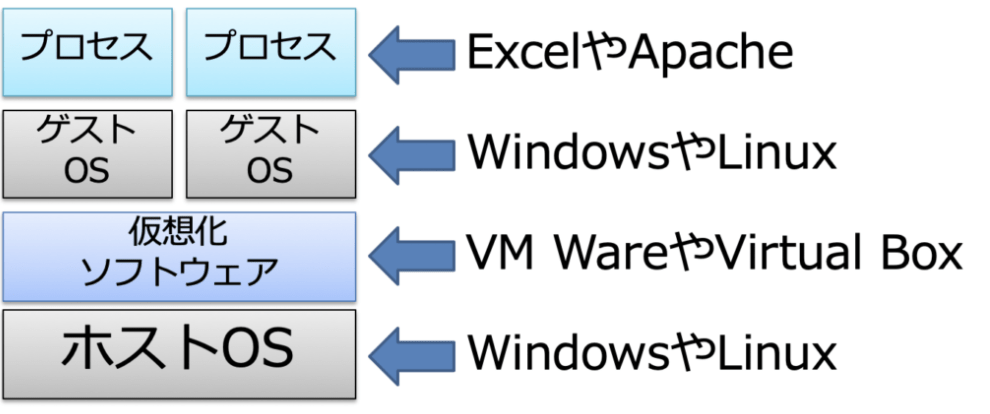
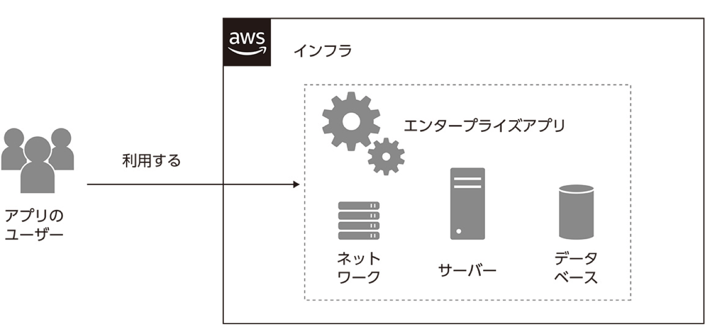
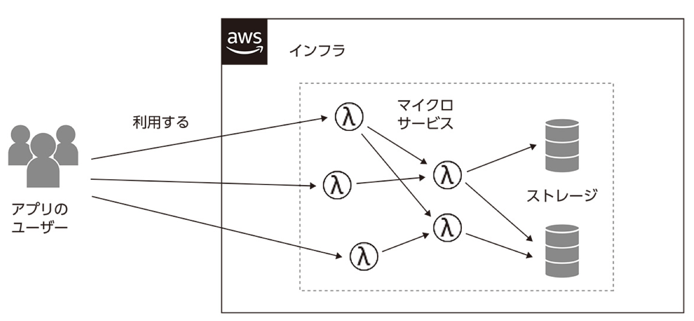

# infrastructure

インフラ関連のためのディレクトリ

---

仮想化とコンテナーーの違い

大前提
**ipアドレス127.0.0.1(localhost)はは仮想環境外部からはアクセスできない。**

## 仮想化

## コンテナーー

ホストOS →（コンテナーで区切られた）プロセス

コンテナーはコンテナー内のプロセスやライブラリを通してホストのOSのカーネルを使っている

## エンタープライズアプリ

エンタープライズアプリとは、サーバ・DB・ネットワーク機器などを組み合わせて作られた、1つの大きなシステム
**会社内で使われる業務システムや、LAMP(Linux/Apache/MySQL/PHP)などの比較的古い技術で作られたwebアプリなどが当てはまる**

## サーバーレスアプリ

**アプリを動作させるインフラをAWSの機能ですべて管理する仕組みのこと。**
サーバを安定させて稼働させたり、急な負荷に対する性能を向上させたりすることが自動で行われる。
**このようなシステムは、大人気アーティストのライブチケット販売や、選挙期間中の期間限定サイトなど、短期間で大量のユーザに利用してもらうようなサービスを構築するときに使われる。**
