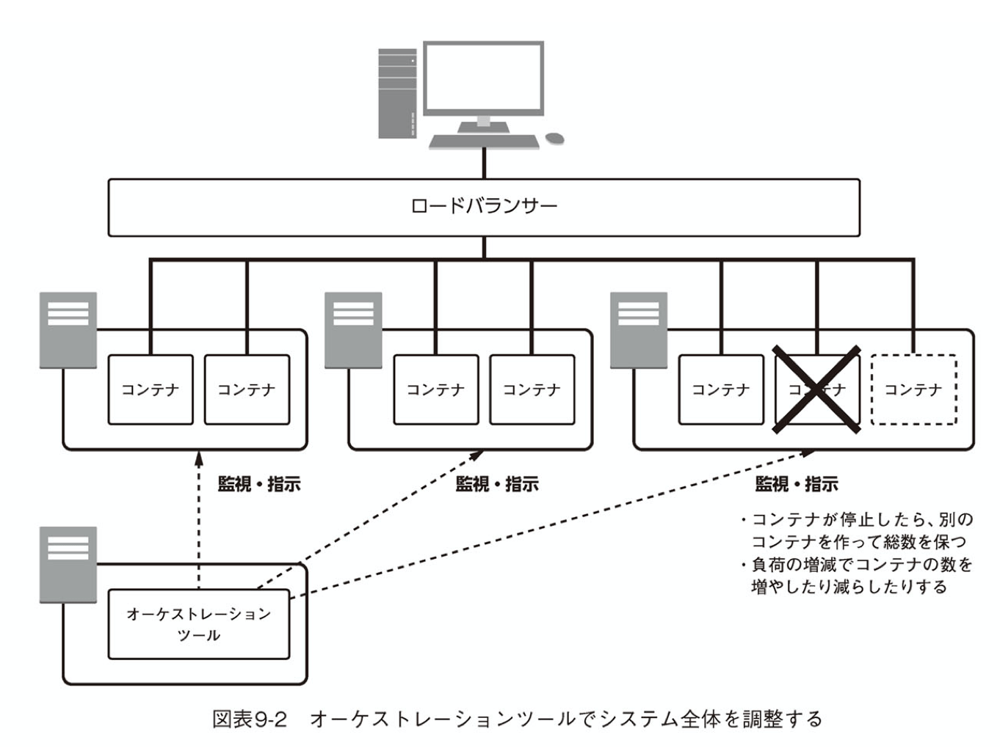
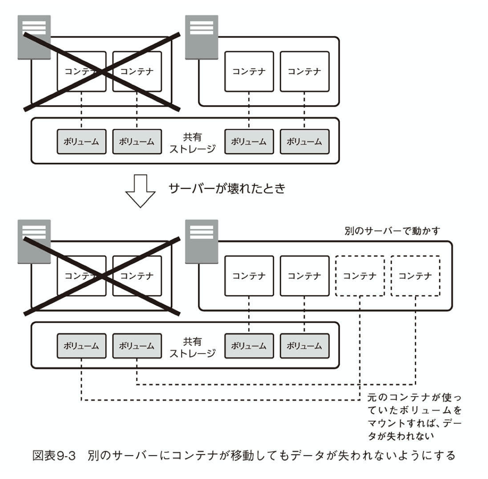
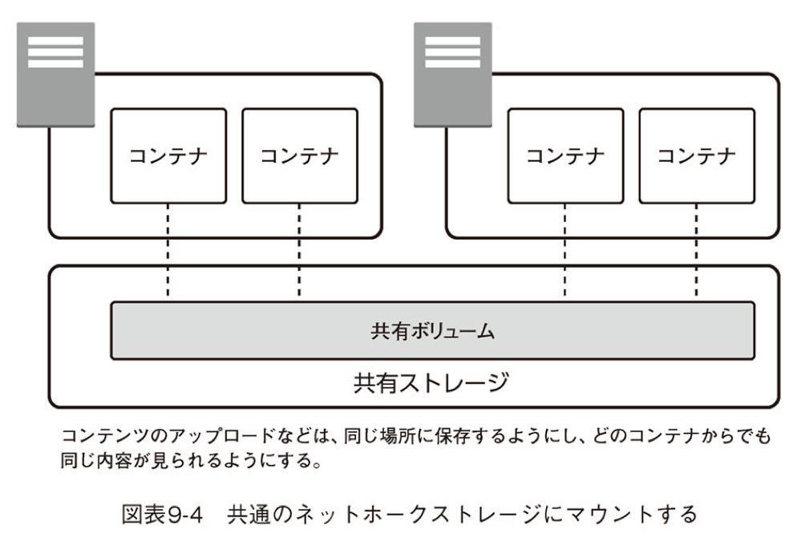
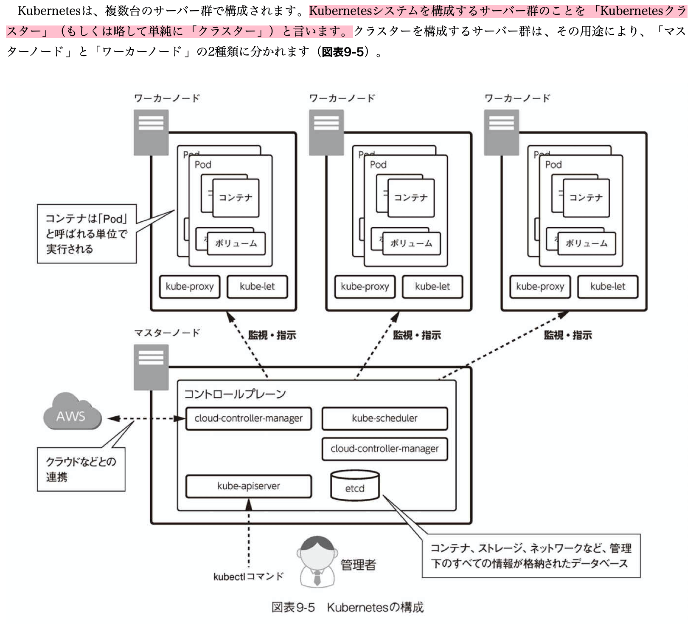

# kubernetes

綴が長いことから略してk8s(8はubernete)という8文字の意味

従来の仮想化とは異なるアプローチのシステム構築方法であり、使い方によっては開発工数や運用工数の削減に大きく貢献する。
kubernetesの基礎技術としてあるのがコンテナ

>コンテナとはプロセスの実行空間を隔離するための技術

コンテナを本番サーバで使うときは、様々な運用上の工夫が必要。
例えば

- 障害が生じても止まらないようにするための冗長性
- 負荷が高まっても耐えられるようにするスケーラビリティ
- データを失わないためのバックアップ
- システム更新時の入れ替え
など

**こうした運用を手助けするのがKubernetes**

## kubernetesの状態

**理解すべきはkubernetesは自律的なシステムであり、コンテナを作る、ネットワークを作るなど1つずつ命令するような使い方を想定していない。**
kubernetesはkubernetesクラスター全体の状態をetcdというDBで管理しており、そのDBの状態を変更することで構成を変更するやり方をする。

## コンテナの本番運用

コンテナの本番運用は開発の時と、考え方が大きく異る
使いやすさよりも、堅牢性が第一に求められる。

## オーケストレーションツールの構成

上記の構成では実際にはなくなったり新しく作られたりしている点に注意。
コンテナの中にデータを保持するような仕組みはNG
コンテナが障害を起こしてなくなればそのコンテナの中のデータを失われる。
コンテナの外にデータを出す必要があるが、バインドマウントやボリュームマウントでは2つの側面が解決しない。
**これらの解決にはサーバ間で共有できるストレージが必要。**
※AWSで共有ストレージを作成するにはS3やEBSを使うことができる。

