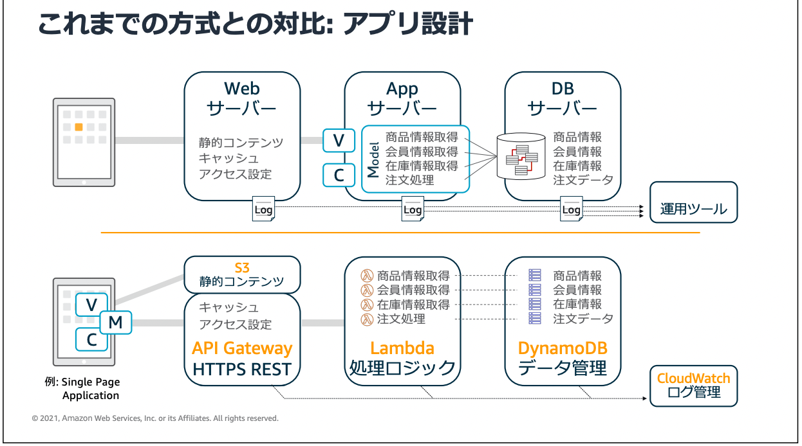
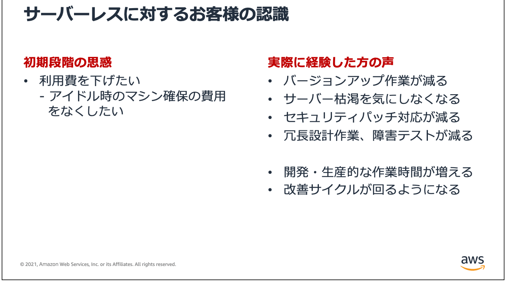

# サーバーレス

[AWS サーバーレスおさらい](https://d1.awsstatic.com/serverless-jp/seminars/20210909_Serverless_session1.pdf)

- サーバレスとは
サーバーがない ×
サーバーの存在を意識しない ◯

簡潔にいうと**常時起動しているサーバーを使わずにアーキテクチャ（仕組み）が実現できている状態**というニュアンスが近い
メリットとしては、常時起動サーバーがなくなり、以下のサーバーあるあるの問題がなくなること

**サーバー確保型**
- 処理量を予測して環境を確保しないといけない
- 確保分の課金
- 使わない時は(意識して)解放
- 自分で冗長化

**サーバーレス**
- 処理要求に応じて自動で環境を確保
- 負荷なし = ゼロ課金
- ms単位の実行時間課金(AWS Lambda)
- 自動で冗長化

サーバーを常時起動している場合、使用していない時間も料金がかかる問題
起動しているサーバーは、誰がメンテナンスするの問題
サーバー設定担当者によって構成が微妙に違うので、デプロイしたらコードが動かない問題
重複しますが、そんなサーバー関連の問題を減らすことができる「サーバレスアーキテクチャ」をお手軽に構築できるのが、「Serverless Framework」となります。

**サーバレスに対するゆ**

---

## Serverless Frameworkについて

[参考URL](https://serverless.co.jp/blog/25/)
[こちらがわかりやすい](https://service.plan-b.co.jp/blog/tech/30863/)

## Serverless Framework install から deploy

[参考URL(リファレンス？)](https://serverless.co.jp/blog/25/)
[参考URL(こちらのがいい)](https://qiita.com/sugo/items/c9de09421fe8d78f5fbd)

1. serverless install
`$ npm install -g serverless`

2. プロバイダーアカウントのセットアップ
プロバイダーとは要はどのクラウドサービスを使用して、Serverlessを動かすかということ。
AWS, GCP, Azureなど様々なクラウドプロバイダーに対応している。

AWSデプロイするためには？
[AWS setup方法](https://www.serverless.com/framework/docs/providers/aws/guide/credentials)

要は以下を実施すればいい
- Serverless用のIAMユーザを発行
- IAMユーザにAdministratorAccessの管理ポリシーを与える

デプロイするのにアクセスキーIDとシークレットアクセスキーが必用なため、それを作成。
IAMユーザー追加して、「AdministratorAccess」のポリシーを付与。
AWSマネジメントコンソールからぽちぽちしました。

厳密には以下のような状態になってます。

グループ作成
グループに「AdministratorAccess」のポリシーを付与
IAMユーザー作成
グループにユーザーを追加

## Serverless Framework

ServerlessはNode.jsで作られたCLIツール
Serverless Framework（サーバーレスフレームワーク）は、Node.jsを使用して記述された無料のオープンソースWebフレームワークである

**Serverless Frameworkでは、Lambda Functionで使用する周辺リソース（S3,SQS(Amazon Simple Queue Service)など）も同時にデプロイ管理することができます。手動で作成した既存のリソースも使用しても問題ありません**

## Serverless Frameworkが台頭した理由

AWSのLambdaが登場したことによりサーバーレスのアプリケーションが注目された。
そのため、LambdaとAPI Gatewayさえ準備すれば、完全サーバーレスが作成される。
Lambdaの管理が煩雑になり、その管理を担う形でフレームワークとして台頭した。

## Serverless Framework セットアップ

プロバイダーのアカウントをセットアップする。
プロバイダーとは、要はどのクラウドサービスを使用してServerlessを動かすか。
AWS, GCP, Azure, IBM Cloudなど様々なクラウドプロバイダーに対応している。

## 各プロバイダーによって

Amazon Web Servicesの一部としてAmazonが提供するサーバーレスコンピューティングプラットフォーム「AWS Lambda」で、アプリケーションを構築するために開発されたその最初のフレームワークである。 現在、サーバレスで開発されたアプリケーションは、Azure FunctionsでマイクロソフトAzure、Apache OpenWhiskを基盤とするIBM Cloud FunctionsでIBM Bluemix 、 Google Cloud Functionsを使用するGoogle Cloud Platform(GCP) 、 OracleのFn[1] を使用するOracle Cloud 、Kubernetesを基盤とするKubeless[※ 2] 、Spotinst 、およびAuth0によるWebtask、など他のFunction as a serviceのプロバイダーに展開する事（デプロイ[※ 3]）も可能である[2]。

サーバーレスアプリは、単にいくつかのタスクを実行するための2つのラムダ関数か、または数百のラムダ関数で構成されるバックエンド全体に過ぎない可能性がある。 サーバーレスは、選択したクラウドプロバイダー内で提供されるすべてのランタイムをサポートする。
サイト「Serverless」はAusten Collins [3]によって開発され、フルタイムのチームによって維持されている。

## Serverless Framework の単位

サービスという単位で実行環境を作っていく。

---

## サービスの作成(Lambda)

サーバレスフレームワークはサービスという単位で実行環境を作成していく
AWSをプロバイダーとしてNode.jsでサービスを開設する場合は以下の手順になります。

`$ $ serverless create --template aws-nodejs --name my-special-service --path my-special-service`

すると、my-special-serviceのディレクトリが作られ、その配下に以下のファイルが出来ているはずです。
これでサービスの作成は完了です。

serverless.yml
handler.js
event.json

## serverless.yml

各サービス全体の設定を行うためのファイル
AWSでは以下のような設定が可能

サービス内のLambdaファンクション群の設定
Lambdaに設定されるIAMロールの設定
デプロイ時にどのファイル/ディレクトリを含めるか/含めないかの設定 →**これ今回に必用**
使用するプラグインの定義
Lambdaファンクションごとのトリガーとなるイベントの定義
Lambdaファンクションが他のAWSリソースを連携する場合は、そのIAMを含めた定義
まずは、serverless.ymlの設定をしてあげましょう。もろもろサービスを実行するために必要な設定はすべてこのファイルで行います。

## handler.js

これはファンクションを定義するためのスケルトンとして生成されるファイルです。これを参考に実際のファンクションのプログラムを作っていきます。

## event.json

ServerlessのCLIでファンクションを実行する際に入力値となるデータを定義するファイルです。Lambdaファンクション内でevent変数に展開されます。

