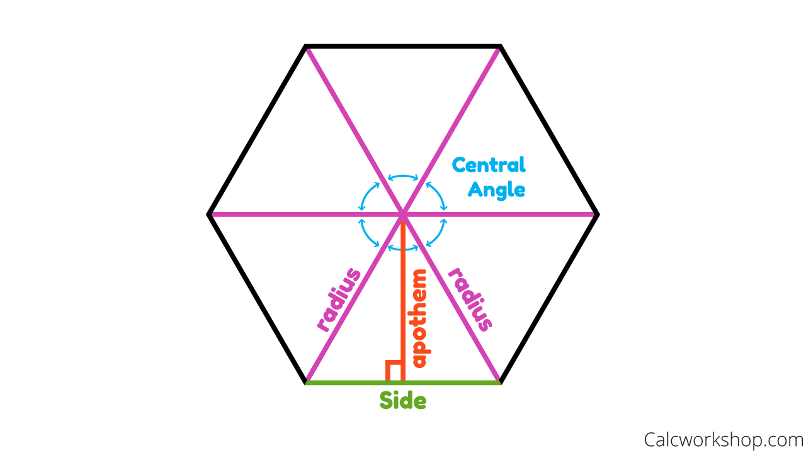

# mathematics

和訳集

radian(ラジアン) = 角度の単位
radius(ラディウス) = 半径
apothem(アポテム) = 辺心距離
[apothem難しいためwiki](https://ja.wikipedia.org/wiki/%E8%BE%BA%E5%BF%83%E8%B7%9D%E9%9B%A2)
シータ（Θ／θ／theta）= 数学で多くの角度を表す記号
コサイン = 余弦(よげん) : 直角三角形における、角と直角とに挟まれる辺の長さの、直角に相対する辺の長さに対する比。余弦を導く三角関数はコサイン (cos)。

## サイン・コサイン・タンジェント

[参考URL](https://kou.benesse.co.jp/nigate/math/a14m0313.html)

sinø
cosø
tanø

## 数学関数

`Math.con()`
