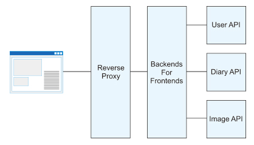

# BFF(Backends For Frontends)

## BFF(Backends For Frontends)とは

名前の通り、フロントエンドのためのバックエンド
フロントエンドのためにAPIをコールしたり、HTMLを生成したりするサーバのことを指す。
上記だと、今までのWebアプリケーションサーバと何が違うのかと思うが、本質的にはそこまで変わらないがフロントエンド専用という役割が異なる。

専門領域に特化させることで集中できるようにするアーキテクチャ設計のことを**BFFとよぶ**

## Webアプリケーションサーバの役割

- データベースや全文検索エンジンといったミドルウェアからデータを取得、更新する
- ページを構築する
- HTTPのインターフェースとしてユーザからの入力情報を得る
など
ここで、データベースや全文検索エンジンからデータを取得、更新する部分はデータの整合性や信頼性を担保しつつ管理することを目的とします。ページを構築する箇所やユーザーからの入力情報を得る箇所はユーザーインタフェース（UI）に該当し、ユーザー体験（UX）を向上させることを目的としています。

## BFFの構成

