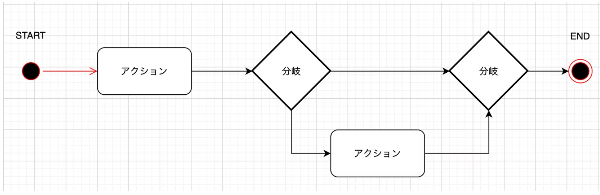

# 図について記す

[状況によって使い分ける構成図](https://qiita.com/e99h2121/items/eaca084ae7b0488ab686)

## PlantUML とは

以下のような図をテキストで素早く描くためのオープンソースプロジェクト。

シーケンス図 / Sequence diagram
ユースケース図 / Usecase diagram
クラス図 / Class diagram
アクティビティ図 / Activity diagram
コンポーネント図 / Component diagram
状態遷移図 / State diagram
オブジェクト図 / Object diagram

## PlantUML 必用なもの

PlantUML の実行には、Javaの実行環境が必要。

[使い方ガイド](https://zenn.dev/wtkn25/articles/vscode-plantuml)
[使い方ガイド(基本の書き方)](https://zenn.dev/msksgm/articles/20211218-robustness-with-plantuml-vscode)

---

ここからは各図について説明する
※大事なのは全部を使うのが正解というわけではなく、そのプロジェクトに応じて使うものとのこと。

[各図についての参考](https://qiita.com/mumucochimu/items/e97a03217588f4101849)

## UML(Unified modeling Langurage)

共有することの難しさを毎日感じてる場合、UML図を記載すると捗る可能性がある
このような記法を統一したものをUMLというそう

|    名前    |   説明  |
|    ---    |     --- |
| クラス図   |  クラスの定義、関連付けなどのクラス構造をあらわす  |
| オブジェクト図  | インスタンス(オブジェクト)の具体的な関係をあらわす   |
| パッケージ図   |  クラスなどがどのようにグループ分けされているかをあらわす   |
| コンポーネント図 |  処理を構成する複数のクラスを1つのコンポーネントとみなし、その内部構造と相互関係をあらわす |
| 複合構造図 | 複数クラスを内包するクラスやコンポーネントの内部構造をあらわす  |
| 配置図    | システムを構成する物理的な構造をあらわす  |
| ユースケース図 |  利用者や外部システムからの要求に対してシステムがどのような振る舞いをするかをあらわす   |
| アクティビティ図 | システム実行時における一連の処理の流れや状態遷移をあらわす。フローチャート    |
| 状態マシン図 |  イベントによって起こるオブジェクトの状態遷移をあらわす   |
| シーケンス図 |  オブジェクト間のやりとりを時系列にそってあらわす   |
| コミュニケーション図 | オブジェクト間の関連とそこで行われるメッセージのやりとりをあらわす    |
| 相互作用概要図 | ユースケース図やシーケンス図を構成要素としてより大枠の処理の流れをあらわす    |
| タイミング図 |  オブジェクトの状態遷移を時系列であらわす   |

## アクティビティ図

アクティビティ図はシステム実行時における一連の処理の流れや状態遷移をあらわす。フローチャートのようなもの

## シーケンス図

シーケンス図はオブジェクト間のやりとりを時系列にそってあらわすもの

オブジェクトごとに上から下に時系列になっています。矢印は形の違いで意味がある。
ツールとして一番有名なのはdrawio
