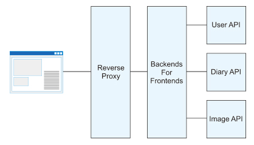

# BFF(Backends For Frontends)

[参考URL](https://atmarkit.itmedia.co.jp/ait/articles/1803/12/news012.html)

## BFF(Backends For Frontends)とは

名前の通り、フロントエンドのためのバックエンド
**フロントエンドのためにAPIをコールしたり、HTMLを生成したりするサーバのこと**を指す。
上記だと、今までのWebアプリケーションサーバと何が違うのかと思うが、本質的にはそこまで変わらないがフロントエンド専用という役割が異なる。

専門領域に特化させることで集中できるようにするアーキテクチャ設計のことを**BFFとよぶ**

## Webアプリケーションサーバの役割

- データベースや全文検索エンジンといったミドルウェアからデータを取得、更新する
- ページを構築する
- HTTPのインターフェイスとしてユーザからの入力情報を得る
など
ここで、データベースや全文検索エンジンからデータを取得、更新する部分はデータの整合性や信頼性を担保しつつ管理することを目的とします。ページを構築する箇所やユーザーからの入力情報を得る箇所はユーザーインタフェース（UI）に該当し、ユーザー体験（UX）を向上させることを目的としています。

## BFFの構成

BFFはリバースプロキシとバックエンドのAPIサーバの間に設置する構成をとることが多い。
リバースプロキシは静的アセットファイルの圧縮。キャッシュといったWebアプリケーションサーバの肩代わりをするためのサーバ。
バックエンドのAPIサーバは主にデータベースや全文検索エンジンといったミドルウェアと連携してリソースを操作したりデータを管理したりする役割として振る舞う。

**BFFはこの2つのサーバ間でページを構築したり、ユーザからの入力情報を受け付けてバックエンドに流したりといったUI/UXに関わる機能を担当する。**

## BFFが必要な技術的背景、歴史的経緯

なぜBFFが必要なのかを知るためにはアプリケーションの内部構造が時代とともに変化し続けているという背景

- リバースプロキシとは
リクエストの流れはプロキシと同様で、クライアント → リバースプロキシ → Webサーバのように伝わる。
リバースプロキシでは**クライアントはWebサーバの存在を知らないという大きな違いがある。**