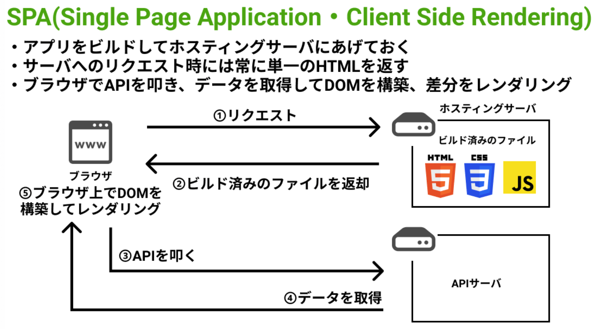

# SPA

近年台頭してきたSPA技術。

上司にメリットを伝えられないためまとめる

## SPA 仕組み

ブラウザから初回リクエストが来ると、サーバはJSのビルドファイルと最小限のHTMLファイルを返却する(HTMLはほぼ空)
そこでブラウザ上のJSがAPIを叩くことで、APIからのレスポンスをもとに初期表示との差分を更新する形でDOMを構築しHTML要素がレンダリングされる。
**※返ってくるHTMLファイルは単一のためSingle Pageと呼ばれている。**
**後述するSSRと対比してClient Side Renderingと呼ばれることも**



ホスティングサーバはS3の場合もある。

## SPAメリット

ネイティブアプリの代わりとして提供可能(PWA対応など)
ページ遷移が高速(ページごとにリクエストを送らないため)

## SPAデメリット

1. 初期ローディングは時間がかかる。
クライアント側ですべてのDOMを構築するとJSのダウンロード → DOM構築と、クライアント側での処理時間が長くなる傾向がる。

2. SEOで不利な可能性もある(初期状態はほぼ何もないHTMLファイルが返却されるため、Googleクローラが中身のコンテンツを認識できない可能性があるため)

## SPA = CSR(クライアントサイドレンダリング)

まず大前提でNuxtやReactなどのJSで呼ばれる時、SSRとCSRの処理に分かれる

CSR ブラウザで動作する部分

以下例
```html
<p id="mode"></p>
<script>
  var target = document.getElementById('mode')
  if (target != null) target.innerHTML = 'csr'
</script>
```

nuxt.jsでいうと、mounted()は
