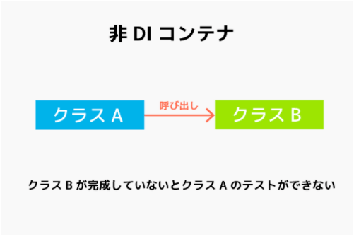
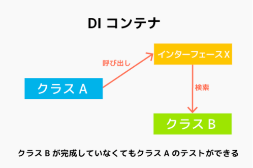

# Object指向

オブジェクト指向とは簡単に言うとクラス内に処理なども追加している
**厳密にはJavaで言うDTOなどはオブジェクト指向とは言わない**

## DI/DIコンテナ

- DI(Dependency Injection)とは 訳：依存性の注入

[参考URL](https://qiita.com/hinom77/items/1d7a30ba5444454a21a8)

Dependency(依存性と訳していた)部分は英語ではオブジェクトのこと。
>つまりDIとは、依存性の注入ではなく、オプジェクトの注入。
>オブジェクトの生成時に他のオブジェクトを注入している形式であることから、Depencency Injection(オブジェクトの注入)と言われる

**もうひとつわかりやすい**
クラス同士を疎結合にして、実データは外部へ出す
→一体何のために？
**クラスの単体テストをしやすくするため**

DI：パターンの一つ

DIコンテナ：DI実現をお手伝いするためのフレームワーク

## DI 本当の使い所

[参考URL](https://www.ulsystems.co.jp/topics/025)

- DIアンチバターン
サービスロケーターパターンはDIの実装としてはやるべきではないとされている。

- DIコンテナのメリット
あるオブジェクトのインスタンスを生成する際に、そのオブジェクトが必要とする他のオブジェクトのインスタンスを生成する手間がなくなる

- 自分の中での使用方法

オブジェクト指向の時に必要となるのか？？

**DI With Test**

下の図のようにクラスAの中でクラスBを呼び出しているとき、クラスAがクラスBに依存しているという
この場合、クラスAが出来上がって単体テストをしたくてもクラスBができていないとそれができない

DIを使った場合
インターフェースがモックの代わりになり、実データ(=リテラル)をクラスBに外出ししている。

昔は実データをXMLファイルに描いていたが、脱XMLのトレンドからすれば今はインターフェースに任せるのがスマートなやり方。

このDI機能はJUnitでも使えるためテスト駆動開発の場合でも導入ができる。

