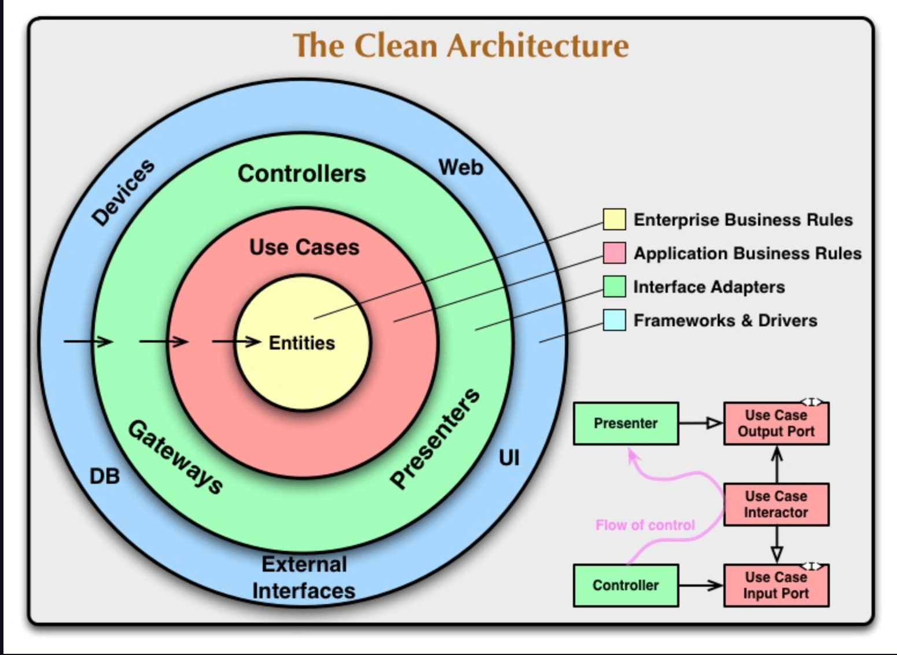

# Clean Architecture

[参考URL(これはやばい)](https://gist.github.com/mpppk/609d592f25cab9312654b39f1b357c60)

クリーンアーキテクチャはRobert C. Martin(Uncle Bob)が2012年に提唱した、**DBやフレークワークからの独立性を確保するためのアーキテクチャである**

前節のレイヤードアーキテクチャが提案されて以降も、ヘキサゴナルアーキテクチャ、オニオンアーキテクチャなどが提案されてきました。これらのアーキテクチャで用いられる用語は異なりますが、目指すところは同じであるとクリーンアーキテクチャ（The Clean Architecture）では述べられている。

>これらのアーキテクチャはどれも細部は異なるけれども、とてもよく似ている。これらはいずれも同じ目的を持っている。関心の分離だ。これらはいずれも、ソフトウェアをレイヤーに分けることによって、関心の分離を達成する。どれも、最低ひとつは、ビジネスルールのためのレイヤーと、インターフェイスのためのレイヤーがある。

クリーンアーキテクチャは、これらのアーキテクチャを単一の概念に無理なく統合する試みです。

関心の分離により、以下が実現できる

1. フレームワーク独立。アーキテクチャは、機能満載のソフトウェアのライブラリが手に入ることには依存しない。これは、そういったフレームワークを道具として使うことを可能にし、システムをフレームワークの限定された制約に押し込めなければならないようなことにはさせない。
2. テスト可能。ビジネスルールは、UI、データベース、ウェブサーバー、その他外部の要素なしにテストできる。
3. UI独立。UIは、容易に変更できる。システムの残りの部分を変更する必要はない。たとえば、ウェブUIは、ビジネスルールの変更なしに、コンソールUIと置き換えられる。
4. データベース独立。OracleあるいはSQL Serverを、Mongo, BigTable, CoucheDBあるいは他のものと交換することができる。ビジネスルールは、データベースに拘束されない。
5. 外部機能独立。実際のところ、ビジネスルールは、単に外側についてなにも知らない。 -- クリーンアーキテクチャ(The Clean Architecture翻訳)

