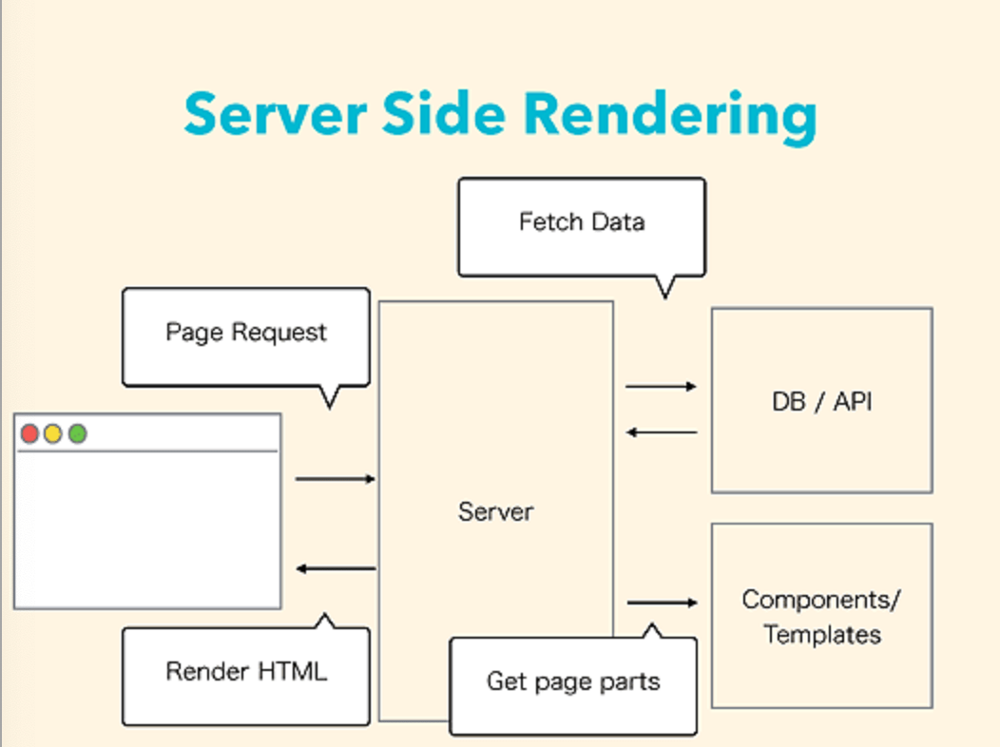
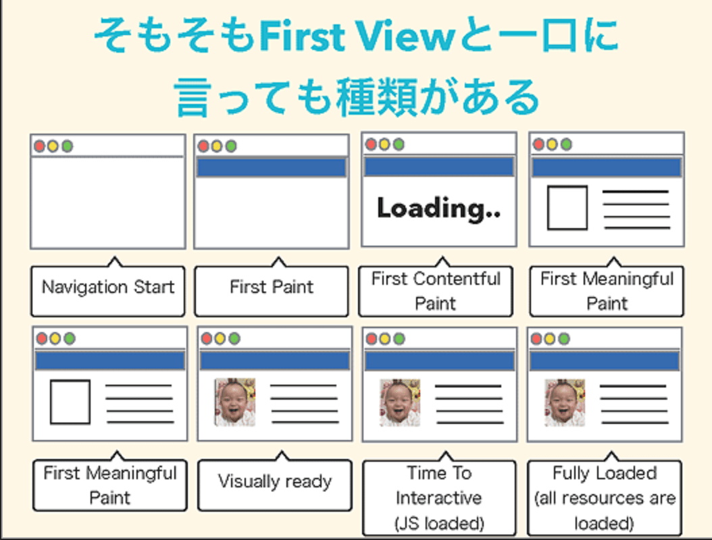
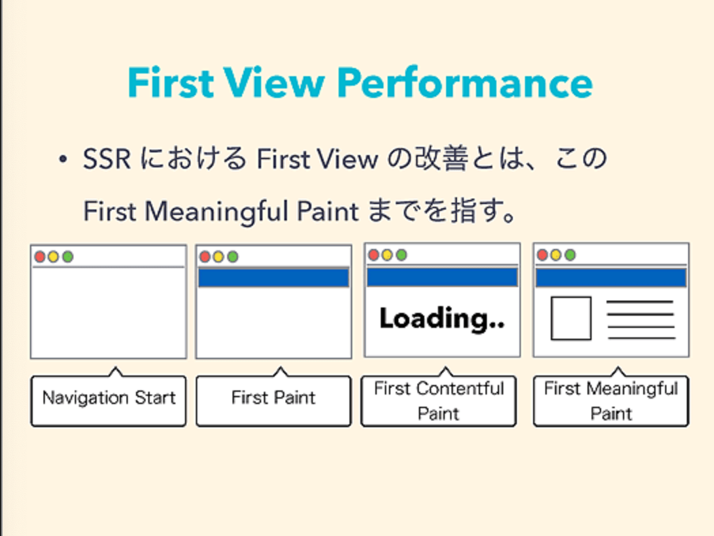
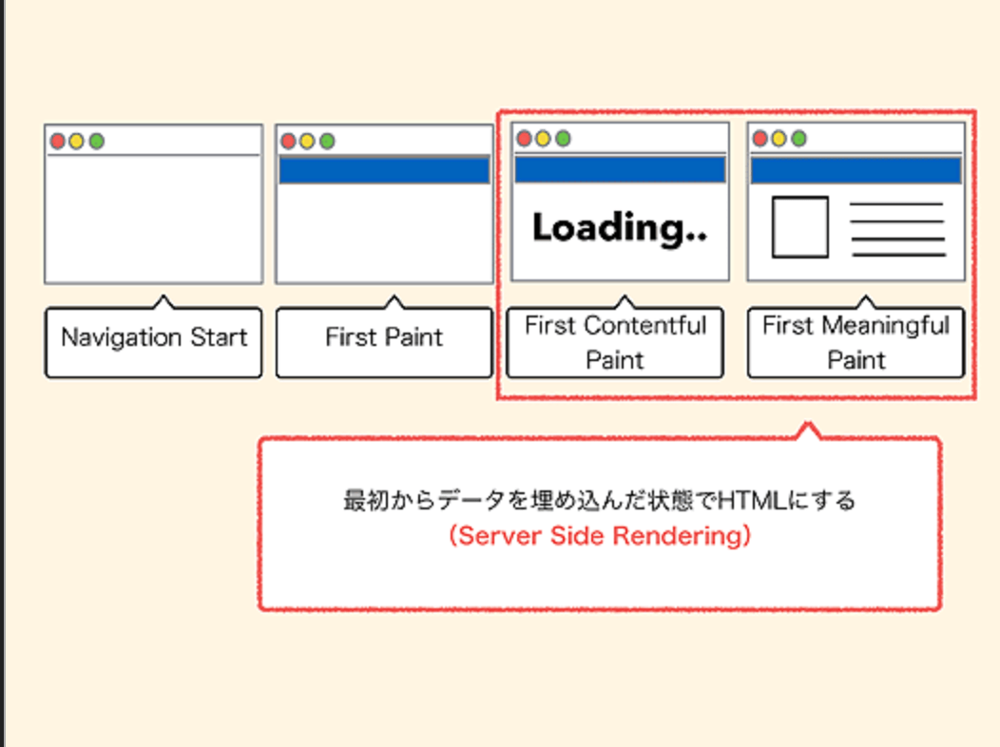

# SSR

[参考URL(前編)](https://www.publickey1.jp/blog/17/server_side_renderingserver_side_rendering_ng-japan_2017.html)
[参考URL(後半)](https://www.publickey1.jp/blog/17/server_side_renderingserver_side_rendering_ng-japan_2017_1.html)

## まずServer Side Renderingとは

ブラウザの動きを見ると、図の左にあるブラウザからサーバーへリクエストが出て、それがサーバーへ到達すると、その裏にDBがあり、DBから値をとってきたらコンポーネントやテンプレートエンジンなどを使ってHTMLにしてブラウザへ返すという動き。

それに伴い、**AngularやReactなどもブラウザの中にこれまでサーバー側で動いていたHTMLを構築するための仕組みが入ってくる**

例
PHPではサーバ側でPHP処理を行いHTMLを構築しブラウザに渡す。
`
<?php echo 'ssr'; ?>
`といった書き方をするとサーバー側で`
ssr
`に置き換えてブラウザに渡るイメージです。

## なぜServer Side Rendiringが必要なのか: SEO

Googleの中の人が、AngularやReactなどのJavaScriptフレームワークを使ったサイトでは、**プリレンダリングつまりServer Side Renderingを推奨する、**という記事が海外SEOに出ている。

GoogleのクローラはJSを実行できるのだが、正確に実行できる保証はない。
だからSEOをちゃんとしたいのであれば、Server Side Renderingをしましょうとなっている。

## なぜServer Side Rendiringが必要なのか: パフォーマンスの改善

**Navigation Start** : ナビゲーションの開始で、それはサーバへリクエストが送られた段階。
**First Paing** : サーバーからデータが返ってきて、なにかレンダリングが始まる。これがFirst Paint
**First Contentful Paint** : ローディングインジケータみたいなのがぐるぐる回るとか、たいして意味はないけれどコンテンツが表示される。
**First Meaningful Paint** : 意味のある情報が表示されるようになる。
**Visually Ready** : 画像とかアセットと呼ばれるものが表示され、コンテンツが見やすくなっています。
**Time to interactive** : JavaScriptがロードされ実行されて、操作が可能になる。
**Fully Loaded** : いいね」ボタンなどのソーシャルボタンなんかはだいたい最後に読み込まれることが多いと思いますが、そこまでコンテンツが全部揃ったもの

じゃあServer Side RenderingにおけるFirst Viewのパフォーマンス改善とはどこを指すかというと、「Navigation Start」から「First Meaningful Paint」まで。
SSRにおけるFirst Viewの改善とはこのFirst Meaningful Paintまでを指す

Server Side Renderingでは、初期データを埋め込んだHTMLをブラウザに送信するので、First Contentful PaintからFirst Meaningful Paintのあいだをすごく短縮できる。

Server Side Renderingをやるというとそんなに簡単でもなかったりではない。

Server Side Renderingにも課題はいくつかあって、サーバでHTMLを生成するのはCPU負荷が高い処理になる。

だいたいブラウザでのレンダリングエンジンはAngularやReactなどJavaScriptで動いていることが多いので、それをサーバで動かそうとするとNode.jsを使うことになります。

