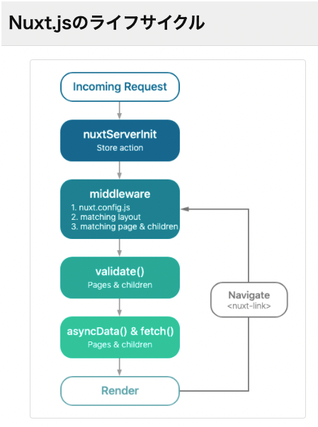
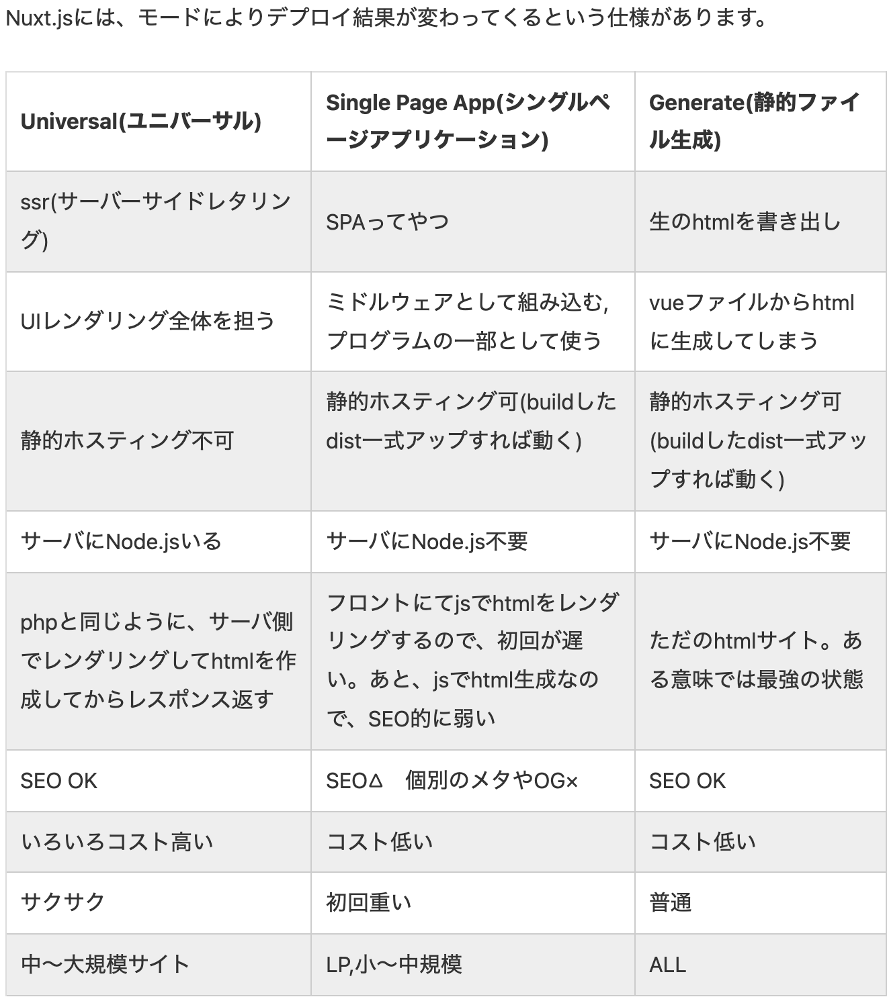

# Nuxt

[nuxt lifesycle](https://qiita.com/too/items/e8ffcf7de7d48dcb9a9b)

Nuxt.jsでSSRを使う場合は、
初回の描画時はSSRとCSR
それ以降の再描画時はCSRのみ

SSRについて
>SSRはNuxt.jsが提供している機能だと思っていましたが、大元は vue-server-render が提供しているのですね。だからVue.jsのドキュメントにもSSRについての記載があります。困ったらまずは公式ドキュメントに立ち戻るのが、やっぱり早道ですね。


## Nuxt 導入に必要なサーバ要件について

[サーバ要件](https://qiita.com/kaketechjapan/items/af5524f2bed5238aefcd)

## NuxtにおけるSSR・SSG・SPAの設定方法

Nuxtはnuxt.config.jsのmodeプロパティとtargetプロパティによってアプリケーションのモードが管理されている(SPA or SSR or SSG)

## Nuxt 各コマンドについて

[各コマンド参考](https://nishinatoshiharu.com/nuxt-build-generate-befavior/)

- dev
devコマンドはtargetの設定値に影響せず同じ仕様

- start
startコマンドはサーバーを立ち上げるが、targetの設定値によって、読み込むディレクトリが異なる
nuxt start ; 静的なホスティング(Netlify, Vercel, Surge など)のように dist/ディレクトリを提供し、デプロイ前のテストに最適です。

- build
アプリケーションをWebpackでビルドし、JSとCSSをミニファイするコマンド
ビルドファイルの出力先は.nuxt配下
**buildコマンドはtarget: server専用**

- generate
静的ウェブサイトへデプロイする静的ファイルを生成するコマンド
静的ファイルの出力先はdist配下
**※generateコマンドはtarget: static専用**
静的ウェブサイトのホスティングサービスではNetlifyやAmazon S3などが有名

## 運用

- SSR
SSRでアプリケーションを運用する場合、nuxt buildでファイルをビルド後、nuxt startでNuxtアプリケーションをサーバー上で起動という流れ。

- SSG or SPA
nuxt generateで静的ファイルを生成後、静的ウェブサイトにアップロードするという流れになります。

## Props

setupで渡されてくるpropsを分割代入してはいけない

```js
// NG
setup({foo}) {
  // foo を使う
}
// OK
setup(props) {
  // props.foo を使う
}

```


## Nuxt2と3の違い(非同期関数について)

[参考URL](https://zenn.dev/coedo/articles/cc000738a0f069)
[参考URL2](https://zenn.dev/kawahara/scraps/38cc622c73f27a)

ちなみに自分のプロジェクトではNuxt2で使われている。

>Nuxt 2 では Options API の asyncData() や Composition API の useAsync(), useFetch(), useStatic() などを使用し、おもに SSG などにおいて画面描画に必要なデータを非同期に取得するといった使い方をしてきました。
>Nuxt 3 ではそれらが新たに useFetch() と useAsyncData() のふたつにアップデートされています。
（くわえてデータ取得時に画面描画をブロックしない useLazyFetch() と useLazyAsyncData() も加わりました）

**Nuxt2**
Options API の asyncData() や Composition API の useAsync(), useFetch(), useStatic()

### asyncData()

ページがロードされる前に(Vueインスタンスが作成される前)に呼び出される関数で、通常API呼び出しなどの非同期処理を記述する


### useAsync() Options APIベースで言うとasyncDataでやっていたことに対応する場合

@nuxtjs/composition-api にあるuseAsync は、setup() 時に呼ぶ関数で、SSR時はサーバサイドで情報を取得し、SPA時にはページ遷移時に呼び出したいものを用意できるという代物。

**useAsync の利用上の注意**
asyncDataのようにuseAsyncはサーバサイドでロードされ、結果をHTMLに書き出す挙動になっている。
**このためクライアントでは再実行されなくて済む**

```js
// サーバでクライアントでもFunctionがコールされてしまう NG
setup() {
    useAsync(async () => {
      await someFunction()
    })
  return {}
}
// SSR及び画面遷移したクライアントでのみ呼ばれる OK (1)
setup() {
  useAsync(async () => {
    await someFunction()

    return true
  })
  return {}
}

// SSR及び画面遷移したクライアントでのみ呼ばれる OK (2)
const foo = useAsync(() => someFunction())
return {foo}
```

### useFetch

useAsyncとは別に単純に非同期な関数をSSR時と画面遷移時に実行したいという目的のためにuseFetchが存在するが、これはcomputedと同時に利用しようとするとエラーが発生する
非常にやっかみのある問題である。。解決としては現状は、、useFetch を使いたい場合は computed を使わないか、 useAsync を使うということになりそうだ。


----


**Nuxt3(アップデートされている)**
useFetch() と useAsyncData()
加えて、データ取得時に画面描画をブロックしないuseLazyFetch()と、useLazyAsyncData()も加わった。

**今後 Page Component は、いわばページレイアウトを記述するだけのラッパー的な存在になっていくかもしれません。**

## Nuxt処理順序

[参考URL(これはやばい)](https://www.japon-line.co.jp/tech/post/nuxt-js%E3%81%AEssr-csr%E5%87%A6%E7%90%86%E3%81%AB%E3%81%A4%E3%81%84%E3%81%A6/)

まず大前提でNuxtやReactなどのJSで呼ばれる時、SSRとCSRの処理に分かれる
CSR : ブラウザで動作する部分

以下例
```html
<p id="mode"></p>
<script>
  var target = document.getElementById('mode') // CSR
  if (target != null) target.innerHTML = 'csr'
</script>
```

SSR(Server Side Rendering) : サーバーサイドレンダリング
CSR(Client Side Rendering) : クライアントサイドレンダリング

処理順序（上から順に処理されます）
**ここからSSR**
nuxtServerInit（SSR）
plugins（SSR）
middleware（SSR）
asyncData（SSR）
fetch（SSR）
beforeCreate（SSR）
created（SSR）CSRでも呼ばれる
**ここからCSR**
plugins（CSR）
beforeCreate（CSR）
created（CSR）
beforeMount（CSR）
mounted（CSR）

内部ナビゲーション時(nuxt-link)
**上記以外の画面遷移時には、CSRの処理のみが走ります。**
pluginsは動かないため、どのページに遷移しても共通の処理を行いたい場合はmiddlewareなどを検討しましょう。

処理順序（上から順に処理されます）
middleware（CSR）
asyncData（CSR）
fetch（CSR）
beforeCreate（CSR）
created（CSR）
beforeMount（CSR）
mounted（CSR）

## どちらを使うか明記させる

created()はSSR, CSRどちらでも呼ばれる。
そのためどちらか明記させないといけない。
以下は例

```js
created() { // or mounted()
  if (process.client) { // ここで明記
    const target = document.getElementById('mode')
    if (target != null) target.innerHTML = 'csr'
  }
}
```

## Nuxt.jsのライフサイクル(深堀り)

**初回アクセス時やリロード時には SSR処理とCSR処理がどちらも動作する。**
lugins と created（beforeCreate）が 2 回走る点に注意です。

- created
createdはVueインスタンスが作成された直後に呼ばれる関数で、Vueインスタンスの各種プロパティ、メソッドは利用できるがレンダリングが完了していないためElementは利用できな

- mouted
レンダリングが完了した直後に呼ばれる関数でElementへのアクセスも可能となる。
※なお子コンポーネントのレンダリング完了は保証されていない。

- mounted

- 初回アクセス時


## Nuxtで少しでもセキュアに情報を扱うためにできること


# Pluginsディレクトリで忘れてはいけないこと

初回アクセス時やリロード時には、SSR処理とCSR処理がどちらも動作する。
plugins と created（beforeCreate）が 2 回走る点に注意。

>認証系は middleware や plugins に記述することが多いかもしれませんが、middleware の場合は内部ナビゲーション遷移時は CSR 側でしか呼ばれないため、どちらの処理も書いておく必要があります。 plugins の場合は、内部ナビゲーション遷移時は呼ばれないので注意が必要。
**plugins の場合は、内部ナビゲーション遷移時は呼ばれないので注意が必要**


## 内部リンクとは(nuxt-link)

nuxt-linkを使用することでページをリロードすることなくページ固有の要素のみを追加でロードするだけで画面遷移を行うことができる。

[内部リンクと外部リンク共有化](https://hafilog.com/nuxt-link-and-atag)

## Nuxt注意点

まずはじめに、Nuxt.jsはSSRとCSRの境界が曖昧で、明確に分けて設計・実装することが慣れるまでは意外と難しかったりします。例えばcreated()はSSRでもCSRでもどちらでも動きますので、**createdで初期化処理をする際、初回アクセス時は2回同じ処理をしていることはご存知ない方もいらっしゃるかもしれません。**

## Nuxt.jsとは

Nust.jsはvue.jsのフレームワーク
>例えばNuxt.jsにはルーティングのVue Routerやデータ管理のVuex、HTMLのメタタグ管理のvue-metaなどのプラグインを使用するために必要となる設定が事前に行われているため細かな設定を行う必要がなくすぐに利用することができます。

Vue.jsとは違い、Nuxt.jsには静的サイトジェネレートという強力な機能がある。
Nuxtの静的化のための機能はOption APIで提供されていたがCompotion APIでの使い方はあまり解説記事がなかった。

[Nuxtでの静的サイトジェネレート作り方](https://ics.media/entry/210120/)

## nuxt ディレクトリ構成

[リファレンス](https://ja.nuxtjs.org/docs/2.x/get-started/directory-structure)

- pagesディレクトリ
pagesディレクトリにはアプリケーションのビューとルートが含まれている
Nuxt.jsはこのディレクトリ内の.vueファイルを全て読み込み、アプリケーションのルーターを作成する。

- componentsディレクトリ
componentsディレクトリにはページにインポートする全てのVue.jsのコンポーネントファイルを入れる
Nuxt.jsを使用すると作成したコンポーネントを.vueファイルに自動でインポートすることができる。
nuxt.config.js内のcomponentsをtrueに設定するとNuxt.jsがスキャンして自動でインポートしてくれる。

- layoutディレクトリ
layoutディレクトリのdefault.vueファイルを追加することで全てのpageに適用ができるデフォルトレイアウトを定義できる。
これは特定のレイアウトを持たない全てのページで使用される。
レイアウトに含める必要があるのは、ページコンポーネントをレンダリングする```<Nuxt />```だけ

- middlewareディレクトリ
アプリケーションミドルウェアが含まれている。ミドルウェアを使用すると、**ページまたはページのグループ(レイアウト)をレンダリングする前に実行できるカスタム関数を定義できる。**
共有ミドルウェアはmiddleware/ディレクトリに配置する必要がある。ファイル名はミドルウェアの名前になる```(middleware/auth.js)```はauthミドルウェアになる。

## Nuxtでの SPA・SSR・SSG とは

[URL](https://qiita.com/nishinoshake/items/f42e2f03663b00b5886d)

Nuxt.jsではSPA・SSR・SSGの中から好きなものを選んで開発ができる
**初期設定ではSSRで動作するようになっている**。

SPA・SSR・SSGでの仕組みは別pageを参照する。

---

## Vuexの導入方法

[参考URL](https://qiita.com/Takabun/items/e0b0c139ccf53c7bb561)

## Vuexについて

Vuexは**Vue.jsでグローバルでのデータの状態管理を行うことができるライブラリ**
Vuexは**これまでprops, emitを利用した親子間のコンポーネントでの状態管理の複雑さを解消するために用いられてきた。**
このライブラリによりどのコンポーネントからでも状態にアクセスしたり、アクションを実行することができる

## Vuexを使用するにあたっての弊害

・TypeScriptとの相性が悪い
・アーキテクチャが複雑で手軽に扱うことが難しい
・コンポーネントをテストすることが難しい

こういった課題を解決するためにVue.jsの2.2以降にprovide、injectといったDIを行うことができる関数が追加された

- DI 依存性の注入
依存性の注入とはコンポーネント間の依存関係をプログラムのソースコードから排除するために、外部の設定ファイルなどでオブジェクトを注入できるようにするソフトウェアパターンである。

## 今日のVuexとは

今までのVue2時にはVuex。しかしVue3ではprovide/injectを使ったステート管理が推進されている
しかしVuexを導入する場合は、Nuxt.jsで公式で推奨されているvuex-module-decoratorsを使用する

[参考URL](https://qiita.com/azukiazusa/items/a50b1ffe05d9937a4db0)

---

## composition APIとは

[参考URL](https://qiita.com/karamage/items/7721c8cac149d60d4c4a)

Vue3の目玉の機能としてComposition APIがある。
Compositionは構成(すること),組み立て(ること)という意味

- なぜComposition APIを使うのか
理由としてはロジックの抽出と再利用をするため。他にもTypeScript型強化などが理由に挙げられる

ロジックの抽出と再利用が必要な理由は
複雑に肥大化したコンポーネントを小分けにして関心事で分別し、クリーンな状態に整理するため
近年Vueを使用して大規模なプロジェクトを構築することが増えた。肥大化してメンテしにくいコンポーネントを目の辺りにしエンジニアが苦しむことがあった。

## composition apiが生まれた経緯

- 今までのVue
Vue2.xではコンポーネントをSFC(シングルファイルコンポーネント)ファイルに記述する
SFCにコンポーネントのView/状態/ロジックをまとめて閉じ込めて記述することできて便利だが
これ以上は分割ができないという欠点があった。
これを解決するのがComposition API

Composition APIによってコンポーネントのコードを整理する際に開発者により高い柔軟性を提供する。
コンポーネント間でロジックや状態を抽出して再利用することが簡単になる。

SFCに記述するのはViewの見た目に関することだけにして、ロジックや状態を外部に切り出せるようになる。

ただしComposition APIのベストプラクティスを今決めるのは時期尚早であり、手探りですすめる必要がある
つまりVueが管理している壁の中の世界から壁の外の無秩序な荒野へと放たれる
設計が重要になる。

Composition APIを使用するデメリットは設計やアーキテクチャを考えなければならない。
例えばクリーンアーキテクチャを理解して実装していくことが求められる

## composition APIにおいてのProviderパターン

[参考URL](https://qiita.com/karamage/items/4bc90f637487d3fcecf0)

- Providerパターンとは
VueにおけるProviderパターンとはprovide/inject APIを使用して
**Composition APIで切り出した状態やロジックをコンポーネント間で共有することを指す。**

## provide/injectの使い方

提供する側(provide)と注入する側(inject)に分かれる

- 送信側(provide)
親コンポーネントで送信を定義

- 受信側(inject)
親コンポーネントから呼び出されている子コンポーネントはinject(key)で使用する。

## 今後ProviderのAPIは変わるかも

もともとPlugin開発やライブラリ開発向けのAPIとして「provide/inject」が用意されていました。
つまり、「provide/inject」はVue3用に用意されたAPIではないのです。
よって、Providerの仕組みは、今後、変わるかもしれません。
「provide/inject」仕組みは、問題点も多いからです。
例えばKeyを書き間違えたら不具合を引き起こしますが、それが実行時にしかわからないです。
injectの対象がコンポーネント単位のため、依存が大きいです。(もっと依存度を下げて使いたい)
今後Vue3で改善されると予想しています。

しかし、抽象レベルの「Providerパターン」の考え方は変わりませんので、知っておいて損はないかと思います。

- まとめ
Composition APIを使って、散らかった部屋の荷物をダンボールに梱包して、外に出そう。
Composition APIを使って梱包した荷物を運ぶのがProviderの役目
Providerで、親コンポーネントから子コンポーネントに共通の状態を簡単に受け渡すことができる。
Prop渡しと違ってバケツリレーをする必要がない。
今後、Vue3ではProviderの改善が進むと予想

## nuxt-linkについて

Vue.jsのrouter-linkを拡張しているもの
そのためrouter-linkと同じ使い方ができる。

## nuxt-linkとaタグの違い

```html<a>```は外部ページ,```vue<NuxtLink></NuxtLink>は内部ページ```

- nuxt-linkを使うメリット

>このコンポーネントは、ページコンポーネント間のナビゲーションを提供し、賢い prefetching（先読み）でパフォーマンスを高めるのに使用します。

- nuxt-link注意点

外部サイトには移動できない。

## nuxt 専用メソッドについて

- asyncData
Vueインスタンスが生成される前に実行されるメソッド
thisは使えない。contextは使える


SSR実行時のnodeにはlocalstorageがありませんから、window.localstorageはさわれません。
そのため、今回のプラグインも{... , ssr; false}として、SSR時は起動しないようにする必要があります。

## nuxt.config

tsにする方法を記載する。

- buildModules

>一部のモジュールは開発時およびビルド時にのみ必要になります。buildModules を使うことで本番環境の起動を速くし、本番環境にデプロイされる node_modules のサイズを大幅に減らすことができます。それぞれのモジュールのドキュメントを参照して、modules と buildModules どちらを使うのが推奨されているかを確認してください。

使用方法の違いは以下のとおりです:
nuxt.config.js に modules を追加するかわりに buildModules を使います
package.json に dependencies を追加するかわりに devDependencies を使います（yarn add --dev または npm install --save-dev）

## tips

[Vue2.xで、composition-api + TypeScript使っているときのメモ](https://zenn.dev/kawahara/scraps/38cc622c73f27a)


## watch

変更を検知し指定のmethodを実行する
※複数の検知も可能

```js

watch(() => {},() => {}, [method1の結果, method2の結果])
```


## setup内でのdocument使用について

[参考URL](https://qiita.com/syu_ikeda/items/ea1e6931643aa812e6a2)

Next.jsはサーバーサイド、クライアントサイド両方で動くフレームワーク。そのため、定義したソースはサーバー、ブラウザ両方の環境で実行されます。

そして、documentやwindowはクライアント(ブラウザ)だけで定義されているグローバル変数です。サーバー環境で動かそうとすると「そんなグローバル変数は定義されていない！」とエラーが発生します。

なので、if (process.browser)でブラウザのみの判定を入れればサーバー環境での実行時には無視され、クライアント環境だけで動くのです。

## Nuxtでの完全静的サイトジェネレート

[参考URL](https://ics.media/entry/210120/)

Nuxt.js 2.13からasyncData()メソッド・fetch()メソッドで取得するデータが静的化された。
nuxt.config.jsのtargetを "static"と設定しgenerateすると、asyncData()およびfetch()で取得する内容が**payload.jsという静的データで保存される。**
それと同時に各ページで取得した内容が織り込み済みのHTMLが生成されます。

**Composition APIにはasyncDataがない**
完全静的化を強力にサポートするasyncData()とfetch()ですが、残念ながらNuxt Composition APIにはそれらが用意されていません。その代わり、useAsync(), useFetch(), useStatic()の3つの非同期処理メソッドが用意されています。

この3つの非同期処理うち、**完全静的化で使用するのは**useFetch()およびuseStatic()になる。
useAsync()はgenerate後もページ遷移時には非同期通信を行って内容を取得します。

Nuxt Composition APIのv0.20.0未満ではuseFetch()を利用してgenerateを行っても静的化されない不具合がありました。最新のバージョンでは修正されているので、完全静的化を行う場合にはuseFetch()を使うのが便利でしょう。

**useFetch()はasyncData()とは違い、ページコンポーネント以外でも利用できます。最新の記事を表示するサイドバーのようなコンポーネントからでも呼び出せます。**
## useFetch, useAsyncの違い


## nuxt error

process.server, process.client による条件分岐により、必要なコードだけをそれぞれの環境（Nuxt サーバー上、ブラウザ上）で実行できるようにする
ブラウザ上の JavaScript に慣れていると window オブジェクトはあることが当たり前だけれど、Nuxt サーバー上にはもちろん存在しない
Nuxt サーバーによる SSR（Server Side Rendering）では、created 時までのライフサイクルのコードが実行されるため、created までに書いている API 通信結果は DOM に格納されるが、CSR（Client Side Rendering）時にも実行されるため、通信が無駄になることがある。その場合 beforeMount に書くのが良い
SSR 時と CSR 時の情報の差がある場合、エラーを吐く。そのため、ホットリロードではなく全画面リロードして動作の確認をする必要がある。条件分岐をコントロールする変数が、asyncData や created で更新される場合は要注意


**Nuxtでアプリを作る際は、SSRでもCSRでも問題なく表示できるように作る必要がある。**

**クローラーなどからのアクセスは常にSSRになるため、クローラーなどに拾ってほしい情報はSSRの段階で確定させる必要がある。**

**一方で、windowオブジェクトにアクセスするもの、例えばlocalStorageを使うようなものはクライアントサイドのみでしか実行することはできません。 mounted 以外で書く場合は process.server 変数などを使って分岐させる必要があります。**

**特に注意したいのが created で（ beforeCreate も）、SSR時とCSR時の両方で呼ばれます。普通に書くと二重に処理してしまうことになるので、意識して書かないと意図しない挙動になる可能性があります。**

[参考URL](https://nazo.hatenablog.com/entry/nuxt-ssr-lifecycle)

## Nuxt でのモックサーバの作り方

[参考URL](https://qiita.com/m_mitsuhide/items/b8e073cba0dae5af2359)

## Nuxt でのprocess.client, prosess.serverについて

NuxtではNodeの環境変数processを拡張する形で、process.server, process.clientが設定されている

[参考定義URL](https://qiita.com/geerpm/items/64caf4ebaf5122b71549)

- process.client
**クライアントサイドでその処理が実行されるか**というのを制御できる。

[nuxt pluginでのaxiosエラー](https://qiita.com/yamotuki/items/ebd5fed5d75ff80c66ee)

---

## Nuxtライフサイクルフック



mounted()
CSR(クライアントサイドレンダリング)の略。

created()
**SSRでも呼ばれる**
createdで使う場合はSSRかCSRどちらで動作させるか明確にする。
まずはじめに、Nuxt.jsはSSRとCSRの境界が曖昧で、明確に分けて設計・実装することが慣れるまでは意外と難しかったりします。例えばcreated()はSSRでもCSRでもどちらでも動きますので、createdで初期化処理をする際、初回アクセス時は2回同じ処理をしていることはご存知ない方もいらっしゃるかもしれません。


```js
created() {
  if (process.client) { // ここでclientとする
    // dom操作をここでする。
  }
}
```
---

## ここから超重要

[参考URL](https://www.japon-line.co.jp/tech/nuxt-js%E3%81%AEssr-csr%E5%87%A6%E7%90%86%E3%81%AB%E3%81%A4%E3%81%84%E3%81%A6/)

- 初回アクセス
初回アクセスやリロード時にはSSR処理とCSR処理がどちらも動作する。
pluginsとcreated(beforeCreate)が2回走る点に注意。

認証系はmiddlewareやpluginsに記述することが多いかもしれませんが、middlewareの場合は内部ナビゲーション遷移時はCSR側でしか呼ばれないため、どちらの処理も書いておく必要があります。

- middleware
内部ナビゲーション遷移時はCSR側でしか呼ばれないため、どちらの処理も書く必要がある。

- plugins
内部ナビゲーション遷移時は呼ばれない

## 処理順序（上から順に処理されます）

**ここからSSR**
nuxtServerInit（SSR）
plugins（SSR）
middleware（SSR）
asyncData（SSR）
fetch（SSR）
beforeCreate（SSR）
created（SSR）
**ここからCSR**
plugins（CSR）
beforeCreate（CSR）
created（CSR）
beforeMount（CSR）
mounted（CSR）

## 内部ナビゲーション時
**上記以外の画面遷移時には、CSRの処理のみが走ります。**
pluginsは動かないため、どのページに遷移しても共通の処理を行いたい場合はmiddlewareなどを検討しましょう。

処理順序（上から順に処理されます）
middleware（CSR）
asyncData（CSR）
fetch（CSR）
beforeCreate（CSR）
created（CSR）
beforeMount（CSR）
mounted（CSR）

## NuxtでBFFを作成する

[参考URL](https://dev.appswingby.com/nuxt/nuxt-js%E3%81%AEserver-middleware%E3%82%92%E4%BD%BF%E3%81%A3%E3%81%A6%E6%89%8B%E8%BB%BD%E3%81%ABbffbackends-for-frontends%E3%82%92%E5%B0%8E%E5%85%A5%E3%81%99%E3%82%8B/)

Nuxt.jsには、serverMiddlewareという機能があります。この機能を利用するとNuxt.js内部でAPIサーバを構築することができる。


## Tokenの作成

nuxtはSSRで動作をさせるのであれば、SSRとCSRのどちらでもlogin処理を行わないといけない。
つまり、ts側とvue側
こんな感じでapiに問い合わせてjwtを取得している。
取得後はlocalStorageに保存。かつencordしている
decordできないものはおかしいと判断。


```ts
/** トークンの取得 */
export async const fetchTokens(code: string): Promise<ApiTokens> => {
  const ichikaraIdAPIServer = process.env.NUXT_ICHIKARA_CONNECT_ID_API_SERVER;
  const url = `${ichikaraIdAPIServer}/v1/auth/token`;
  const data = { code };
  const tokens = await Axios.post<ApiTokens>(url, data, {
    withCredentials: true,
  }).then((r) => convertToCamelKeys<ApiTokens>(r.data));

  saveApiTokens(tokens);
  return tokens;
}
```

## Nuxtのtargetとmodeとssrについて

[参考URL](https://zenn.dev/kurosame/articles/52e96b724380d2)

- targetプロパティ

設定可能な値はserverかstaticのどちらかで、デフォルトは`target: server`
**これから開発するアプリのデプロイ先によってこの値を判断する**

サーバーホスティング

`target: server`とする
サーバ上でNuxtを動かすとき
EC2, ECS, レンタルサーバーなど

静的サイトホスティング

`target: static`とする
ホスティングサービスへブラウザがそのまま実行できるHTMLやJSをデプロイするとき

S3+CloudFront、Netlify、Vercel、Firebase Hosting など

- modeプロパティ

設定可能な値はspaかuniversalのどちらかで、デフォルトは`mode: 'universal'`




## Nuxt envについて

[参考URL(結構つかえる)](https://zenn.dev/kouchanne/articles/83466e36e1c30f174ae8)
[参考URL](https://blog.cloud-acct.com/posts/u-nuxt-module-cryptojs)

2.13以降に使える

publicRuntimeConfig : CSR時・SSR時どちらでも利用したいもの
**※publicRuntimeConfigに登録した値は`window.__NUXT__.config`に登録されHTMLに展開される。**


privateRuntimeConfig : SSR時のサーバーサイド限定で利用したいもの
**ただ、SPAモードでは、クライアントでレンダリングを行なっているため、ここに登録した値を参照することはできません。**

## .envの扱い(env プロパティの環境変数は漏洩します)

プロジェクトルートに.envファイルを作成すればデフォルトの変数がセットされるようになった。
**※envプロパティに登録した値もそうですが、基本的にクライアントで使用する環境変数はソースコード上に展開されます。**

envプロパティに登録した環境変数はコンパイル中に変換され値がセットされる
**コンパイルが実行されるタイミングは、nuxt buildコマンドが実行された時**
buildコマンド以前に環境変数の値を定義していないとenvプロパティで参照することができない。
>envプロパティに定義する環境変数は、DockerfileのENVで定義する必要があります。
