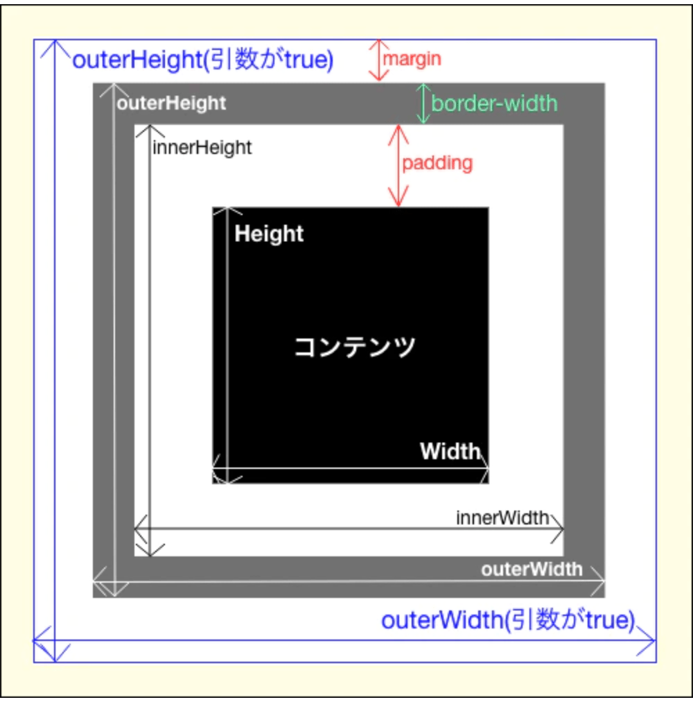

# DOM api

jsはDOMの操作apiがかなり多いため、備忘録として学んだことを記す

## 要素に設定されているstyle属性を知りたい場合。

- window.getComputedStyle()

[参考URL](https://qiita.com/amamamaou/items/bb79bec002a6ff033810)

>window.getComputedStyle() メソッドは、要素に適用されたスタイルの値を基本的な値に計算しなおした後、すべてのCSSプロパティの値を返します。

※font-size: 1em;となっていた場合もその要素のサイズも計算されて返す

## <video>タグに対して

[リファレンス](https://developer.mozilla.org/ja/docs/Web/API/HTMLMediaElement/srcObject)

HTMLMedia​Element​.src​Object

>HTMLMediaElement インターフェイスの srcObject プロパティは HTMLMediaElement に関連付けられたメディアソースを提供するオブジェクトを設定または取得します。 このオブジェクトは MediaStream、MediaSource、Blob や(Blobから派生している) File です。

## mouse move

[参考URL](https://qiita.com/yukiB/items/31a9e9e600dfb1f34f76)

## innerHeightとouterHeightの違い

[参考URL](https://qiita.com/yyzzyykk/items/60f1559820f1c6d09b7a)

outerHeightをしないとborderとmarginを取得しない。
