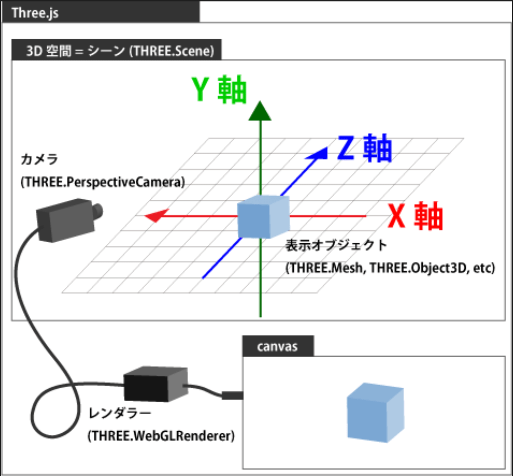

# Three.js

[参考URL](https://ics.media/tutorial-three/)

Three.jsはHTMLの3D技術(WebGL)を扱いやすくしたフレームワーク
>ちなみに前提としてThree.jsはWebGL対応のブラウザが必須となりますので、動作確認はFirefoxやChrome、Safari、Edgeなどを使うといいでしょう。
>また、WebGLはローカルファイルのセキュリティーの制限があるため、ローカルサーバー上で実行することをオススメします

## Three.js概要

Three.jsは**HTML5で3Dコンテンツを制作するためのJavaScriptライブラリ**
WebGLだけで3D表現をするためには、立方体1つ表現するだけでも多くのJavaScriptやGLSSコードを各必要があり専門知識も必要となる。Three.jsを使用すればJavascriptの知識だけで簡単に3Dコンテンツが作成できるため手軽に扱えるようになる


もともと2000代後半のFlashの時代からウェブの3D表現が人気を集めてキマシtあ。今では標準技術としてのWebGLがゲームやビジュアライゼーションなどの多くの場面で採用されている。

>3Dでは三角関数やベクトルの計算をする場面が多い。



## ユビキタス

[ThreeJS基本](https://ics.media/entry/14771/)

シーン : シーンてとは3D空間のことで、3Dオブジェクトや光源などの置き場となる。
ジオメトリ : 頂点情報や面情報を持っている。Three.jsには様々なジオメトリが用意されている。
マテリアル : 色や質感の情報を持っている。
メッシュ : 作成したジオメトリとマテリアルを使用してメッシュを作成。メッシュをシーンに追加する。**立方体はメッシュという表示オブジェクトを使用して作成**
アニメーション : JSでアニメーションをさせるには時間経過で関数を呼び続ける必要がある。
画面更新 : Three.jsでは自動的に画面が最新に切り替わらない。そのため明示的に画面が更新されるように命令を書く必要がある。
立方体 : 立方体はメッシュという表示オブジェクトを使用して作成する。メッシュを作るにはジオメトリ(形状)とマテリアル(素材)の二種類を用意する必要がある。
カメラ : 3Dはどの視点から空間を撮影するかという実装をする。この機能やは視点やカメラと呼ばれる。
>Three.jsではTHREE.PerspectiveCameraクラスのコンストラクターで画角、アスペクト比、描画開始距離、描画終了距離の4つの情報を引数として渡しカメラを作成します。
ライト : ライトを作らないと真っ暗の状態。ライトもシーンに追加することであhんエイされｒ。
平行光源 : 太陽光のように一定方向から差し込む光。
アニメーション : `renderer.render()`を一度しただけではcanvas要素に一度描かれただけなので更新はされない。アニメーションをさせるにはパラパラアニメのようにコマ送りする必要がある。

```js
// new THREE.PerspectiveCamera(画角, アスペクト比
const camera = new THREE.PerspectiveCamera(45, 960 / 540);
```

## Three.js学ぶ順序


## Three.jsの基本構造


## マテリアル

3Dの見栄えを決定するマテリアルとライティングについて説明する。

- マテリアルとは
マテリアルとは**物体の質感設定のこと**
3Dで形状を作る際には、見栄えを決めるマテリアルを指定することで、着色や画像・陰影の割当、ライティングの反射などを適用できる。

>代表的なマテリアルとして「単色塗りのマテリアル」と「画像を使ったマテリアル」の二種類があります。どちらもTHREE.MeshStandardMaterialクラスを使用しますが、コンストラクタの引数に色（16進数表記の色）か画像テクスチャを指定するかで自動的に適したマテリアルになります。
