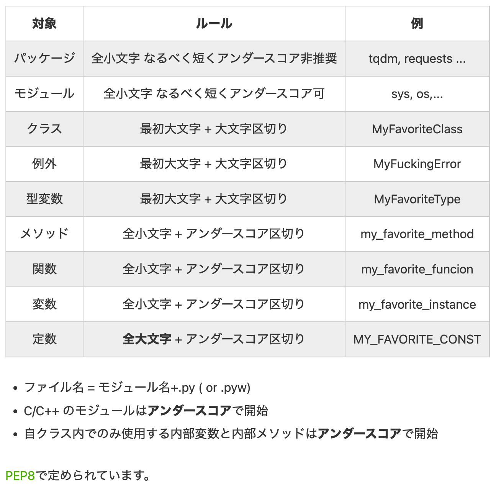

# Python

[学ぶ前に考えること](../新たな言語を学ぶ前に.md)
以下からは上記で記載したmd順に探っていく

---

## Pythonの仕組み

[Pythonはどうやって動くのか](https://kaityo256.github.io/python_zero/howtowork/index.html)

---

## Python利用用途

1. 機械学習を使った人工知能の開発 → Pythonがライブラリが充実しているため
2. 自動データ処理や分析などの業務効率化 → 自動データ処理に関しては別でもできる。分析はPythonが強いか
3. スクレイピングによるWEB上の画像データ・テキストデータの自動収集 → スクレイピングは結局WebDriverを使うためどれでもいい
4. WEBサービス・WEBアプリケーション制作 → 日本だとRubyやPHPが強い。わざわざPythonでやるのであればAIなどの活用がしたいなど
5. スマホアプリ（Android）制作 → できるのか、Kotlinが強いけど
6. デスクトップアプリ制作 → これはWindows？
7. 組み込みアプリケーション制作 → C++が強いはず

**メルカリでの利用用途**
機械学習を用いたマイクロサービスでは研究・実験段階で用いたPythonのライブラリをそのままプロダクションでも使用したいなどといった理由でPythonをメインの言語に採用することが増えています。使用したいライブラリにはデータの前処理パイプラインを記述するもの、自然言語処理や画像処理を行うもの、C++などで記述されたライブラリのPythonラッパー、場合によってはモデルのサービングを行うものなどが挙げられるかと思います

---

## Python コードスタイル

[参考URL](https://legacy.python.org/dev/peps/pep-0008/)

- Python インデント
インデントはタブまたはスペースで行うが、スペース何文字分というルールは決まっていない。
**コーディング規約では4つが推奨されている。**

---

## Pythonのversion管理

asdfやpyenvがある

参考URL
[asdfが有名っぽい](https://dev.classmethod.jp/articles/try-asdf-settings/)

**pyenvがanyenvから使える**ため、それを使用する
またnodeのようにlocalでversion分けができる。

---

## Pythonの環境構築

Python自体がanacondaなど、構築自体がめんどくさい。そのためDocker構築がいいと言われている。
あとは仮想環境でやるとか言っていた気がする....

## Pythonのパッケージ管理ツールとは

**pipが代表格**
pipはPythonで書かれたパッケージソフトウェアをインストール・管理するためのパッケージ管理システム
多くのPythonパッケージは、Python Package Index上にある。

またパッケージには

- 公式が配布しているもの
- サードパーティが配布しているものがある。

サードパーティのパッケージはPyPIというサイトで配布されている。
[PyPl](https://pypi.org/)

### Pythonのライブラリ(pipについて)

Pythonのライブラリは主に以下の3種類となる。
**site-packagesはJSでいうnode_moduleと一緒**

- 標準ライブラリ
- site-packagesディレクトリ(pip installでインストール)
- ユーザ別site-packageディレクトリ(pip install --userでインストール)

Pythonが読み込むライブラリの場所を知りたい場合

```sh
$ python
Python 3.9.10 (main, Feb 24 2022, 22:46:36)
[Clang 13.0.0 (clang-1300.0.29.30)] on darwin
Type "help", "copyright", "credits" or "license" for more information.
>>> import sys
>>> sys.path
['', '/Users/tanakanaohitoshi/.anyenv/envs/pyenv/versions/3.9.10/lib/python39.zip', '/Users/tanakanaohitoshi/.anyenv/envs/pyenv/versions/3.9.10/lib/python3.9', '/Users/tanakanaohitoshi/.anyenv/envs/pyenv/versions/3.9.10/lib/python3.9/lib-dynload', '/Users/tanakanaohitoshi/.anyenv/envs/pyenv/versions/3.9.10/lib/python3.9/site-packages']
>>>
```

### site-packages ローカルインストール

[ローカルライブラリ実行方法](https://www.bunkei-programmer.net/entry/2018/12/17/232646)

>site-package インストール確認
`$ pip show flake8`

>グローバルインストール

```sh
$ pip install xxx # グローバルインストールされる
# /Library/Python/2.7/site-packages
# 全アカウント共通で使用する、所謂グローバルな場所にインストールされてしまう。
```

>ローカルインストール

AWS Lambdaでpythonランタイムを選択した際に、lamdaに標準インストールされていないモジュールを追加インストールする場合もローカルインストールする事になるので、この辺は覚えておくと色々と便利そうです。lambdaの件は以前以下の記事を書いたので、合わせてご覧下さい。


---

## pythonの型付け

Pythonに型ヒントが入った。
**VSCodeではPylanceという拡張機能で対応する**(MicroSoft製)

[導入](https://blog.ntacoffee.com/mypy-and-vscode/)

## 各型について

### dataclasses

[dataclass](https://qiita.com/tag1216/items/13b032348c893667862a)
データを格納するためのクラスを簡単に定義できる機能
クラス定義にデコレータを１つ付けるだけで__init__や__str__などの特殊メソッドを自動生成してくれます。


---

## Pythonの環境変数

direnvでOS環境変数にぶち込めばいける

環境変数にアクセスするためには

```py
import os
username: str=os.environ["USER_NAME"]
```

---

## Python Editor

VSCodeが使いやすいがどうだろうか
PyCharmの統合IDEがある

---

## Python Lint(静的解析ツール)

flake8
flake8 は、次の Lint1 を含んだラッパーツールです。

---

## Python Formatter(Pritterみたいなもの)

VSCodeでは、Python拡張を入れることで、Pythonのコードの編集(自動保管ができる)
コードの自動フォーマットを行うには、フォーマッターを別途インストールしておく必用がある。

Formatterの種類としては

- autopep8
- yapf
- Black(最近人気): FacebookやDropbox、Mozillaなどでも導入されている。

### Blacｋとは

>Black は自分自身を **The uncompromising code formatter** と説明しています。 ようするに、「私が定義する設定に従いなさい」という意味で、ユーザーにほとんど設定の余地を残していません（行の長さ程度は設定できます）。 このようにすることで、チーム内でのフォーマット論争を防ぐ効果があります。 TypeScript (JavaScript) でよく使われている Prettier フォーマッターも同様の思想で作られており、ほとんど設定ができないようになっています（こちらは opinionated という単語を使っています）。

### Black スタイル

- インデントは4 (PEP8 通り)
- トップレベルのクラス定義や関数定義の間には**2行の空白行**を入れる（クラス内のメソッド間は 1 行）PEP 8 通り。
- 1 行あたり最大 88 文字 まで
  - PEP 8 は 79 文字と言っているが、それだと改行がたくさん入りすぎる傾向があるので、Black では 1 割増しの 88 文字にした。Raymond Hettinger の講演 Beyond PEP 8 でも 90 文字くらいがよいと指摘している。

- 文字列リテラルは ダブルクォートで囲む（Issue #51 などの議論を経てダブルクォートに落ち着いた。理由をまとめると以下のような感じ）
  - PEP 257 で docstring はダブルクォートで囲むべしとされており、それに合わせるのが一貫性があってよい。PEP 8 では docstring 以外の文字列リテラルにシングルクォートを使っているが、バラバラにする理由がない。
  - 空白文字列をシングルクォートで表現すると '' となって、フォントによっては判別しにくくなる。ダブルクォートであれば一目瞭然 ("")。
  - ダブルクォートの中でシングルクォートを使うことはよくあるが（例: "don't"）、その逆は少ない。
  - UK レイアウトや German レイアウトのキーボードでは、" の入力は苦じゃないよ。シングルクォートの方が入力しやすければ、それで入力しておいて Black に " に変換させればよい。


---

## Python 自動補完(オートコンプリート)

VSCodeでは、Python拡張を入れることで、Pythonのコードの編集(自動保管ができる)

---

## Python ユニットテスト

[参考URL](https://qiita.com/flcn-x/items/fcbbc2fb291b970290f2)


| module | 概要 | 特徴 |
| --- | --- | --- |
| doctest | docstringを使用した標準モジュール | docstringのみで簡単だが他モジュールの使用制限がある。 |
| unittest | 他言語と類似する標準モジュール | 標準だが他言語と類似形式のためpythonらしくない（らしい） |
| pytest | サードパーティのテストモジュール | pythonらしくテストが記述できる。現在比較的人気らしい。 |

---

## Python コマンドラインオプション

[Pythonの-mオプションが探しに行っている場所](https://shuzo-kino.hateblo.jp/entry/2016/11/08/224859)
-mオプション
Pythonは-mオプションを付けてpythonを実行するとモジュールを実行してくれます。
このオプションは$PYHTONPATHで設定されているモジュールの配置場所や、
設定ファイルなどで設定されているsys.pathの場所にあるモジュールを実行できます。
ということでなんのこっちゃという感想もありますが、**本来は見つけられないPATH場所を見つけてpipモジュールを実行してくれている。**

`$ python -m <module-name>`
モジュール名とは、○○○.pyの○○○の部分
モジュールの他に、パッケージも-mを付与して実行します。
パッケージとは複数のモジュールが集めて一つにまとめたファイルのこと

---

## Python 各コーディング

### 命名規則



## Python インポート周り徹底理解

[参考URL](https://qiita.com/papi_tokei/items/bc34d798dc7a6d49df30)

Pythonのライブラリは主に以下の3種類となる。

- 標準ライブラリ
- site-packagesディレクトリ(pip installでインストール)
- ユーザ別site-packageディレクトリ(pip install --userでインストール)

### .pyファイルのインポート(同階層)

クラスも関数も同時にimport 可能

.
├── lib_a.py
└── main.py

```python
from lib_a import Student, add
```

---

## Python ファイル操作

### 基礎知識

基礎の流れ

1. ファイルを開いて
2. ファイル操作を行い
3. ファイルと閉じる

```py
# ファイルを新規作成
file = open("test.txt", "w",encoding='utf-8')
# writeメソッドを利用しファイルに文字を書き込む
file.write("Hello Python!")
# ファイルを閉じる
file.close()
```

### with構文

with構文とは、ファイル操作処理のコードを**短縮して記述するため**の構文

with文はファイル操作を行うopen関数を簡易的にかけるようにするだけではなく**例外処理やファイルのcloseを自動的にしてくれたりと結構便利な機能を持ち合わせている**

withを使った場合(↑の基礎との対比)

```py
with open("test.txt", "w",encoding='utf-8') as file:
    file.write("Hello Python！")
```

>withのメリット

1. ソースコードをすっきりさせる
2. ファイルの閉じ忘れを防止(close漏れの防止)
  ファイルの閉じ忘れにはデメリットが存在します。開けるファイル数には限りがあることや、開いたままのファイルが思わぬエラーを引き起こしてしまうためです。
  ※閉じ忘れたからと言って、ファイルが壊れたりすることはありません。閉じ忘れてもPythonが自動的にファイルを閉じてくれる仕組み自体は備わっています。
3. ブロックが生成されるため可読性が向上する

---

## 　変数

[参考URL](https://uxmilk.jp/41600)

### 変数(クラス変数) public staticみたいなもの

クラス変数は、クラスに依存している変数です。インスタンスからでも、クラスからでもどちらからでも呼び出し可能で、**インスタンスが異なっても同じ値を取得することができます。**

### 変数(インスタンス変数)

インスタンス変数は、インスタンスに依存している変数です。**インスタンスを複数作成すればそれぞれ異なる値をもつ**

**このようにクラス変数とインスタンス変数が同じ変数名だった場合、インスタンス変数が優先されます。**

ちなみにpythonではprivateな変数、変更不可な変数は存在しないようです。
ただ、privateに関しては、「_」で始まる変数、メソッドはプライベートだという慣習はあるみたいです。
普通に呼び出すことは可能なので個人の努力が必要ですが。。。

---


## コンストラクタ

```py
class TestClass2:
    val = []
    def __init__(self):
        print("init:" + str(self.val))
        # 初期化
        self.val.append(1)
        self.val.append(2)
        self.val.append(3)
```

## デストラクタ

コンストラクタとは反対にインスタンスをPythonが削除するときに動作するメソッド
インスタンス削除時に実行される

```py
class TestClass4:
    val = []
    def __del__(self):
        # デストラクタ
        print("del:デストラクタ")

testClass4 = TestClass4()
del testClass4
# > del:デストラクタ
```

## オーバーロード

ythonではオーバーロード（引数違いのメソッドを定義する）はできない様子

## インターフェース

[参考URL](https://www.lifewithpython.com/2017/11/python-interface.html)

Python 3.6 の時点で Python には言語機能としてのインタフェースは存在しない。
具体的にいうと、「継承先に特定のインタフェースの実装を強制できるような仕組み」が Python にはない.

---

## Python path検索

検索順は以下

1. ビルトインモジュールにあるか探す
2. sys.pathに格納されているディレクトリにあるか探す

---

## requirement.txt(慣例でファイル名はこれ)

[参考URL](https://note.nkmk.me/python-pip-install-requirements/)

Pythonのパッケージ（ライブラリ）をpipで管理している場合、設定ファイルrequirements.txtを使って指定のパッケージを指定のバージョンで一括インストールすることができる。

pipの一括インストールオプション: -r requirements.txt
設定ファイルrequirements.txtの書き方
現在の環境の設定ファイルを書き出し: pip freeze

`$ pip install -r requirements.txt`

- version指定
バージョン指定を省略すると最新版がインストールされる。

- その環境のpip モジュールを以降する

`$ pip freeze > requirements.txt`
このrequirements.txtを別の環境にコピーして一括インストールする。
`$ pip install -r requirements.txt`

### 3点ドット(...) Pythonの組み込み定数Ellipsis

Ellipsisと...は同じellipsisオブジェクト。

[参考URL](https://note.nkmk.me/python-numpy-ellipsis/#:~:text=NumPy%E9%85%8D%E5%88%97%20ndarray%20%E3%81%AE%E3%82%A4%E3%83%B3%E3%83%87%E3%83%83%E3%82%AF%E3%82%B9,%E7%9C%81%E7%95%A5%E3%81%97%E3%81%A6%E6%8C%87%E5%AE%9A%E3%81%A7%E3%81%8D%E3%82%8B%E3%80%82)
[Ellipsisオブジェクトについて](https://qiita.com/yubessy/items/cc1ca4dbc3161f84285e)
