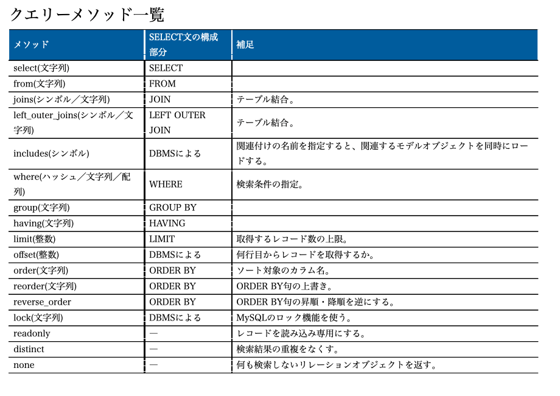

# ActiveRecord

[参考URL](https://railsdoc.com/migration)

直接SQLを使わずにDBのテーブルやカラムなどの構造を変更できる仕組み

```ruby
def change
end

# 昔からある記法
def up

def down
```

## has_many

has_manyは関連づけの中でも参照される側(親側)。一多対の関連

## where

whereメソッドに`カラム名:配列`というハッシュを渡すと、カラムの値が複数の候補のどれかと同じ

```ruby
members = Member.where(number: [15, 17, 19]) # 15 or 17 or 19
members = Member.where(number: 12..14) # 12 ~ 14
members = Member.where.not(number: 12..14) # 12 ~ 14ではない
members = Member.where.("name = ?", name) # プレースホルダ
```

---
## Railsのモデル(ActiveRecord) クラスのクラスメソッドについて

Railsのモデル(ActiveRecord)はDBからデータを取り出したり検索したりするための強力な機能を備えている

**以下はモデルクラスのクラスメソッド欄**
Railsのモデル群はActiveRecord::を継承していることを忘れてはいけない。

### idsメソッド

```ruby
member = Member.ids
→ [0, 1, 2] # SELECT "members"."id" FROM "members"
```

テーブルに存在するすべてのレコードの主キーを配列として取得ができる

### find 1件

主キーの値を指定するととれる
例外が発生することを前提にしたプログラムとして作成する

```ruby
member = Member.find(3)
```

- 例外
ActiveRecord::RecordNotFoundが発生する

### find_by 1件

あるカラムを使ってレコードを検索し、**最初に一致したものを返す**
検索対象のカラムはいくつも設定ができる。
引数には`name: "Taro"`のようにハッシュでカラム名: 値を指定する。

```ruby
member = Member.find_by(sex: 1, administrator: false)
```

- 例外
例外は発生せずnilが返る

---

## クエリーメソッド



以下はクエリーメソッドというらしい
**クエリーメソッドのつなげる順番は自由**

### where 一致した件数

大前提
whereメソッドはリレーションオブジェクトを作成すると、そのままでは検索は実行されない。
検索条件を保持しているだけ

検索条件に一致する複数のレコードが取り出せる
クエリーメソッドが実際に返すのは、配列ではなくActiveRecord::Relationクラスのオブジェクト
**これをリレーションオブジェクトという**

このオブジェクトの役割はデータベースからデータを取り出すための検索条件を保持することと、検索を実行してその結果をモデルの配列として使えるようにすること

これは使える

### 生成されたSQLを調べる

```ruby
members = Member.where(name: "Taro"); nil
members = Member.where("number < 20") # WHERE句に指定する検索条件を文字列で指定することもできる。

puts members.to_sql
# SELECT "members".* FROM "members" WHERE "members"."name" = "Taro"
```

### 検索が実行されるタイミング

大前提
whereメソッドはリレーションオブジェクトを作成すると、そのままでは検索は実行されない。
検索条件を保持しているだけ

リレーションオブジェクトはRubyの配列と同じ名前のメソッドを持っている
each, map, length

上記のメソッドを呼び出すと、その時に初めてSQLによる検索を実行しモデルオブジェクトの配列を利用できるようになる。

## where便利な使い方

whereメソッドにカラム名: 配列というハッシュを渡すとカラムの値が複数の候補のどれかと同じという検索条件を指定できる。

```ruby
members = Member.where(number: [15, 16, 18]) # select members from members where in (15, 16, 18)
# ハッシュの値を範囲オブジェクトにするとその範囲にあるという検索条件もできる
members = Member.where(number: 12..14) # 12 ~ 14 select members from member where number between 12 and 14
```

whereメソッドの直後にnotメソッドを指定すると ~ではないという検索条件が使える

- プレースホルダ

; nilはwhereメソッドの呼び出しの後に結果の表示を消している

```ruby
name = "taro"
members = Member.where("name = ?", name); nil
```

- SQLインジェクションを防ぐ
whereメソッドで検索を行うときは以下にしてはいけない

```ruby
@member = Member.where("name = '#{name}'")
```
変数の中にSQL文にとって意味のある文字(1重引用符)が含まれると、データベースが不正に利用されることがあるため
ハッシュで指定するかプレースホルダで変数を展開すれ。

## リレーションオブジェクト

リレーションオブジェクトはみかけ上は配列と同じように振る舞うが、実際に検索を実行してデータを取り出すのはデータが必要になったときという特徴を持っている。
Lazy Loadingと呼ばれる。これにより、すっきりしたコードで余計な検索の実行を省くことができる。

---

## ファインダーメソッド

ここからはファインダーメソッド

リレーションオブジェクトにはファインダーメソッドと呼ばれるメソッドが備わっている

例として
firstは検索条件に一致するレコードを先頭から1個だけ取り出し、モデルオブジェクトを1個(存在しなければnilを)返す

```ruby
member = Member.where(sex: 2).order(:number).first
```

## クエリービルダー

```ruby
members = Members.find_by_sql("SELECT * FROM members WHERE number = 11")
```

---

## Railsバリデーションまとめ

[参考URL](https://qiita.com/h1kita/items/772b81a1cc066e67930ec)

前提
**バリデーションを設定しただけでは保存に失敗したときのメッセージは表示されない。**


- presence
presenceで値が空とみなされるのは、nil, false, 空文字
※これはblank?メソッドがtrueを返す場合と同じ

## バリデーショントリガーされるやつ

create
create!
save
save!
update
update!

## validation

基本saveメソッドがバリデーションを実行する。
しかしsaveメソッドを使わずにバリデーションを行うには、valid?メソッドかinvalid?メソッドを使用する

```ruby
member.number = nil
member.valid? # false
member.invalid? # true
```

チェックに引っかかればvalid?はfalseを返す
チェックに引っかかればinvalid?はtrueを返す

Railsではvalid?メソッドを実行するとバリデーションが実行されます。
バリデーションが通ればtrueを返し、引っかかればfalseを返します。
ちなみにinvalid?メソッドは逆の振る舞いをします。


## validatesメソッドの書き方

シンボルでモデルの属性名を指定し、その後にハッシュでバリデーションの種類: trueを並べれば、その種類のバリデーションが行われる。

```ruby
validates :number, :name, presence: true
# validates :シンボルでモデルの属性名
```


## Rails ActiveRecord まとめ

モデルはデータベースのテーブルに対応するオブジェクト。モデルクラスのインスタンスはテーブルの1つのレコードにあたる
データベースの設定はdatabase.ymlで行う。3つの環境に合わせて3つのデータベースを用意する
データベースの中にテーブルを作成するにはマイグレーションスクリプトを記述
データベースの作成やマイグレーションにはbin/railsコマンドを使う
saveメソッドがバリデーションを実行する。
