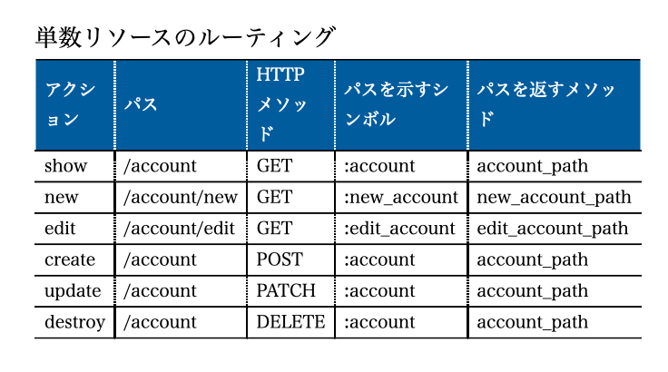
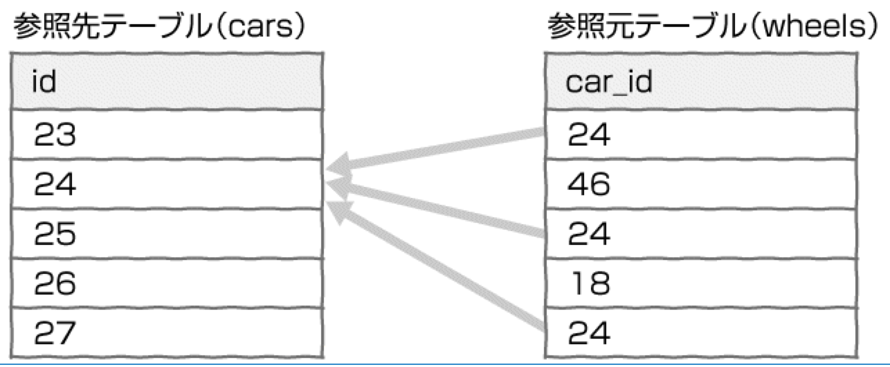
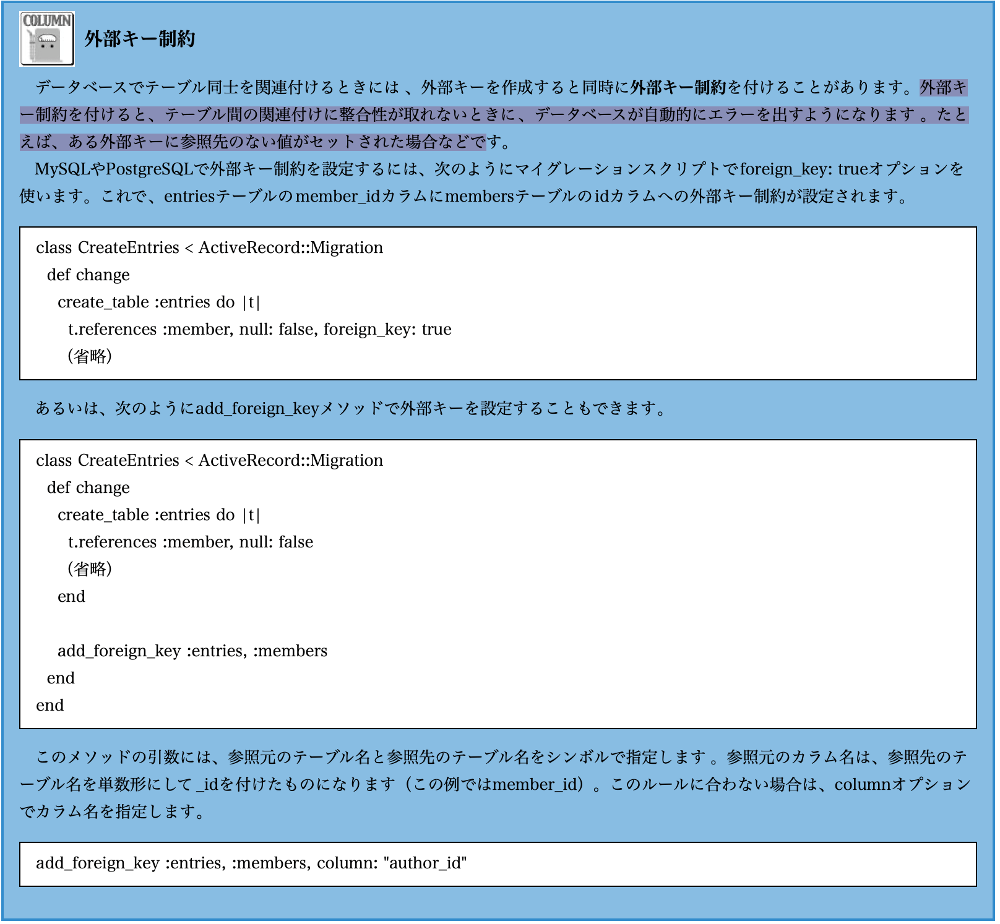

# Ruby on Rails

[Railsガイド(本リファレンス)](https://railsguides.jp/)
[Rails](https://atmarkit.itmedia.co.jp/ait/articles/1102/23/news109_3.html)
[Railsのクリーンアーキテクチャ](https://qiita.com/shunjikonishi/items/e39ed8091e1dca817468)
[【Rails】hashid-railsを用いてIDを難読化・暗号化させる方法](https://techtechmedia.com/hashid-rails/)

## Railsスタイルガイド

シンボル名、メソッド名、変数名は**スネークケース**にする

## Rails欠点

[参考URL](https://techlife.cookpad.com/entry/2017/04/06/172601)

RailsはDBのテーブルをそのまま読み書きするような単純なアプリケーションは簡単にできるが、より複雑なアプリケーションではそのぶん慎重な設計が必用になるため、Trailblazerのような複雑なWebアプリケーション構築を支援するライブラリが注目を集めている。

## Railsの設計哲学

1. DRY(Don't Repeat Yourself): 繰り返しを避けよ

DRYはDRY原則とも呼ばれる。Railsを使ったWebアプリケーションでは同じことを繰り返し記述するのは避けなければならない。
同じことをソースコードや設定ファイルの中で繰り返し記述するのはムダ。
仕様変更やバグフィックスのときに一部を変更し忘れる可能性が高くなる。
DRYを意識することで効率よく、品質のよいアプリケーションが作成できる。

2. 設定より規約（Conventition over Configurations）

「規約」とは、言い換えれば「デフォルトの設定」です。**あらかじめ用意された規約にしたがってアプリケーションを開発することで、記述量を大幅に減らせる。**
たとえば、モデルには命名規約がありテーブル名をmembersのように複数形にすると、モデルのクラス名は単数形のMember、クラスを記述するファイル名はmember.rbとなります。決まりきった手順に従うことで、余計な設定を記述する必要がなくなり、プログラマはコードに集中できるようになります。

Railsで採用されているルール（規約）にしたがっていれば、Active Recordモデルの作成時に書かなければならない設定用コードは最小限で済みますし、設定用コードが完全に不要になることすらあります。これは「設定がほとんどの場合で共通ならば、その設定をアプリケーションのデフォルトにすべきである」という考えに基づいてる。

## Rails でのアーキテクチャー


## MVCへの対応

RailsではMVCでの役割をフォルダーごとに分けることで開発もスムーズに行えるような仕組みになっている。

## Rails model

モデルとDBは1対1の相互関係で成り立っている。
※開発現場でもモデルが一番最初に作られる。
※モデルはただのクラスだがDBと連携するクラスをRailsではモデルと呼ぶ

## Railsで新規タグ

Railsでクラスを作るには、直接ファイルを作成するのではなく専用のコマンドをつかうことが多い。

## Rails 3つのモード(environment)

Railsには3種類ある

開発 : develop : コードを書きながらブラウザで確認するための環境
テスト : test : 自動テストのための環境
本番 : production : ウェブサイトを一般に公開する時の環境

## Dockerを使わない場合のRails

Dockerを使わないRailsデプロイでは、以下の環境変数が自動で設定される。
**Docker経由の場合は、自分で本番用の環境変数を設定する必要がある。**

- `LANG`: en_US.UTF-8

- `RACK_ENV`: production
Rackへ現在の環境を示す変数
Rackとは … http送受信処理を担当するモジュールのこと。

- `RAILS_ENV`: production
Railsへ現在の環境を示す変数

- `RAILS_LOG_TO_STDOUT`: enabled
logを標準で出力するか否かのフラグ。enabled = 出力する。

- `RAILS_SERVE_STATIC_FILES`: enabled
publicディレクトリからの静的ファイルを提供してもらう（apiモードではあんま意味ないかも）

## Railsで使われているMVCのデザインパターン


**APIモードではViewは存在しない。**

- モデル
モデルはデータとビジネスロジックを表す。ビジネスロジックとはたとえば給与計算ロジックのようなアプリケーションドメイン特有の処理のこと(localhost/api/users)→userの一覧を出すみたいな
Railsではモデル層はActiveModelという概念に抽象化され、デフォルトではActiveRecordというO/Rマッピングの機能を提供するライブラリが使われる。
ActiveRecordでは、リレーショナルデータベースのテーブルに対応するモデルクラスにアプリケーションのデータとロジックを実装していきます。データの永続化に関する処理の多くはActiveRecordが担当してくれるので、単純なモデルであれば、プログラマが書かなければならないコードの量は、ごくわずかです。一般的にプログラマがモデルに追加することの多いコードとしては、クラスの持つ値の検証や、他モデルとの連携が挙げられます。


- コントローラ
ユーザのリクエストを受けて、モデルに適切な動作を要求する。
またどのビューをどの組み合わせで利用するかを決定する。
Webアプリケーションにおけるコントローラーには、このほかWebに関する一般的な仕事を受け持つという側面があります。たとえばセッション管理や、URLの解釈、HTTPリクエスト・レスポンスの処理、クッキーの管理などを担当します
Railsでは、コントローラーはAbstractControllerとして抽象化された上で、Webアプリケーション用の機能がActionControllerとして実現されています。プログラマは、これを継承したApplicationController（アプリケーションごとに1つ用意されます）に共通機能を追加したり、さらにこのApplicationControllerを継承した各種のコントローラークラスを追加していくことで開発を進めます。なお、個々のリクエストに直接的に対応する機能を実装した部分はアクションと呼ばれ、コントローラークラスのpublicなインスタンスメソッドとして実装されます。

## Railsの構成と機能

Railsは**復数のコンポーネントで構成されている。**
Railsの実体はコンポーネント（Rubyで書かれたライブラリ）の集合体
**基本とある3つのコンポーネントの名前を覚える**

- Active Record : モデル
- Active View : ビュー
- Active Controller : コントローラー

## Rails APIモードとは

Rails APIモードとは、API作成に特化したモード
APIモードではMVCのV(ビュー)が存在しないため、rails newを実行した際にビューに関するファイルやGemが生成されません。
API作成に特化したモードのことで、Rails5で実装された機能らしいです。 簡単に今までのRailsとの違いを説明すると、MVCでいう、Viewの部分が存在しません。 変わりにそのURLにアクセスするとerbを返さず、jsonを返す仕様になっています。 また、標準で入っているGemもViewの分が必要なくなっているので、普通に立ち上げたRailsのプロジェクトよりも少なくなっています。 詳しくは各々で調べてみてください。

- APIモードの違い
[参考URL](https://note.com/icchoco/n/nd408d2a9b2c8)


---

## gemとは

gemはRubyGemsと呼ばれるRuby用のパッケージ管理システムによって管理されたライブラリ
RubyGemsが提供するgemコマンドを通じてインストール等ができます。


---

## bundler、Gemfile、Gemfile.lockの関係性について

[参考URL](https://qiita.com/nishina555/items/1b343d368c5ecec6aecf)

Ruby on RailsでWebアプリケーション（以降ではRailsアプリと略します）を開発をするにあたり、gemの活用は開発効率をあげるために重要


- bundler(node_modulesみたいな)
bundlerは依存関係にあるgemの依存関係やバージョンを管理してくれるgem
**bundlerを利用することで依存関係にあるgemの一括インストール。gemのバージョン管理ができるようになる**
`$ bundle install`を使って、Gemfileに記載されたgemをインストールする。


- Gemfile (package.jsonみたいな)
GemfileとはRailesアプリで利用されるgemの一覧を管理するファイル
bundlerによってインストールされるgemはどこで管理されているのか。

## Rails 開発モードと本番モード

[参考URL](http://programing-kiso-note.blogspot.com/2014/01/ruby-on-rails.html)

Railsには開発モードと本番モードという２つのモードがあり、それぞれ役割ごとにデータベースを切り替えて使う機能が備わっている。

本番環境への切り替え方は以下の用にする
1.環境変数の設定
export RAILS_ENV=production(linuxの場合,windowsの場合はset RAILS_ENV=production)
2.モードが変わったかどうかは以下のコマンドで確認
ーrails consoleでコンソールを開く。
ーRails.envとコマンドを叩く、これで現在の開発モードが出てくる。
3.precompileをする。
ーassetsの圧縮ファイルを作成する事が目的？SASSのbuild、JSファイルの圧縮などを行っておくのだと思われる。これを行う事により高速に動作する?
確認したところ圧縮しているわけではなさそう。キャッシュファイルの生成と書いてはいる。
4.本番モードに切り替えた場合データベースをシードから作っていないので
作成する。
rake db:create
rake db:migrate


## Active Recordについて

Active RecordとはMVCで言うところのMつまりモデルに相当するものであり

---

## Rails フォルダー構成

```sh
store            … アプリケーションのルートディレクトリ
  app            … MVCに関わるアプリケーションの中心的なコード
    controllers  … コントローラークラス
    helpers      … ヘルパーモジュール（ビュー用のヘルパーメソッド）
    mailers      … メール用のコントローラー
    models       … モデルクラス
    views        … テンプレート類
      layouts    … テンプレートに適用するレイアウト
  config         … 設定ファイル類
    environments … 開発、テスト、本番運用といった環境ごとの設定
    initializers … アプリケーション起動時に実行したいファイル
    locales      … 国際化に関するリソース
  db             … データベースに関するファイル
  doc            … rdocなどのドキュメント
  lib            … アプリケーションが使うライブラリコード全般
  log            … アプリケーションが出力するログ
  public         … Webの静的なコンテンツ
  script         … ユーティリティースクリプト
  test           … Railsのデフォルトの自動テストに関するファイル
  tmp            … 一時ファイル
  vendor         … アプリケーション外部に由来するコード
    plugin       … Railsプラグイン
```

## Rails url

[参考URL](https://qiita.com/190131start/items/49e2e9a42f49f17e45c6)

resources :users
6つのアクションが自動生成されますね。
これはREST設計になっています。

GET /users            users#index
POST /users           users#create
GET /users/:id        users#show
PATCH /users/:id      users#update
PUT /users/:id        users#update
DELETE /users/:id     users#destroy

## Rails  ルーティングを確認する方法

[参考URL](https://sakurawi.hateblo.jp/entry/rails-route)

ファイルで確認する方法は`config/routes.rb`でみる

Railsの流れとしては
URLにアクセス（+アクションメソッド）すれば、どのコントローラーアクションが実行されるかを示したもの。

CLI上
`$ rails routes`
`config/routes.rb`の中身がCLIで見られる。

ブラウザで確認


## Puma

[参考URL](https://nekorails.hatenablog.com/entry/2018/10/12/101011)

Pumaとは、複数のリクエストを並行しうて処理することができる高速化を目的としたWebサーバ
Rails5以降はデフォルトでpumaが導入されており、自ら導入する必要はありません。

## docker  rails

[参考URL](https://qiita.com/eighty8/items/0288ab9c127ddb683315)

## rails debug

[参考URL](https://qiita.com/nishina555/items/e5886339d381db61b412)

```ruby
puts ps
puts current_external_id
puts new_external_id

# get fire again22
# <PaymentSetting:0x0000ffff50fbe668>
# price_1GwjUCI8OazorEAhkvB0EXBI
# price_1GwjUCI8OazorEAhtLlr784x
# get fire again2

# inspectを使えば、メモリ値の中身を見れる。
puts ps.inspect
puts current_external_id
puts new_external_id

# get fire again22
#<PaymentSetting id: 1, service_type: "stripe", payment_type: "card", is_subscription: true, period: 1, status: "active", created_at: "2022-02-03 07:29:41", updated_at: "2022-02-03 07:29:41", visible: true>
# price_1GwjUCI8OazorEAhkvB0EXBI
# price_1GwjUCI8OazorEAhtLlr784x
# get fire again2
```


## -b 0.0.0.0

-b 0.0.0.0

rails serverのコマンドオプションとなります。
railsのプロセスをどのipアドレスにバインドするかを指定します。
ここではlocalhostのipアドレス「127.0.0.1」を「0.0.0.0」にバインドしています。
なぜこんな事をするのか?
**仮想環境で起動したRailsは、localhostのipアドレス「127.0.0.1」でアクセスできない**
そこで仮想外部からアクセスできるように、ip「0.0.0.0」に紐付けをする必要がある。
これにより、自分のPC上のブラウザでRailsにアクセスできるようになる.。

## Tips

[参考URL](https://hacktomo.hatenablog.com/entry/2017/12/14/012423)

```sh
# ルーティング確認(api起動をしている際)
$ rails routes
# rails内の環境変数を確認したい場合(コンソールを出す : console の略)
$ rails c

```

## DBの読み書きに使用するタイムゾーン

Railsにはアプリのタイムゾーンとは別に、DBの読み書きに使用するタイムゾーンがある。
※これはどのバックエンドでも言えることだろう

---

## Rails6でのZeitwerk(ツァイトベルク)

[参考URL](https://zenn.dev/murakamiiii/articles/893d83626c9f15)

- そもそもなぜRailsではrequireなしにファイルを読み込むのか

他の言語などにおいて、他のファイルを読み込むとなればimportするなどして明示的に読み込む必要があるが、**Railsではそれをよしなにやってくれる。**
Zeitwerkという仕組みがRailsには組み込まれているから

Rails6から自動読み込みモードZeitwerkが追加された。


---

## プロジェクト構造

Railsアプリケーションでは**ファイル名はそれらが定義する定数と一致する必要**があり、**ディレクトリは名前空間**として機能する
Zeitwerkは例として、app/controllers/users_controller.rb定数を定義するUsersController(クラス)のことを期待しています。

## Rails6からのlibディレクトリ以下のファイル読み込み

Rails6のデフォルトではlibディレクトリ以下のファイルは読み込まれない

読み込む方法は2つある

1. requireで呼び出し

読み込みたい場所でrequireで宣言する方法
Railsがデフォルトで読み込むパスにはapp/libまで設定されている。それ以下のファイルパスを渡す。

api/lib/validator/email_validator.rbの場合
=> "validator/email_validator.rb"のパスを渡す

2. application.rbで呼び出し

Rails6のオートロードシステム(Zeitwerk)に読み込むパスを追加する方法

## rails での test

Railsのデフォルトではfixture(フィクスチャー)を使ってテストデータを生成する。

- fixtureとは
fixtureとは、Railsが用意しているテストデータを生成するための方法です。
この方法を使う場合、テストデータはymlファイルで生成する。

## Pundit

[参考URL](https://qiita.com/yutaro50/items/52484b7ae4ca87aa99a2)

Rubyのgemライブラリ
**認可の仕組みを提供してくれる**
ユーザによってページ表示の許可・拒否をしたり表示情報の範囲を変えたりすることができるgem

## module

[参考URL](https://techplay.jp/column/536)

moduleには部品の集まりや区分という意味になる。
Rubyの**moduleはclassと同じようにmodule内に関数の定義ができること、**プログラム上での役割や振る舞いをまとめることができる。

classとの違いは？
1. moduleからインスタンスが生成できないこと
2. moduleは継承ができない

- moduleを使うメリット

```ruby
module Car
  class SuperCar
    def self.introduce
      puts "This is SuperCar"
    end
  end
end

class SuperCar
  def self.introduce
    puts "これはスーパーカーです"
  end
end

Car::SuperCar.introduce # module呼び出し
SuperCar.introduce # class呼び出し
```

module名とclass名は同名であるが、**moduleには名前空間としての役割を持っているためコンパイル上では別のものとなっている。**

## ruby独自の機能にMix-in

Mix-inすることでmodule内のメソッドをインスタンスメソッドとして利用することがができる
includeでの拡張は静的である。

```ruby
module Lion
  def cryLion
    puts "ガオー！"
  end
end

module Cat
  def cryCat
    puts "ニャー"
  end
end

class Animal
  include Lion, Cat # moduleの機能をincludeしている
end

obj = Animal.new

obj.cryLion # Lionクラスのmethodを利用
obj.cryCat  # Catクラスのmethodを利用
```

---
ここから本

## Rails処理順序(基本)


1. ブラウザからのリクエストを受け取ると、Railsはパスを調べroutes.rbにしたがってどのコントローラのどのアクションを選べば良いかを決める(Controllerの中にアクションは複数ある)
2. Railsは選ばれたアクション(メソッド)を実行する(アクションにはモデルとの間で情報のやり取りをするプログラム)を書く
3. モデルはDBのテーブルと対応している、アクションはモデルから取得した情報のうち、表示に必要なものをインスタンス変数に保存し返す

## route

RailsアプリケーションではRESTの原則にしたがってデータをリソースとして扱う
>RailsにはRESTに基づいた作法でウェブアプリケーションを作成する機能がある。

## Railsにおけるリソースとは

コントローラが扱う対象に名前をつけたもの。
リソース名を設定するには`config/routes.rb`にresourcesメソッドを追加するだけ

`resources: リソース名の複数形で記述する`

**上記で7つのアクションのルーティングが設定できる。**

これをRESTフルなルーティング、またはリソースベースのルーティングと呼ぶ
※リソースを扱うコントローラーはMembersControllerの様に、リソース名+Controllerという名前が一般的

## config/routes.rb

```ruby
resources :orders, only: [:index]
```
必ずorderのモデルが必要ではない。
リソース名に対応したコントローラに対して、**7つのアクションのルーティングを自動的に設定するだけ**


## リソースを扱うコントローラー

コントローラでは7つのアクションを用意する
この7つは原則としてデータベースの基本操作であるCRUDを実装したもの

api/app/controllers

```ruby
module User::Apis::V1::User
  class PaymentHistoriesController < ApiController

    def index
      params = index_params
      offset = params[:offset] || 0
      authorize(nil, policy_class: PaymentHistoryPolicy)

      common_query = policy_scope(nil, policy_scope_class: PaymentHistoryPolicy::Scope).ransack(params[:q]).result
      payment_histories = common_query.
                            order(captured_at: :desc).
                            limit(limit).
                            offset(offset)
      total_count = common_query.count

      render json: payment_histories, root: "payment_histories", meta: total_count, meta_key: "total_count",
             include: SERIALIZER_INCLUDE, adapter: :json
    end
  end
end
```

## 7つのアクション

7つのアクションを呼び出すには以下画像をみる。
HTTPメソッドの組み合わせを使う。


- index
リソースの一覧を表示する
- new
リソースを追加する(テーブルに新しいレコードを作成する)ためのフォームを表示する
- create
リソースを作成する(テーブルに新しいレコードを作成する)
- show
リソースの属性を表示する(レコードの内容を表示する)
- edit
リソースを更新する(既存のレコードのカラムを更新する)ためのフォームを表示する
- update
リソースを更新する(既存のレコードのカラムを更新する)
- destroy
リソースを削除する(テーブルからレコードを削除する)

## 7つのアクション以外の追加

任意のアクションを追加するには resourcesメソッドにブロックを渡しブロックの中でもHTTPメソっドを表すメソッド アクション名を記述

## パスを返すメソッドが使える(resource)

リソースを指定すると、コントローラーのアクションを表すパスを取得できる


## 特定のアクションを使わない場合

```ruby
resources :contents, only: [:index, :show, :create, :update]
```

onlyオプションに渡す
上記だと:index, :show, :create, :updateアクションのルーティングだけ設定する。

## Rails起動ガイド

[参考URL](https://railsguides.jp/initialization.html)

1. bin/railsが読み込まれる

```ruby
#!/usr/bin/env ruby
APP_PATH = File.expand_path('../config/application', __dir__)
require_relative "../config/boot"
require "rails/commands" # ここでAPP_PATH定数が使われる
```

2. /config/boot.rbが読み込まれる

```ruby

ENV['BUNDLE_GEMFILE'] ||= File.expand_path('../Gemfile', __dir__)

require 'bundler/setup' # Gemfileが存在する場合は、bundler/setupをrequireする
require 'bootsnap/setup' # Speed up boot time by caching expensive operations.
```

3. rails/commmands.rbを実行する

2が終わると、次に**コマンドの別名を拡張するrails/commandsをrequireする**
拡張されたのは以下
```ruby
require "rails/command"

aliases = {
  "g"  => "generate",
  "d"  => "destroy",
  "c"  => "console",
  "s"  => "server",
  "db" => "dbconsole",
  "r"  => "runner",
  "t"  => "test"
}

command = ARGV.shift
command = aliases[command] || command

Rails::Command.invoke command, ARGV
```

## /initializers以下のrbファイル

アプリケーション起動時にロードされるもので、初期化処理で使われる
自分でrbファイルを追加して使うことも可能

## 国際化 internationalization 略してi18nと呼ばれる

---

## 単数リソース

membersリソースの重要な特徴は、それが集合的な概念であるということ。
0人以上のメンバーからなる集まりを表現している。
**しかしウェブアプリケーションを構成する要素の中には、多くとも1個しか存在しないものがある。**
この種のリソースを単数リソースと呼ぶ

単数リソースの例として
セッション・自分のアカウント情報・自分のパスワード

## 単数リソースのルーティング

単数リソースのルーティングを設定するには、config/routes.rbの中でresourcesメソッドではなく、単数系のresourceメソッドを使う。


```ruby
resource :account
```

上記のように書いてもこのリソースを扱うコントローラーの名前は`AccountsController(複数形のs)に注意`



**単数リソースのため集合を扱うindexアクションはない**

## Railsでのセッション

Railsはセッションデータを符号化してクッキーに保存するが、暗号化はしないためユーザがデータを解読できることに注意
ただし、セッションデータが改ざんされた場合はエラーになる仕組みになる。

## Railsでの暗号化カラムを使う準備

パスワードのハッシュ値(ダイジェスト)をホゾのするためのカラムは password_digestのカラム名を指定する必要がある。

1. カラムにpassword_digestを追加する
2. クラスメソッドを追加
クラスメソッドhas_secure_passwordを用いると、パスワードの保存と認証のためのしくみをモデルクラスに追加することができる

```ruby
class Member < ApplicationRecord
  has_secure_password

  validates :number, presence: true,
end
```

この変更の結果、Memberクラスにpasswordおよびpassword_confirmationという2つの属性が定義される。

passwordカラム : パスワードそのもの
password_confirmationカラム : 確認用のパスワード


## アクション・コールバック

上は8章まで

---

## モデル間の関連付け

CarクラスとWheelsクラスがあるとする。
関連付けを行うにはCarクラスに以下を記載する。

```ruby
class Car
  has_many :wheels
end
```

has_manyはモデル間の関連付けを指定するメソッド。これによりCarモデルとWheelモデルの間に**1対多の関連付け**が設定され、**Carモデルにインスタンスメソッドwheelsが追加される。**

## 関連付けを作るメソッド

Railsでは、モデル間の関連付けをモデクラスのメソッドhas_manyおよびbelongs_toで作る
**has_manyによって使えるようになった参照元のメソッドが返すにはリレーションオブジェクト**

- 1対多の関連付け
has_manyを使用
つまり、そのモデルクラスの**テーブルの複数のレコードが別のテーブルのレコード1つを**参照する結びつきを作る

以下の図を見てほしい

参照先のモデルクラスでhas_many(~をたくさんもつ)を使えば、1対多を実現する。

```ruby
# こっちが参照先のクラス
class Car < ApplicationRecord
  has_many: wheels # has_manyに渡す名前は複数形にする。
end
```

上記により、以下が可能となる。
車輪を作成し、自動車に関連付けて保存するには次のように記述する。

```ruby
@wheel = Wheel.new
@wheel.car = @car
@wheel.save
```

自動車から車輪を関連付けるには << で追加をする。<<を使うと、関連付けと車輪のレコードの保存が同時に行われます。

```ruby
@car.wheel << @wheel
```

## 関連付けルール

has_manyとbelongs_toでモデル間の関連付けを表すときには、名前について次のルールがある。
外部キーのカラム名は、car_idのように「参照先のテーブル名（モデル名）を単数形にしたもの」＋「_id」とする。
belongs_toに指定する名前は、テーブル名（モデル名）の単数形を使う。
has_manyに指定する名前は、テーブル名（モデル名）の複数形を使う。

**関連するキー(カラム名)を替えたい時**
外部キーのカラム名がルールと異なるときは、foreign_keyオプションでカラム名が指定できる。

```ruby
class Car < ApplicationRecord
  has_many :engins, foreign_key: "vehicle_id"
end

class Engine < ApplicationRecord
  belongs_to :car, foreign_key: "vehicle_id"
end
```

**関連付けで使われるメソッド名を替えたい時**
class_nameオプションを使う。

```ruby
class Car < ApplicationRecord
  has_many :engins, class_name: "Motor"
end
```

**参照元にルールを適用したい時**
dependent

```ruby
class Car < ApplicationRecord
  has_many :engins, dependent: :destory # 参照先のレコードを削除した時に参照元のレコードも削除
  has_many :engins, dependent: :nullify # 参照先のレコードを削除した時に参照元の外部キーがNULLになる
end
```

## 外部キー成約




---

## 名前空間

名前空間を導入する理由
例
会員情報やニュース記事を誰でも編集できるものだった。編集権限を管理者だけにしたい

大体のサイトの利用者は操作権限の観点から次の3点に分けれる

- 訪問者(サイトにログインしていないユーザ)
- 一般会員(サイトにログインしているadmin属性がfalseのユーザ)
- 管理者(サイトにログインしているadmin属性がtrueのユーザ)

## 名前空間を導入する戦術の種類

2通りある

1つめ
個々の操作ごとにユーザがその権限を持つかどうかを判定して、リンクの表示・非表示を切り替えたりリレーションオブジェクトに検索条件を加えたり、例外Forbiddenを発生させたりする

2つめ
ユーザの種類ごとに別々のコントローラーを用意する。
こちらの戦術の時に登場するのが名前空間という概念。

例
>会員の表示、追加、編集、削除を行う機能はMembersControllerクラスで実装されています。私たちは次節で別のコントローラクラスAdmin::MembersControllerを作成します。このクラスの名前は記号::で2つの部分に分かれます。Adminの部分はモジュール名です。このモジュールが付いているため、MembersControllerクラスとAdmin::MembersControllerクラスは別物として区別されます。この状況を「両者は別の名前空間にある」と表現します。

## コントローラーに名前空間を導入する

**app/controllersディレクトリの下に名前空間ごとのサブディレクトリを作るのが定石**

1. config/routes.rbに名前空間を定義

```ruby
namespace :admin do
  root "top#index"
  end
end
```

引数に名前空間の名前をシンボルで指定し、ブロックの内部で名前空間に属するルーティングを記述する
上記の変更の結果として、URLパス/adminからAdmin::TopControllerのindexアクションにルーティングが設定されます。URLパスを生成するメソッドはadmin_root_path


## 定数

[参考URL](https://railsguides.jp/autoloading_and_reloading_constants.html)

>通常のRubyプログラムのクラスであれば、依存関係のあるプログラムを明示的に読み込む必要があります。たとえば、以下のコントローラではApplicationControllerクラスやPostクラスを用いており、通常、それらを呼び出すにはrequireする必要があります。

```ruby
# Railsではこのように書かないこと
require "application_controller"
require "post"
# Railsではこのように書かないこと

class PostsController < ApplicationController
  def index
    @posts = Post.all
  end
end
```

>Railsアプリケーションでは上のようなことはしません。アプリケーションのクラスやモジュールはどこででも利用できます。

```ruby
class PostsController < ApplicationController
  def index
    @posts = Post.all
  end
end
```

通常のRailsアプリケーションでrequire呼び出しを行うのは、libディレクトリにあるものや、Ruby標準ライブラリ、Ruby gemなどを読み込むときだけです。そのため、これらのような自動読み込みパスに属さないものについてはすべて後述します。

Railsではこの機能を提供するため、いくつものZeitwerkローダーを開発者の代わりに管理しています。

## Railsでのmemo化

>Railsでマスター系のDBで何度も同じ内容を叩いたり、N+1問題対策でincludesをつけていても、結局
>デカイSQLを発行してしまい効率的ではない場合もある。そこでメモリに保存して再利用する方法memoistを使う方法がある

[参考URL](https://qiita.com/kon_yu/items/c5a1a5e5a4ef878425dd)

## Railsでのミドルウェア

[参考URL](https://fuqda.hatenablog.com/entry/2019/03/25/210850)

- Railsでのミドルウェアとは？
OSとアプリケーションの間に入って動作するソフトウェアのこと

- 現在のRailsアプリのミドルウェアの状態を知りたいときは
`$ bundle exec rake middleware`

- どこで読み込むのか
>config.middleware.useの引数に読み込みたいミドルウェアを指定します！
>※ initializers配下のファイルであれば、ある程度どこに書いてもOKっぽい？けどカオスになるので、`/config/application.rb`に書くのが安全な気がします。

---

## RailsでのLintツール

RuboCopを使用する

---
## 全Rubyistに今すぐ伝えたいwebpackとwebpacker

webpackerは、自前でwebpackをRailsに導入せずとも簡単にwebpackをRailsに取り込んで、Railsの仕様と融合させる（押し付ける？）事が出来るようにする為のGemです。
要は、webpackの事をあまり知らなくてもRailsライクにwebpackを利用できるようにしてくれるという事ですね。
また、JavaScriptファイルを呼び出すためのヘルパーメソッドが変わります。

```ruby
# ヘルパーメソッドが変わる
# これまで
<%= javascript_include_tag 'notebook', 'data-turbolinks-track': 'reload' %>
# webpacker導入後
<%= javascript_pack_tag 'hoge' %>
```

**つまりapi modeの時はいらないということ！！！！！！！！！！！！**

[参考URL](https://qiita.com/jesus_isao/items/1f519b2c6d53f336cadd)

>WebpackerはRails 7以降では使う理由がなくなり、今後は開発が止まっていきます。新規PJでwebpackerは採用しない方が良いでしょう

- webpackとwebpackerの関係
まず前提として、**webpackと、webpackerは別物**

>webpackはJSのnpmのパッケージです。JSのコミュニティの中で育ちました。npmというのは、Node.jsで使えるパッケージ管理ツールのことで、つまりはRubyでいうbundlerです。JSの開発者たちは、このnpmか、その代替のyarnをみんな使っています。
そしてwebpackerはRubyのgemです。Railsでもwebpackが楽に使えるように作られました。

## Rails for Stripe

[参考URL](https://qiita.com/tomokazu0112/items/89f69c47761ac782ce13)

## Rails Formオブジェクト

[参考URL](https://qiita.com/ren0826jam/items/0effb716067a861e71f2)

モデルとフォームの責務を切り分けられることで、単体のモデルに依存しない場合やフォーム専用の特別な処理をモデルに書きたくない場合に用いたりする。

Railsのフォームは基本的にモデルに依存しており、たとえば**1つのフォーム送信で複数のモデルの更新をしたい場合バリデーションの責務が曖昧なもの**となり可読性も低下するため、責務を明確にするということで使う。

1つのフォームで複数モデルの操作をしたいときにForm Objectを使うと処理がすっきりかける。
またログインに関する処理など、特定のフォームでしか行わない処理もForm Objectに書くと良い。

## ActiveRecord

RDBテーブルに対応するモデルクラスへアプリケーションのデータとロジックを実装していく。

defaultでは以下のURL
`localhost:3000/admin`
しかしこれを認可で変更は可能
`localhost:3000/private/admin`
