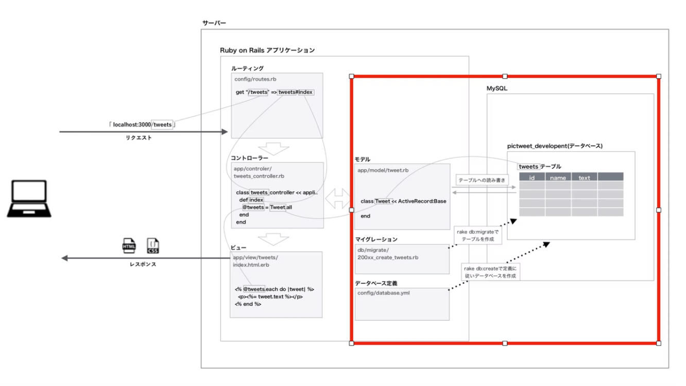
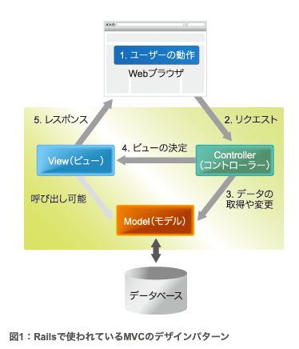
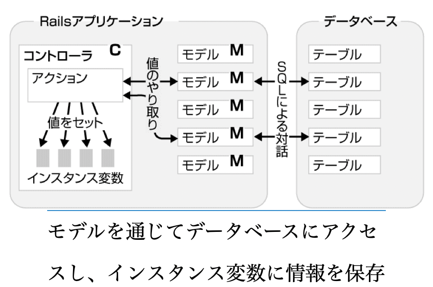
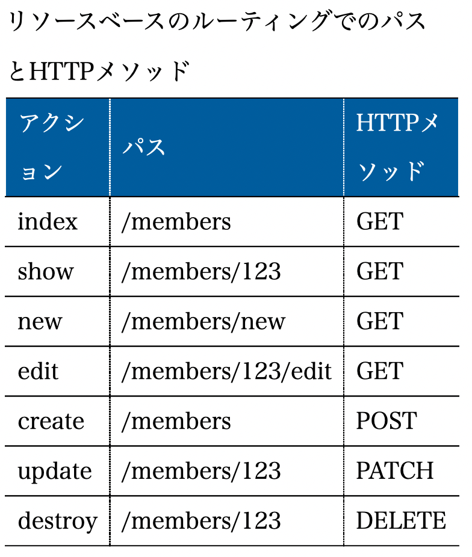
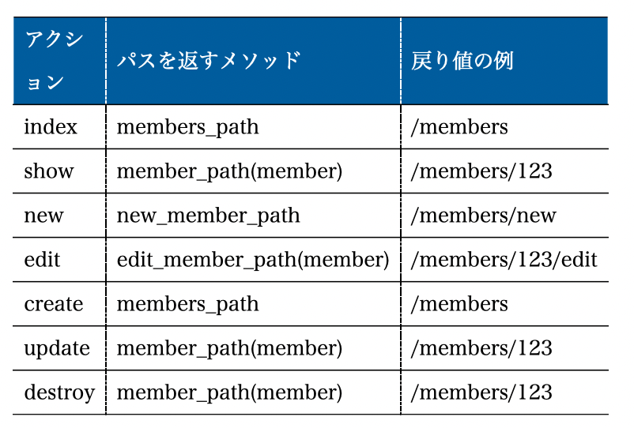

# Ruby on Rails

[Railsガイド(本リファレンス)](https://railsguides.jp/)
[Rails](https://atmarkit.itmedia.co.jp/ait/articles/1102/23/news109_3.html)

## Railsの設計哲学

1. DRY(Don't Repeat Yourself): 繰り返しを避けよ

DRYはDRY原則とも呼ばれる。Railsを使ったWebアプリケーションでは同じことを繰り返し記述するのは避けなければならない。
同じことをソースコードや設定ファイルの中で繰り返し記述するのは無駄。仕様変更やバグフィックスのときに一部を変更し忘れる可能性が高くなる。
DRYを意識することで効率よく、品質のよいアプリケーションが作成できる。

2. 設定より規約(Conventition over Configurations)

「規約」とは、言い換えれば「デフォルトの設定」です。**あらかじめ用意された規約に従ってアプリケーションを開発することで、記述量を大幅に減らせます。**
たとえば、モデルには命名規約があり、テーブル名をmembersのように複数形にすると、モデルのクラス名は単数形のMember、クラスを記述するファイル名はmember.rbとなります。決まりきった手順に従うことで、余計な設定を記述する必要がなくなり、プログラマはコードに集中できるようになります。こうした効果について、DavidHeinemeierHansson氏は「制約が自由をもたらす」と述べています。

Railsで採用されているルール（規約）に従っていれば、Active Recordモデルの作成時に書かなければならない設定用コードは最小限で済みますし、設定用コードが完全に不要になることすらあります。これは「設定がほとんどの場合で共通ならば、その設定をアプリケーションのデフォルトにすべきである」という考えに基づいてる。

## Rails でのアーキテクチャー



## MVC

RailsではMVCでの役割を分けるだけではなく、モデルはここ、コントローラーはここに書くというようにM,V,Cごとにフォルダで分けることで開発もスムーズに行えるような仕組みになっている。

## Rails model

モデルとDBは1対1の相互関係で成り立っている。
※開発現場でもモデルが一番最初に作られる。
※モデルはただのクラスだがDBと連携するクラスをRailsではモデルと呼ぶ

## Railsで新規タグ

Railsでクラスを作るには、直接ファイルを作成するのではなく専用のコマンドをつかうことが多い。

## マイグレーションファイル

[リファレンス](https://railsguides.jp/active_record_migrations.html)

マイグレーションファイルはDBへの変更を記述しておくファイル
例として、テーブルを作成したいときや、カラムを追加したい時はマイグレーションファイルを作成する。

マイグレーションファイルはテーブルの中身のカラムを作成するファイル。
**※マイグレーションではRubyのDSLを持っているので生のSQLを作成する必要はない。そしてスキーマとスキーマへの変更をDBの種類に依存せずに済む。**


## Dockerを使わない場合のRails

Dockerを使わないRailsデプロイでは、以下の環境変数が自動で設定される。
**Docker経由の場合は、自分で本番用の環境変数を設定する必要がある。**

- LANG: en_US.UTF-8（ランゲージ）

- RACK_ENV: production（ラックエンブ）
Rackへ現在の環境を示す変数
Rackとは … http送受信処理を担当するモジュールのこと。

- RAILS_ENV: production（レイルズ エンブ）
Railsへ現在の環境を示す変数

- RAILS_LOG_TO_STDOUT: enabled（ログ スタンダート アウト）
logを標準で出力するか否かのフラグ。enabled = 出力する。

- RAILS_SERVE_STATIC_FILES: enabled（サーバー スタティック ファイルズ）
publicディレクトリからの静的ファイルを提供してもらう（apiモードではあんま意味ないかも）

## Railsで使われているMVCのデザインパターン



**APIモードではViewは存在しない。**

- モデル
モデルはデータとビジネスロジックを表す。ビジネスロジックとは例えば給与計算ロジックのようなアプリケーションドメイン特有の処理のこと(localhost/api/users)→userの一覧を出すみたいな
Railsではモデル層はActiveModelという概念に抽象化され、デフォルトではActiveRecordというO/Rマッピングの機能を提供するライブラリが使われる。
ActiveRecordでは、リレーショナルデータベースのテーブルに対応するモデルクラスにアプリケーションのデータとロジックを実装していきます。データの永続化に関する処理の多くはActiveRecordが担当してくれるので、単純なモデルであれば、プログラマが書かなければならないコードの量は、ごくわずかです。一般的にプログラマがモデルに追加することの多いコードとしては、クラスの持つ値の検証や、他モデルとの連携が挙げられます。


- コントローラ
ユーザのリクエストを受けて、モデルに適切な動作を要求する。
またどのビューをどの組み合わせで利用するかを決定する。
Webアプリケーションにおけるコントローラーには、このほかWebに関する一般的な仕事を受け持つという側面があります。例えばセッション管理や、URLの解釈、HTTPリクエスト・レスポンスの処理、クッキーの管理などを担当します
Railsでは、コントローラーはAbstractControllerとして抽象化された上で、Webアプリケーション用の機能がActionControllerとして実現されています。プログラマは、これを継承したApplicationController（アプリケーションごとに1つ用意されます）に共通機能を追加したり、さらにこのApplicationControllerを継承した各種のコントローラークラスを追加していくことで開発を進めます。なお、個々のリクエストに直接的に対応する機能を実装した部分はアクションと呼ばれ、コントローラークラスのpublicなインスタンスメソッドとして実装されます。

## Railsの構成と機能

Railsは**復数のコンポーネントで構成されている。**
Railsの実体はコンポーネント(Rubyで書かれたライブラリ)の集合体
**基本とある3つのコンポーネントの名前を覚える**

- Active Record : モデル
- Active View : ビュー
- Active Controller : コントローラー


## Rails APIモードとは

Rails APIモードとは、API作成に特化したモード
APIモードではMVCのV(ビュー)が存在しないため、rails new を実行した際にビューに関するファイルやGemが生成されません。
API作成に特化したモードのことで、Rails5で実装された機能らしいです。 簡単に今までのRailsとの違いを説明すると、MVCでいう、Viewの部分が存在しません。 変わりにそのURLにアクセスするとerbを返さず、jsonを返す仕様になっています。 また、標準で入っているGemもViewの分が必要なくなっているので、普通に立ち上げたRailsのプロジェクトよりも少なくなっています。 詳しくは各々で調べてみてください。

- APIモードの違い
[参考URL](https://note.com/icchoco/n/nd408d2a9b2c8)


---

## gemとは

gemはRubyGemsと呼ばれるRuby用のパッケージ管理システムによって管理されたライブラリ
RubyGemsが提供するgemコマンドを通じてインストール等ができます。


---

## bundler、Gemfile、Gemfile.lockの関係性について

[参考URL](https://qiita.com/nishina555/items/1b343d368c5ecec6aecf)

Ruby on RailsでWebアプリケーション（以降ではRailsアプリと略します）を開発をするにあたり、gemの活用は開発効率をあげるために重要


- bundler(node_modulesみたいな)
bundlerは依存関係にあるgemの依存関係やバージョンを管理してくれるgem
**bundlerを利用することで依存関係にあるgemの一括インストール。gemのバージョン管理ができるようになる**
`$ bundle install`を使って、Gemfileに記載されたgemをインストールする。


- Gemfile (package.jsonみたいな)
GemfileとはRailesアプリで利用されるgemの一覧を管理するファイル
bundlerによってインストールされるgemはどこで管理されているのか。

## Rails 開発モードと本番モード

[参考URL](http://programing-kiso-note.blogspot.com/2014/01/ruby-on-rails.html)

Railsには開発モードと本番モードという２つのモードがあり、それぞれ役割ごとにデータベースを切り替えて使う機能が備わっている。

本番環境への切り替え方は以下の用にする
1.環境変数の設定
export RAILS_ENV=production(linuxの場合,windowsの場合はset RAILS_ENV=production)
2.モードが変わったかどうかは以下のコマンドで確認
ーrails consoleでコンソールを開く。
ーRails.envとコマンドを叩く、これで現在の開発モードが出てくる。
3.precompileをする。
ーassetsの圧縮ファイルを作成する事が目的？SASSのbuild、JSファイルの圧縮などを行っておくのだと思われる。これを行う事により高速に動作する?
確認したところ圧縮しているわけではなさそう。キャッシュファイルの生成と書いてはいる。
4.本番モードに切り替えた場合データベースをシードから作っていないので
作成する。
rake db:create
rake db:migrate


## Active Recordについて

Active RecordとはMVCで言うところのMつまりモデルに相当するものであり

---

## Rails フォルダ構成

```sh
store            … アプリケーションのルートディレクトリ
  app            … MVCに関わるアプリケーションの中心的なコード
    controllers  … コントローラークラス
    helpers      … ヘルパーモジュール（ビュー用のヘルパーメソッド）
    mailers      … メール用のコントローラー
    models       … モデルクラス
    views        … テンプレート類
      layouts    … テンプレートに適用するレイアウト
  config         … 設定ファイル類
    environments … 開発、テスト、本番運用といった環境ごとの設定
    initializers … アプリケーション起動時に実行したいファイル
    locales      … 国際化に関するリソース
  db             … データベースに関するファイル
  doc            … rdocなどのドキュメント
  lib            … アプリケーションが使うライブラリコード全般
  log            … アプリケーションが出力するログ
  public         … Webの静的なコンテンツ
  script         … ユーティリティースクリプト
  test           … Railsのデフォルトの自動テストに関するファイル
  tmp            … 一時ファイル
  vendor         … アプリケーション外部に由来するコード
    plugin       … Railsプラグイン
```

## Rails url

[参考URL](https://qiita.com/190131start/items/49e2e9a42f49f17e45c6)

resources :users
６つのアクションが自動生成されますね。
これはREST設計になっています。

GET /users            users#index
POST /users           users#create
GET /users/:id        users#show
PATCH /users/:id      users#update
PUT /users/:id        users#update
DELETE /users/:id     users#destroy


## Puma

[参考URL](https://nekorails.hatenablog.com/entry/2018/10/12/101011)

Pumaとは、複数のリクエストを並行しうて処理することができる高速化を目的としたWebサーバ
Rails5以降はデフォルトでpumaが導入されており、自ら導入する必要はありません。

## docker  rails

[参考URL](https://qiita.com/eighty8/items/0288ab9c127ddb683315)

## rails debug

[参考URL](https://qiita.com/nishina555/items/e5886339d381db61b412)


## -b 0.0.0.0

-b 0.0.0.0

rails serverのコマンドオプションとなります。
railsのプロセスをどのipアドレスにバインドするかを指定します。
ここではlocalhostのipアドレス「127.0.0.1」を「0.0.0.0」にバインドしています。
なぜこんな事をするのか?
仮想環境で起動したRailsは、localhostのipアドレス「127.0.0.1」でアクセスできません。

そこで仮想外部からアクセスできるように、ip「0.0.0.0」に紐付けをする必要があるのです。

これにより、自分のPC上のブラウザでRailsにアクセスできるようになるのです。

## Tips

[参考URL](https://hacktomo.hatenablog.com/entry/2017/12/14/012423)

```sh
# ルーティング確認(api起動をしている際)
$ rails routes

# rails内の環境変数を確認したい場合(コンソールを出す : console の略)
$ rails c

```

## DBの読み書きに使用するタイムゾーン

Railsにはアプリのタイムゾーンとは別に、DBの読み書きに使用するタイムゾーンがある。

---

## Rails6でのZeitwerk(ツァイトベルク)

[参考URL](https://zenn.dev/murakamiiii/articles/893d83626c9f15)

- そもそもなぜRailsではrequireなしにファイルを読み込むのか

他の言語などにおいて、他のファイルを読み込むとなればimportするなどして明示的に読み込む必要があるが、**Railsではそれをよしなにやってくれる。**
Zeitwerkという仕組みがRailsには組み込まれているから

Rails6から自動読み込みモードZeitwerkが追加された。


---

## プロジェクト構造

Railsアプリケーションでは**ファイル名はそれらが定義する定数と一致する必要**があり、**ディレクトリは名前空間**として機能する
Zeitwerkは例として、app/controllers/users_controller.rb定数を定義するUsersController(クラス)のことを期待しています。

## Rails6からのlibディレクトリ以下のファイル読み込み

Rails6のデフォルトではlibディレクトリ以下のファイルは読み込まれない

読み込む方法は2つある

1. requireで呼び出し

読み込みたい場所でrequireで宣言する方法
Railsがデフォルトで読み込むパスにはapp/libまで設定されている。それ以下のファイルパスを渡す。

api/lib/validator/email_validator.rbの場合
=> "validator/email_validator.rb"のパスを渡す

2. application.rbで呼び出し

Rails6のオートロードシステム(Zeitwerk)に読み込むパスを追加する方法

## rails での test

Railsのデフォルトではfixture(フィクスチャー)を使ってテストデータを生成する。

- fixtureとは
fixtureとは、Railsが用意しているテストデータを生成するための方法です。
この方法を使う場合、テストデータはymlファイルで生成する。

## Pundit

[参考URL](https://qiita.com/yutaro50/items/52484b7ae4ca87aa99a2)

Rubyのgemライブラリ
**認可の仕組みを提供してくれる**
ユーザによってページ表示の許可・拒否をしたり表示情報の範囲を変えたりすることができるgem

## module

[参考URL](https://techplay.jp/column/536)

moduleには部品の集まりや区分という意味になる。
Rubyの**moduleはclassと同じようにmodule内に関数の定義ができること、**プログラム上での役割や振る舞いをまとめることができる。

classとの違いは？
1. moduleからインスタンスが生成できないこと
2. moduleは継承ができない

- moduleを使うメリット

```ruby
module Car
  class SuperCar
    def self.introduce
      puts "This is SuperCar"
    end
  end
end

class SuperCar
  def self.introduce
    puts "これはスーパーカーです"
  end
end

Car::SuperCar.introduce # module呼び出し
SuperCar.introduce # class呼び出し
```

module名とclass名は同名であるが、**moduleには名前空間としての役割を持っているためコンパイル上では別のものとなっている。**

## ruby独自の機能にMix-in

Mix-inすることでmodule内のメソッドをインスタンスメソッドとして利用することがができる
includeでの拡張は静的である。

```ruby
module Lion
  def cryLion
    puts "ガオー！"
  end
end

module Cat
  def cryCat
    puts "ニャー"
  end
end

class Animal
  include Lion, Cat # moduleの機能をincludeしている
end

obj = Animal.new

obj.cryLion # Lionクラスのmethodを利用
obj.cryCat  # Catクラスのmethodを利用
```

---
ここから本

## Rails処理順序(基本)




1. ブラウザからのリクエストを受け取ると、Railsはパスを調べroutes.rbに従ってどのコントローラのどのアクションを選べば良いかを決める(Controllerの中にアクションは複数ある)
2. Railsは選ばれたアクション(メソッド)を実行する(アクションにはモデルとの間で情報のやり取りをするプログラム)を書く
3. モデルはDBのテーブルと対応している、アクションはモデルから取得した情報のうち、表示に必要なものをインスタンス変数に保存し返す

## route

RailsアプリケーションではRESTの原則に従ってデータをリソースとして扱う
>RailsにはRESTに基づいた作法でウェブアプリケーションを作成する機能がある。

## Railsにおけるリソースとは

コントローラが扱う対象に名前をつけたもの。
リソース名を設定するには`config/toutes.rb`にresourcesメソッドを追加するだけ

`resources: リソース名の複数形で記述する`

**上記で7つのアクションのルーティングが設定できる。**

これをRESTフルなルーティング、またはリソースベースのルーティングと呼ぶ
※リソースを扱うコントローラーはMembersControllerの様に、リソース名+Controllerという名前が一般的

## config/toutes.rb

```ruby
resources :orders, only: [:index]
```
必ずorderのモデルが必要ではない。
リソース名に対応したコントローラに対して、**7つのアクションのルーティングを自動的に設定するだけ**


## リソースを扱うコントローラー

コントローラでは7つのアクションを用意する
この7つは原則としてデータベースの基本操作であるCRUDを実装したもの

api/app/controllers

```ruby
module User::Apis::V1::User
  class PaymentHistoriesController < ApiController

    def index
      params = index_params
      offset = params[:offset] || 0
      authorize(nil, policy_class: PaymentHistoryPolicy)

      common_query = policy_scope(nil, policy_scope_class: PaymentHistoryPolicy::Scope).ransack(params[:q]).result
      payment_histories = common_query.
                            order(captured_at: :desc).
                            limit(limit).
                            offset(offset)
      total_count = common_query.count

      render json: payment_histories, root: "payment_histories", meta: total_count, meta_key: "total_count",
             include: SERIALIZER_INCLUDE, adapter: :json
    end
  end
end
```

## 7つのアクション

7つのアクションを呼び出すには以下画像をみる。
HTTPメソッドの組み合わせを使う。


- index
リソースの一覧を表示する
- new
リソースを追加する(テーブルに新しいレコードを作成する)ためのフォームを表示する
- create
リソースを作成する(テーブルに新しいレコードを作成する)
- show
リソースの属性を表示する(レコードの内容を表示する)
- edit
リソースを更新する(既存のレコードのカラムを更新する)ためのフォームを表示する
- update
リソースを更新する(既存のレコードのカラムを更新する)
- destroy
リソースを削除する(テーブルからレコードを削除する)

## 7つのアクション以外の追加

任意のアクションを追加するには resourcesメソッドにブロックを渡しブロックの中でもHTTPメソっドを表すメソッド アクション名を記述

## パスを返すメソッドが使える(resource)

リソースを指定すると、コントローラーのアクションを表すパスを取得できる



## 特定のアクションを使わない場合

```ruby
resources :contents, only: [:index, :show, :create, :update]
```

onlyオプションに渡す
上記だと:index, :show, :create, :updateアクションのルーティングだけ設定する。

## Rails起動ガイド

[参考URL](https://railsguides.jp/initialization.html)

1. bin/railsが読み込まれる

```ruby
#!/usr/bin/env ruby
APP_PATH = File.expand_path('../config/application', __dir__)
require_relative "../config/boot"
require "rails/commands" # ここでAPP_PATH定数が使われる
```

2. /config/boot.rbが読み込まれる

```ruby

ENV['BUNDLE_GEMFILE'] ||= File.expand_path('../Gemfile', __dir__)

require 'bundler/setup' # Gemfileが存在する場合は、bundler/setupをrequireする
require 'bootsnap/setup' # Speed up boot time by caching expensive operations.
```

3. rails/commmands.rbを実行する

2が終わると、次に**コマンドの別名を拡張するrails/commandsをrequireする**
拡張されたのは以下
```ruby
require "rails/command"

aliases = {
  "g"  => "generate",
  "d"  => "destroy",
  "c"  => "console",
  "s"  => "server",
  "db" => "dbconsole",
  "r"  => "runner",
  "t"  => "test"
}

command = ARGV.shift
command = aliases[command] || command

Rails::Command.invoke command, ARGV
```

## /initializers以下のrbファイル

アプリケーション起動時にロードされるもので、初期化処理で使われる
自分でrbファイルを追加して使うことも可能


SELECT `products`.`id` AS t0_r0, `products`.`fanclub_id` AS t0_r1, `products`.`type` AS t0_r2, `products`.`slug` AS t0_r3, `products`.`plan` AS t0_r4, `products`.`name` AS t0_r5, `products`.`description` AS t0_r6, `products`.`status` AS t0_r7, `products`.`created_at` AS t0_r8, `products`.`updated_at` AS t0_r9, `products`.`visible` AS t0_r10, `fanclubs`.`id` AS t1_r0, `fanclubs`.`name` AS t1_r1, `fanclubs`.`slug` AS t1_r2, `fanclubs`.`description` AS t1_r3, `fanclubs`.`icon_url` AS t1_r4, `fanclubs`.`cover_image_url` AS t1_r5, `fanclubs`.`status` AS t1_r6, `fanclubs`.`position` AS t1_r7, `fanclubs`.`created_at` AS t1_r8, `fanclubs`.`updated_at` AS t1_r9, `fanclubs`.`liver_name` AS t1_r10, `fanclubs`.`liver_name_ruby` AS t1_r11, `payment_settings`.`id` AS t2_r0, `payment_settings`.`service_type` AS t2_r1, `payment_settings`.`payment_type` AS t2_r2, `payment_settings`.`is_subscription` AS t2_r3, `payment_settings`.`period` AS t2_r4, `payment_settings`.`status` AS t2_r5, `payment_settings`.`created_at` AS t2_r6, `payment_settings`.`updated_at` AS t2_r7, `payment_settings`.`visible` AS t2_r8, `bulletins`.`id` AS t3_r0, `bulletins`.`license_id` AS t3_r1, `bulletins`.`image_url` AS t3_r2, `bulletins`.`description` AS t3_r3, `bulletins`.`status` AS t3_r4, `bulletins`.`delivery_start_at` AS t3_r5, `bulletins`.`created_at` AS t3_r6, `bulletins`.`updated_at` AS t3_r7 FROM `products` LEFT OUTER JOIN `fanclubs` ON `fanclubs`.`id` = `products`.`fanclub_id` LEFT OUTER JOIN `products_payment_settings` ON `products_payment_settings`.`product_id` = `products`.`id` LEFT OUTER JOIN `payment_settings` ON `payment_settings`.`id` = `products_payment_settings`.`payment_setting_id` LEFT OUTER JOIN `bulletins` ON `bulletins`.`license_id` = `products`.`id` WHERE `products`.`type` = 'License' AND `products`.`fanclub_id` = 8 AND `products`.`status` IN (1, 2) AND `fanclubs`.`status` = 1 AND `payment_settings`.`status` = 1


