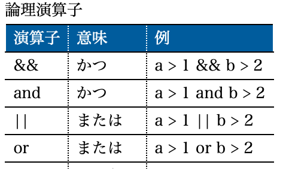
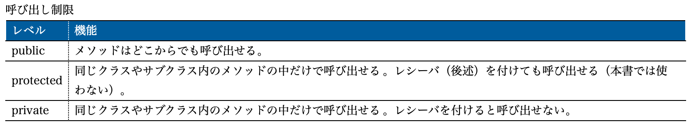
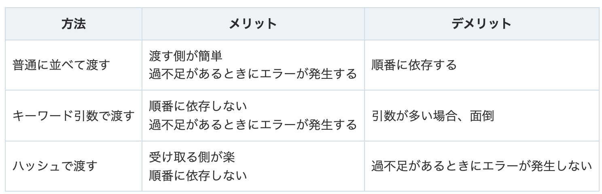

# Ruby

[他言語からRuby入門について](https://www.ruby-lang.org/ja/documentation/ruby-from-other-languages/)
[Rubyist Magazine](https://magazine.rubyist.net/articles/0061/0061-ForeWord.html)
[ruby リファレンス](https://www.ruby-lang.org/ja/documentation/)

## Rubyを書く時意識すること

文字列も数値も配列もすべてクラスから生成されたインスタンス（その上の基底クラスが定義されているから文字列ならこのメソッドみたいに使える）
つまり、何が言いたいのかは
型を意識しながら書く。そこで調査する範囲が狭まる（stringか、ならstringのメソッド一覧を探すかみたいな）

## Ruby パッケージ


## Ruby 3.0.Xの依存関係

`% sudo apt install -y libssl-dev libreadline-dev zlib1g-dev`

※macOSだとopensslでまかなうらしい

## Ruby 仕組み

### 変数宣言でのメモリ確保

JavaやC#のような言語では、利用する前に変数の名前とそこに格納できるデータの種類（データ型）をあらかじめ宣言する必要がある、
JavaやC#のような言語では、宣言という行為を経て始めてデータを格納するための領域がメモリ上に確保される

Rubyでは？
Rubyでも変数の宣言は必要だが、スクリプト上で**変数に初めて値を格納したタイミングで変数のための領域が自動的にメモリ上に確保される。**

### require, include, extend

[違いについて](https://qiita.com/suzukiry/items/db936ff7312ba7d97315)

require
ファイルをメモリに読み込む
loadとの違いは、requireはすでにメモリに展開されていた場合はたとえ対象ファイルに変更があっても読み込みしないが、loadはする、そうです。
読み込み先が頻繁に更新されるときは、loadを使ってその変更をタイムリーにひろう、ために使うそうです。

include


## Language Server Protocolは(LSP)

[Rubyプロジェクトにsolargraphとrobocopを入れる](https://zenn.dev/massu_devix/articles/e400308d55011d)

## Ruby他言語との違い

Perlの多くの部分を踏襲したRubyでしたが、1点決定的に異なる部分がある。
それはRubyが純粋なオブジェクト指向言語である、という点。

後からオブジェクト指向の仕組みを取り入れたPHPとは異なり、**Rubyは最初からオブジェクト指向で記述できるよう開発された言語。実行はインタプリタ方式**

Ruby on Railsを使用した場合の最大のメリットは、**開発スピード低予算でWebアプリを簡単に作ることができること。**

**Railsは「フレームワークに依存させることによって開発コストを最小にする」ことを極限まで追求したような化け物フレームワーク**

## Rubyスタイルガイド

[スタイルガイド](https://techracho.bpsinc.jp/hachi8833/2017_02_13/35364)

1. **シンボル名、メソッド名、変数名**はスネークケースにする
2. **クラス名とモジュール名**はキャメルケースにする（camelCase）
3. **ファイル名とディレクトリ名**はスネークケースにする
4. **ソースファイル名**にはクラス名やモジュール名のキャメルケースをスネークケースに変えたものを使う
5.


## Railsとクリーンアーキテクチャーの相性

[RailsとClean Architectureに関する考察](https://qiita.com/shunjikonishi/items/e39ed8091e1dca817468)

Clean Architectureは「使用するフレームワークにかかわらず通用する普遍的な設計手法」を目指したもの。
一方でRailsなどのアプリケーションフレームワークは「フレームワークに依存させることによって開発コストを最小にする」ことを目指したもののため、絶妙に合わないかも

## Rubyのインデント

スペース2が基本

## Rubyの文字コード

UTF-8が標準

## Rubyの改行コード

LFで統一するのが慣例（macOSやLinux）

## Ruby コンパイラとインタプリタ

Rubyはインタプリタ型のプログラミング言語。
Rubyプログラムが記述されたソースコードを逐次解釈して実行する。
**Ruby 1.9以降の言語実装(YARV)では処理を高速化するためにテキストコードをいったん独自のバイナリーコードに変換してから実行する。**
現在のRubyはコンパイラとインタプリタの中間言語といえる。

## Rubyによってできること

1. Webアプリケーション
2. WebAPI
3. スクレイピング
4. スマホアプリ
5. 機会学習

## すべては値

式と文に違いはありません。 すべては値を持ちます。nilであっても例外ではありません。 Rubyでは次のように書くことが可能
**※if文を変数に入れることができる**

```ruby
x = 10
y = 11
z = if x < y
      true
    else
      false
    end
z # => true
```

## Rubyの内部実装(シンボル)

[参考URL](https://qiita.com/Kta-M/items/53a13ef60e14fcb41193)

Rubyの内部実装は、メソッド名や変数名、定数名、クラス名などの名前を整数で管理している
これは名前を直接文字列として処理するよりも速度面で有利だから。
そしてその整数をRubyのコード上で表現したものがシンボル
シンボルは、ソース上では文字列のように見え、内部では整数として扱われる、両者を仲立ちするような存在です。

名前を管理するという役割上、シンボルと文字列は一対一に対応します。 また、文字列と違い、immutable (変更不可）であり、同値ならば必ず同一です。

## 疑問符(?)や感嘆符(!)のメソッド

Rubyでは、メソッド名の最後にが
慣習的に、問い合わせ系のメソッドの最後には疑問符が使われます (例: レシーバが空の場合にtrueを返すArray#empty?)。 また、使用に危険を伴うメソッドの最後には感嘆符が使われます (例: selfあるいは引数の内容を書き換えるようなメソッド。exit!など)。 けれど、危険なメソッドすべてがこの慣習にしたがっているわけでも ないことに注意してください。 Array#replaceは、与えられた配列の内容で配列の内容を置き換えます。 この操作は、自身を変更しないようなメソッド名とは意に反する振る舞いをします。

## 時間

```ruby
Time.current
# Railsの独自のメソッドで、TimeWithZoneクラスを使用している。
# config.time_zone で設定したタイムゾーンを元に現在時刻を取得する。

Time.now
# Timeクラスを使用している。
# 環境変数TZの値。なければシステム(OS)のタイムゾーンを元に現在時刻を取得する。
```

## Ruby 定数

[参考URL](https://yulii.github.io/ruby-freeze-method-20150922.html)

Rubyにおける定数は不変の値というよりグローバル変数に近い（ミュータブルのため目立たないバグを埋め込む可能性がある。）
またRubyでは先頭が大文字になっている識別子のことを定数としていることからクラス名であるStringやArrayなども定数として扱っている。

[参考URL](https://qiita.com/fursich/items/a1b742795cf10eebc73f)

- 定数参照
## ::演算子
>あるクラスまたはモジュールで定義された定数を外部から参照する ためには::演算子を用います。またObjectクラスで 定義されている定数(トップレベルの定数と言う)を確実に参照する ためには左辺無しの::演算子が使えます。

## $LOAD_PATHとは

ファイルを読み込むRubyのメソッド`load`や`require`がファイルを参照する時に使われるディレクトリパス群
application.rbにもrequire "rails"などと言った記述がありますが、これだけでどうやってRailsのGemファイルを参照しているのか疑問だが、$LOAD_PATHにパスが設定されているため。

## ブロック構文

Rubyに組み込まれたメソッドの中には、ブロック構文を使って処理や条件を指定可能なメソッドがある。

Rubyで使えるメソッドの中には引数の他に、`do ~ end`または`{}`で囲まれたブロック構文を利用するメソッドが多い。

**そして、ブロック構文は、doで始まり、endまでが範囲です。また、省略して{}で囲む書き方も可能。**

- ブロック構文の使い分け
厳密な違いは結合の強さが違い、`{}`が優先されるが、

## Rubyにおけるメソッドの呼び出し方

Rubyでメソッドを呼び出す場合、次の2種類があり、**どちらの方法が使われるかはメソッドによる**

1. メソッドと引数で呼び出す

メソッド名のみ、または、メソッドに続けて括弧内に引数を指定する方法です。引数は、値や変数の他、式も記述できます。

```ruby
hoge
hoge()
```

2. ブロック付きメソッドで呼び出す

do～endまたは{}で囲った制御構造を付けてメソッドを呼び出す方法です。eachメソッドなど、繰り返し処理の内容を記述する場合などで使われます。そして、do～end、または、{}内の制御構造がブロック構文です。

```ruby
hoge do 制御構造 end

hoge { 制御構造 }
```

## Ruby 変数

[参考URL](https://techracho.bpsinc.jp/hachi8833/2017_02_13/35364)

Rubyでは**変数の命名によって変数のスコープ**が変わる（もちろん変数定義場所なども影響する）

- 小文字または_で始まる識別子
ローカル変数（最初の代入はそのスコープに属するローカル変数の宣言になる）
またはメソッド呼び出し（宣言されていない識別子の参照は引数のないメソッド呼び出しとみなされる）

- @で始まる変数
インスタンス変数（特定のオブジェクトに所属し、そのクラスまたはサブクラスのメソッドから参照できる）

- @@で始まる変数
クラス変数（クラス定義の中で定義され、クラスの特異メソッド、インスタンスメソッドなどから参照・代入できる）

- $で始まる変数
グローバル変数（宣言なしでコードのどこでも利用できる）

- アルファベット大文字 ([A-Z]) で始まる識別子
定数（定義と初期化は代入で行われる、メソッド内では定義できない）


```ruby
# 変数
price = 100
# 定数（大文字で始める必要がある）
TAX_RATE = 1.1
```


## @_

[参考URL](https://qiita.com/CASIXx1/items/98d31734e26da8982f97)

@_hogeはただのインスタンス変数
@hogeではない理由はある命名規則に則っているから


## Rubyでの文の終わり方

Rubyでは文の終わりを示すためのセミコロン（;）はない。
**改行が文の終わりとみなす**

そのため以下はひとつの文
```ruby
a = true; b = true; c = false;
```

## Rubyでのオブジェクトとは

**Rubyでは、すべてのデータはオブジェクト**
**配列やHash、数字や文字列もオブジェクト**
**オブジェクトは、必ず何らかのクラスのインスタンスなる**

オブジェクトとは、とても簡単に言うと、関連する変数（値）とメソッド（動作）をまとめて、そのまとまりに名前を付けたものです。関連する変数やメソッドを1つのオブジェクト内で宣言してまとめてしまうことで、管理しやすくするのがオブジェクト指向です。

ソースコードの見やすさや複数のソースコードファイルがあるときの管理のしやすさを考えると、関係のある変数やメソッドはまとめておく方が好ましく、それを実現できる仕組みとしてオブジェクトが用意されています。

Rubyでは、オブジェクトは、何かのクラスのインスタンスのことを言います。インスタンスは、クラスという設計図からnewメソッドで生成された、メモリ上の領域のことを指します。コンピューターのメモリ上に、オブジェクトの変数や元となったクラス名を保存し、Rubyはその情報を元に、処理を実行します。

## 数値

かつてFixnumクラスとBignumクラスがあった
現在はIntegerとFloatの2つがある。

気をつけこと

1. IntegerとFloatを計算したら自動的にFloatに変換される。
2. 整数同士の割り算の結果は常に整数になる。

## 文字列

[破壊的な変更を防ぐ](https://qiita.com/jnchito/items/e2687e2bf2f49411a1b4)

将来リリースされるRuby 3ではパフォーマンスを向上させるために、文字列リテラルがデフォルトでイミュータブルになる（つまりfreezeされる）と言われています。frozen_string_literalというマジックコメントが導入されたのはRuby 3への移行を支援するためです。

気をつけること

1. テンプレートリテラルは二重引用符(")で囲まれた文字列の中に#{}があると展開してくれる。
2. **数字と文字列の連結** と **>で比較したりするとエラーとなる。**

**もちろん参照渡し**
そしてRubyの文字列はミュータブル、つまり**破壊的な変更が可能なオブジェクト**

```ruby
a = 'hello'
# 文字列を破壊的に変更する
a.upcase!
# 元の文字列が変更される
a #=> "HELLO"
```

破壊的な変更を防止したい場合

```ruby
a = 'hello'

# 初期状態ではfreezeしていない
a.frozen? #=> false

# 文字列をfreezeさせる
a.freeze
a.frozen? #=> true

# freezeされると破壊的な変更ができない（エラーになる）
a.upcase! #=>RuntimeError: can't modify frozen St
```

## 配列

要素の番号は0から始まる。
現在の要素数より、大きな番号を指定して要素を取り出すと、何もないことを表すnilが返される

気をつけること
1. 要素数の数より大きな数を指定して要素を入れると可変してくれる。

```ruby
irb(main):011:0> ani = ['a','b','c']
irb(main):012:0> ani[8] = 'd'
irb(main):013:0> puts ani
a
b
c


d
=> nil
```

2. 配列に要素として、様々な雑多なオブジェクトを入れることができる(文字列・数字・オブジェクトをごちゃまぜ可能)
3. %w()の中にスペースで区切って文字列を並べると配列を簡潔に記述できる。文字列の中で式展開などを使いたい場合は%W()を使う

## デバッグで使うメソッド

inspect
オブジェクトの内容を読みやすい形にした文字列を返す。

p
putsと同じ結果を返す


## 式

**式は何らかの値を返す**
Rubyでは式と文の区別はあまりない(if文の結果を変数に入れられるため)

## 演算子

気をつけること

```ruby
=~ # 文字列と正規表現が一致するかを判定するRubyの演算子
```

## ||演算子

[参考URL](https://qiita.com/ngron/items/4d3ca9827d1969fccd60)

```ruby
# 代入
hoge = nil || false || 1 || 2
#hoge = (偽) || (偽) || (真hoge)
p hoge
=> 1
```

## 代入演算子としての||演算子

||= という記号を見たことがある人はいるのではないでしょうか。
使い方としては、左辺が存在しない(偽)の場合、右辺の値が代入されるイメージです

```ruby
hoge ||= 1
p hoge
=> 1
```

## &.(ぼっち演算子)

[参考URL](https://qiita.com/onikan/items/e3a12e23e10ca301a9fc)

Rubyでは通常、レシーバーに対してメソッドが実行された時、レシーバー(オブジェクト)がnilだった場合にエラーを返す

しかしプログラムによってはエラーを返したくない時がある、そんな時に使うのが&.
&.はオブジェクトがnilだった場合にエラーではなく、nilを返してくれる

## &.(ぼっち演算子) メリット

返り値が「〇〇かnil」を返すみたいなメソッドがRubyにはあります。それを受け取ったレシーバーに、レシーバーに「nilが想定されていないメソッド」を使ってしまうと、エラーが出力されてしまいます。

そんな時に「&.」を使うことで、そのメソッドはエラーではなく、nilを返してくれるようになります。

```ruby
# オブジェクト&.メソッド
@nickname = current_user.nickname
@nickname = current_user&.nickname
# 前者では、ログインしていない場合、エラーが出てしまいます。currrent_userがnilだからです。
# 後者では、ぼっち演算子を使っているのでエラーははかれません。
```

## 条件式

気をつけること
条件式の結果は c = (a == b)のように取り出すことができる。trueかfalseを返す

a == bのようにある条件が成立しているかどうかを調べる式を**条件式という**

- 論理演算子


## falsyな値

気をつけること

**0と空文字は真になる** → JSではfalseになっていた

Rubyでは条件式がfalseになるのは
**falseかnilの時だけ**


## if文

気をつけること
1. falsyな値に気をつける

if文を1行で終わらしたい場合
`if num % 2 == 0 then puts "偶数です" end`
※thenが必要

2. 後置のifを頻繁に使う

trueだったらputsをする。
`puts "偶数" if num % 2 == 0`

## unless

**条件式が正しくないときに**プログラムを実行する

```ruby
unless num % 2 == 0
  puts "偶数ではない"
end
```

**ifと同様に後置のunlessも使える**


## メソッド

**メソッド名の最後には?か!をつけることができる**

- ?と!がつくメソッド
? : ?がついたメソッドはtrueまたはfalseを返すことができる。
! : !がついたメソッドはそのオブジェクトの中身を変更することを表す(!がつかないメソッドはオブジェクトを変更せずに新しいオブジェクトを返す)
※メソッド名に?や!をつけるのはRubyの文法というより慣習。自分でメソッドを作る時も意識する。

気をつけること

1. 戻り値を返したい場合は、最後に変数名を1行書けば済む(Rubyではメソッド内で最後に実行された式の値が戻り値になる)
2. 引数がないmethodの場合は名前の記述だけで呼び出せる。
3. methodを呼び出す時に `triangle 11, 9`のようにかっこを省略することもできる。
4. `&:メソッド`の書き方でブロックを渡せる

```ruby
def triangle(base, height)
  result = base * height / 2.0 # resultが戻り値になる。
end
```

### 引数省略

かっこは省略できるが、かっこはつけるべき
以下の場合はつけなくてもよい

- 引数がない関数の場合
- カッコをつけないスタイルが慣例になっているもの（putsのような）


## ローカルスコープ

ローカルスコープとなるところ
1. method内
2. ブロック内

気をつけること
**if文やunless式の中のローカルスコープはスコープがない。**

## ブロック

気をつけること
1. ブロックはdoとendの代わりに {}で囲むことができる
`10.times { |i| print i, ","}`
2. メソッドに引数とブロクを両方渡すことができる
```ruby
2.upto(6) do |i|
  print i, ", "
end
```

Rubyでの面白い特徴のひとつ。
Rubyではmethodを呼び出す時にブロックと呼ばれるコードのかたまりを渡すことができる。
**※ブロックは繰り返しの処理によく使われる**

簡潔にいうと
ブロックとは**doからendまでのプログラムのひとかたまりの部分**
ブロックには | と |で囲んでブロックパラメータを指定できる。

## 配列

要素を順番に処理するのはeachメソッドを使う

```ruby
arr = ["a", "b", "c", "d", "e", "f"]
arr.each do |item|
  print item + ", "
end
```

## シンボル

**メソッドや変数の名前だけではなく、アプリケーションで特別な意味を持つ名前を表すのにもシンボルが使われる。**

Railsの開発でよく使われるのはハッシュのキーをシンボルにすること

rubyのシンボルは名前を表すオブジェクト。
シンボルを作るには`:cat`のように名前のまえに:(コロン)を付ける

Railsの開発でよく使うのはハッシュのキーをシンボルにすること。

`class: "menu" は :class => "menu"`と同義

## シンボルとはなにか

**文字列を整数で表したもの**

シンボルを作成すると、Rubyの内部では**文字列→一意**の整数の変換が行われ、整数値として管理される。
シンボルは1つの文字列が1つのオブジェクトに1対1で対応する。
シンボルの内容は変更できない。upcase!のような!つきのメソッドを￥持たない


文字列の代わりにシンボルを使うと、プログラムの実行を少々効率化できる。
多くのRubyプログラマはソースコードを読みやすくするためにシンボルを使う。


---
--- object ---

## オブジェクトのコピー

参照渡しを避けるには、`dupメソッド`を使用。すべての値は持っている。

## クラス

## インタンスメソッド

クラスの中にdef ~ endでインスタンスメソッド

## レシーバー

レシーバとは、メソッドの働きかけるオブジェクトのこと

`"aaa".length`
"aaa".lengthと書いた時にメッセージを受け取る側のオブジェクトを レシーバ と呼んだりする。

## インスタンス変数

@を付けた変数はクラスのインスタンスごとに作られるインスタンス変数

気をつけること
1. インスタンス変数の初期値はnil

## アクセス修飾子



**2014年にリリースされた、言語仕様で独立した行にprivateとかくと次に独立したpublicまたはprotectedが出現するまでの間に定義されたメソッドはすべてプライベートメソッドとなる。**

## initialize method (コンストラクタか？)

newでインスタンスを作成する時に自動で実行されるメソッド

## レシーバとself

`robo.move`のようにメソッドを呼び出す対象をレシーバ(受け取るもの)
Rubyでは、メソッドの呼び出しをオブジェクトに対してメッセージを送信すると考えるため
**※レシーバを省略すると現在のオブジェクトを表すselfがレシーバと見なされる。**
self.moveだと、selfを省略できる。

## メソッド呼び出し

`レシーバ.メソッド(引数) {ブロック}`

レシーバがselfの場合は省略可能、**ブロックは&でも渡せる**、等の細かいルールがあるが、基本はこの4つの要素から成り立っている。


## 引数

渡し方は3種類ある

1. 普通に並べて渡す
2. キーワード引数で渡す
3. ハッシュで渡す



2 キーワード引数で渡す

```ruby
def sum_keyword(a:, b:)
  a + b
end

def sum_keyword_with_default(a:, b: 100)
  a + b
end

# 正常系
sum_keyword(a: 10, b: 20)
 # 順番が逆でもOK
sum_keyword(b: 20, a: 10)
```

3 ハッシュで渡す
ハッシュで渡す場合は、引数に過不足があっても例外は発生しません
デフォルト値を設定したい場合は、デフォルトのハッシュを作って、それとマージしてあげれば良いです。

```ruby
def sum_hash(hash)
  hash[:a] + hash[:b]
end

# デフォルト引数
def sum_hash_with_default(hash)
  default_hash = { b: 100 }
  hash = default_hash.merge(hash)

  hash[:a] + hash[:b]
end
# 正常系
sum_hash({ a: 10, b: 20 })
# 順番は気にしなくてOK
sum_hash({ b: 20, a: 10 })
# 余分な値が入ってもエラーにならない
sum_hash({ a: 10, b: 20, c: 30 })
# 不足していても(渡したときは)エラーにならない
sum_hash({ a: 10 })
```

```ruby
def f(*args)
  p args
end

# 各呼び出しパターン
f # => []
f() # => []
f(42) # => [42]
f(42, "answer") # => [42, "answer"]
f(42, "answer", [4, 8, 10]) # => [42, "answer", [4, 8, 10]]
f(42, "answer", [4, 8, 10], {l: 6, r: 9, op: "*", base: 13})
# => [42, "answer", [4, 8, 10], {:l=>6, :r=>9, :op=>"*", :base=>13}]

```

## オブジェクト内のメソッドにアクセスするには？

考えていること
```ts
class A {
  private a: int = 0;
  construct(a: int) {
    this.a = a;
  }
}

const a = new A(1);
```
上記じゃアクセスできない

- アクセサメソッド

**なんと、Rubyではオブジェクト内のデータにアクセスするには、メソッドを書かなければいけない**
**アクセサメソッドでやり取りできるデータを属性と呼ぶ。**

- 属性の実態
属性の実態は変数ではなく、**インスタンス変数とメソッドの組み合わせである。**

## アクセサメソッドの簡略

簡略な書き方がある。

```ruby

class Robot
  attr_reader :name # 読み出し用メソッドが
  attr_writer :name # 書き込み用メソッドが
def

# 読み書き両方のメソッドを作りたいとk
class Robot
  attr_accessor :name
  attr_accessor :name, :name2 # いくつも作りたい時
def

```

## アクセサメソッドのクラス内と外側の呼び出し違い

アクセサメソッドはrobo.nameの様にクラス外から呼ぶ

クラス内ではレシーバーを省略しnameだけで呼べる

```ruby
def change_name(new_name)
  old_name = name # method呼び出し
  name = new_name # 注意。nameはローカル変数になる
  self.name = new_name # 正しい呼びだし
end

```

## クラスメソッド

[参考URL](https://magazine.rubyist.net/articles/0046/0046-SingletonClassForBeginners.html)

定義のしかたが2つある。

`def self.method_name`の特異メソッド形式
特異メソッド方式では、def self.class_methodのようにメソッド名の前にクラスメソッドを定義する対象のクラス名をつけて定義します。リファレンスマニュアルにあるように直接クラス名を書いてもいいのですが、定義するクラス自身の中に書く場合はこのようにself. と書くことが多いでしょう。

`class << self`の特異クラス形式
特異クラス方式では、`class << self`と書いた行からendまでの間に`def class_method`のようにクラス名を書かずにインスタンスメソッドと同じようなメソッド定義を書いていく。
この間に書いたものはクラスメソッドとして定義される。


- 定義

```ruby
class A
  # クラスメソッドの定義
  def self.b
  end
end
```

## class << self

- クラスメソッドの書き方（別）
こちらの書き方が好きなプログラマーも多い

```ruby
class Robot
  class << self # この間にはいくつもクラスメソッドを置くことができる。
    def lodad(fname)
      # クラスメソッドのないよう
    end
  end
end
```

## クラスメソッドとインスタンスメソッドの違い

クラスに属するメソッド＝クラスメソッドはクラス自身に関する情報の
変更や参照の役割をもっている

インスタンスに属するメソッドは、個別のインスタンスに関する情報の
変更や参照の役割りを持っている

## 定数

1. クラス内で先頭1文字が大文字だと定数となる
2. クラス外で定義すると、その定数はどこからでも参照できる。

定数はメソッド内では定義ができない。

## 継承とミックスイン

Rubyには既存のクラスを拡張する方法が色々ある。
Rubyではクラスの継承は単一継承

## モジュール(普通に使う分にはutilとして使えるのでは？)

Rubyのモジュールやクラスは定数。
同じ名前空間で同じ名前の定数を定義はできない。（そのためmoduleとclassの名前同一は無理）

```ruby
module A
# モジュールにメソッドをまとめておく
end
```

クラスにモジュールを取り込むことをミックスインと呼ぶ

- 名前空間としてのモジュールとクラス（これ認可に使えるのでは？)
ミックスイン以外にモジュールは名前空間として使うことができる。

`モジュール名::クラス名`でクラスを参照できる


## Kernelモジュール

Kernelモジュールはputsの様によく使われるメソッドを集めたモジュール
ObjectクラスはKernelモジュールをミックスインしており、**すべてのクラスはObjectクラスのサブクラス**

## Class自体

```ruby
class Robot
end

robo1 = Robot.new
robo2 = Robot.new
```

クラスRobotは、Robotクラスを表すオブジェクトを指している。
Robotクラスを表すオブジェクトも何かのクラスのインスタンス。
→そのクラスはClassクラス。Classクラスはクラスに関する機能を備えたクラス。

RobotはClassクラスのインスタンスを参照する定数のため普通の変数のように別の変数で参照したり、メソッドの引数に渡すことができる

```ruby
kkass = Robot # Classオブジェクトを指す
r = kkass.new # Robot.newと同じ
r.kind_of?(Robot) # クラスはメソッド引数にモナれる

```

## モジュールとクラスの違い

どちらもクラスインスタンス（またはモジュールインスタンス）を作れる
どちらもメソッドを定義できる
どちらもRubyのモジュールやクラスは定数。
同じ名前空間で同じ名前の定数を定義はできない。（そのためmoduleとclassの名前同一は無理）
モジュールはオブジェクトを作れない
クラスはオブジェクトを作れる

```sh
irb(main):001:0> module Parent
irb(main):002:1>   class Child
irb(main):003:2>   end
irb(main):004:1> end
=> nil

# どちらもクラスインスタンスを作れる
irb(main):005:0> Parent.class
=> Module
irb(main):006:0> Parent::Child.class
=> Class

# モジュールはオブジェクトを作れない
irb(main):008:0> Parent.new
Traceback (most recent call last):
        2: from /home/vagrant/.rbenv/versions/2.5.5/bin/irb:11:in `<main>'
        1: from (irb):8
NoMethodError (undefined method `new' for Parent:Module)
# クラスはオブジェクトを作れる
irb(main):009:0> Parent::Child.new
=> #<Parent::Child:0x00005587aeab9c90>

```

## モジュールinclude

[参考URL](https://www.techscore.com/blog/2013/03/01/rails-include%E3%81%95%E3%82%8C%E3%81%9F%E6%99%82%E3%81%AB%E3%82%AF%E3%83%A9%E3%82%B9%E3%83%A1%E3%82%BD%E3%83%83%E3%83%89%E3%81%A8%E3%82%A4%E3%83%B3%E3%82%B9%E3%82%BF%E3%83%B3%E3%82%B9%E3%83%A1/)

## モジュールがincludeされた時にクラスメソッドとインスタンスメソッドを同時に追加する頻出パターン

```ruby
module Hoge
  def self.included(base)
    base.extend(ClassMethods)
  end

  module ClassMethods
    # クラスメソッドとして使える
    def hello
      puts 'Hello!'
    end
  end

  # インスタンスメソッドとして使える
  def bye
    puts 'Bye!'
  end
end
```
YourModule を include すると、bye メソッドはインスタンスメソッドとして使えるようになります。そして、ネストしている ClassMethods モジュールで定義されている hello はクラスメソッドとして使えるようになります。

## モジュールのincludとextend

```ruby
module Logging
  def log(message)
    puts message
  end
end

# Logging モジュールを include すると、インスタンスメソッドとして log メソッドを使えるようになります。
class Momotaro
  include Logging
end

momotaro = Momotaro.new
momotaro.log('桃から生まれた')

# Logging モジュールを extend すると、クラスメソッドとして log メソッドを使えるようになります。
class Kintaro
  extend Logging
end

Kintaro.log('マサカリを担いだ')

```

---

## RubyのPATH捜査について

- require
requireはロードパスを起点として相対パスでファイルを検索する
requireが取り込み対象として捜査するディレクトリは組み込み変数の`$LOAD_PATH`に格納される
`$ ruby -e 'puts $LOAD_PATH`

- require_relative
その呼び出しているファイルからの相対パス

## Railsの場合

Railsにはrequire関連で特殊な機能がある。

まず自分で定義した**ModelやControllerなどのClassやRailsが自動的にrequire対象としてくれる。**


## Gemを作る

[参考URL](https://qiita.com/harashoo/items/1284fd5362c1a4f6c8a8)

## Rubyだけのプロジェクト始めかた

- Gemへ公開する必要もない場合
`$ bundle init`をする（Gemfileが作成される）

- Gemへ公開する場合
`$ bundle gem [gem name]`

## bundle

`bundle init`
Gemfileを作る

`bundle install`
bundle installはGemfile.lockがある場合、Gemfileではなく、Gemfile.lockを基に必要なGemをインストールします。

option
`bundle install`では`--without`オプションを使用することで不要なgroupをインストール対象から外すことが可能。

[参考URL](https://kojinjigyou.org/17707/)

## Gemfile

[Gemfileの書き方](https://zenn.dev/lunarxlark/articles/gem-gemfile-format)
常に最新のversionを指すよりも固定した方が安全。

```Gemfile
source 'https://rubygems.org'

# install時のlatest version
gem 'rake'

# x.x.x以上のバージョンが必要
gem 'serverspec' >=x.x.x

# x.x.x以上、y.y.y以下のバージョンが必要
gem 'serverspec' >=x.x.x, <y.y.y

# x.1からx.9はOK。メジャーバージョンが上がると不可
gem 'serverspec' ~> x.0

# version固定
gem 'rails', '3,2,1'

# always latest version
gem 'rails', :git => 'git://github.com/rails/rails.git'

gem 'fuga', :require => false

# Railsアプリのデータを触るバッチスクリプトで、バッチスクリプトでしか使わないgemがあるとしましょう。そのときに、:require => falseをつけておくと、

# ・Railsアプリ本体ではそのgemは呼ばれない
# ・スクリプトの方では手動でrequireすればよい

# ということになります。

# グループ指定とは軸がちがいます。テストの時にしか使わないgemなどの場合はグループ指定で対応してください。

# テスト環境では必要だが本番環境で入らない、というようなgemを環境によってインストールしたりしなかったりするという制御はグループ指定でないとできません。
```


## Gemがローカルインストールかグローバルインストールか確認する

```sh
$ gem list | grep mechanize              # グローバルインストールされているgem一覧
$ bundle exec gem list | grep mechanize  # ローカルインストールされているgem一覧
mechanize (2.7.6)
```

bundle execを付けた方だけ、mechanize (2.7.6)が表示されているのでローカルでのみ
mechanizeのインストールが完了しています。

## require: false

コマンドラインから実行する必要があるが**コード内では必要のないGem**の時に記載する。

[参考URL](https://qiita.com/hryau6/items/c327d444fd364a8a1c9b)

---

## rubocop

静的構文解析ツール

[rubocop処理の流れ](https://yumishin.com/rubocop-2/)

rubocopはバージョンごとに新しいCop（Lintのツール）が追加されたりCopの名前が変わったりする。
そのためバージョンアップ後には、大抵は設定やソースコードを見直さなければならない。
だいたい2週間に1回は行う作業らしい

## 出力の見方

155 files inspected, 16 offenses detected
155ファイル中16個の指摘があると言う意味

## 違反レベル(5段階)

Warning以上は直す方針

F Fatal危険度5
E Error危険度4
W Waring危険度3
C Convention危険度2
R Refactor危険度1

また以下のコードでW以上に絞って検出できる。

```sh
rubocop --fail-level W --display-only-fail-level-offenses
```

### .rubocop_todo.ymlを作成する

`.rubocop_todo.yml`があるとチェックがスキップされる。

以下コマンドを実行すると作成される。

```sh
bundle exec rubocop --auto-gen-config
```

## rubocop version up作業

[参考URL](https://qiita.com/tonluqclml/items/e41bceece33e000e0b53)

---


## アノテーションコメント

[参考URL](https://qiita.com/tbpgr/items/1c046a877c6be4d89876)

TODO
あとで追加すべき不足している機能を記す

FIXME
修正すべき壊れたコードを記す

OPTIMIZE
パフォーマンスに影響を与える最適化すべき箇所を記す

HACK
リファクタリングすべきコードの臭いのする箇所を記す

REVIEW
レビューすべき箇所を記す