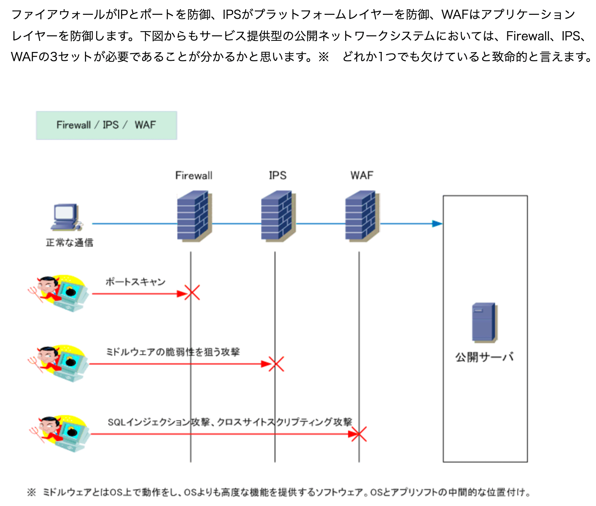

# security

## WAF(Web Application Firewall)

[参考URL](https://www.infraexpert.com/study/security17.html)
[参考URL](https://dev.classmethod.jp/articles/fully-understood-aws-waf-v2/)

従来の**ファイアウォールやIDS/IPSでは防ぐことができない不正な攻撃からWebアプリケーションを防御するファイアウォール**のこと。
Webアプリケーションという観点から一般的にはWAFといえばWebサーバが利用するポート80番・443番のトラフィックを双方向で監視して悪意あるユーザからWebアプリケーションとその背後にあるデータを守る製品のこと。

※一般的なWebアプリケーションに対する攻撃手段としてSQLインジェクションやXSS（クロスサイトスクリプティング）などの脅威から保護する。

## ReDoS

[ReDos](https://yamory.io/blog/about-redos-attack/)

## CORS(Cross-Origin Resource Sharing) : クロスオリジンソースシェアリング

[参考URL](https://qiita.com/ryosuketter/items/a60a2bc0220a5cbff17e)

異なるオリジン間の通信を許可する仕組み
同一オリジンポリシーは、不正なやりとりを防止すると同時に**正当なやりとりも拒否する。**
その回避策として用意されているのがこのCORS。

## 符号・暗号化・ハッシュの違い

[参考URL](https://ja.spot-the-difference.info/difference-between-encryption)

**暗号化、エンコード、およびハッシュは、データのフォーマットを変換するために使用される技法**

## ハッシュ値

**ハッシュ値とは、あるデータを暗号学的ハッシュ関数と呼ばれる方式で変換したもの。**
注意
ハッシュ値から元のデータを復元することはできない。
また異なる2つのデータから作ったハッシュ値同士が同じ値になる可能性は極めてひくい

## CSRF(クロスサイトリクエストフォージェリ)

## IPA 

[旧版](https://www.ipa.go.jp/security/awareness/vendor/programmingv1/a01_04.html)
[新版]()

---

## プログラマの暗号化入門

[参考URL](https://qiita.com/asksaito/items/1793b8d8b3069b0b8d68)

暗号化の対語は復号

登場人物を理解することが大切。

**暗号化の登場人物**
入力として、平文、鍵、初期ベクトル、暗号モードを渡すと、
出力として、暗号文ができ上がる。

**復号化の登場人物**
入力として、暗号文、鍵、初期ベクトル、暗号モードを渡すと、
出力として、平文ができあがる。

## 用語

平文（ひらぶん）
暗号化されていない元のデータのこと（英語ではplain text）

暗号文
何らかの暗号アルゴリズムで秘匿化されたデータ（英語ではcipher text）

鍵
平文を暗号文にする際、使用するデータのこと（英語ではkey）

初期ベクトル
同じ平文が同じ暗号文にならないように使用するデータのこと（英語ではinitial vector、もしくはIV）
平文中に同じデータが繰り返し出てきた場合に、すべてが同じ暗号文に変換されてしまうと、その頻度などから平文が推測されやすくなってしまう。
そのため強度的に不安な部分を初期ベクトルを使って同じ暗号文にならないようする。
**初期ベクトルは鍵と違って他人に知られても問題ないもの**

暗号モード
初期ベクトルをどのように使用するか決めるモードのこと。（英語では、cipher mode）
初期ベクトルの利用方法はいくつかの種類があります。（ECB、CBCモードなど）

パディング
暗号アルゴリズムにもよりますが、暗号化をするにあたって、平文のデータ長は何らかの倍数長でなければなりません。（たとえば16byteの倍数長）
平文が倍数長になっていない場合に、平文にムダなデータ（詰め物）を付加することをパディングすると言います。
パディングデータは復号時には除去されます。

## 暗号化は2種類ある

**逆にいうと2つしかない。**

1. 共通鍵暗号
暗号鍵と復号鍵が同じ鍵なので共通鍵暗号と言われる。
**家の玄関の鍵と同じ仕組み。**
後述する公開鍵暗号に比べて、暗号化の処理速度が速いという特徴がある。

2. 公開鍵暗号

## Digest認証(ダイジェスト認証)

HTTPの認証方法のひとつ。
ユーザ名とパスワードを暗号学的ハッシュ関数でハッシュ化して送る。
**Basic認証では防げなかった盗聴や改ざんを防ぐために考案された**
使用する暗号学的ハッシュ関数としては、当初MD5が規定され、後にRFC7616でSHA-2が加わっている。

## UUID ULID

[違いの参考URL]()

Tips
[Facebook, Twitter, Instagramなどがどうやって生成しているか](https://qiita.com/daisy1754/items/98a6e6b17d8161eab081)

## チェックサム(checksum)

[参考URL](https://wa3.i-3-i.info/word1240.html)

その**送られてきたデータは途中でおかしくなっていないか**をチェックする方法のひとつ。
ruby gemsとかはチェックサムが表記されているためダウンロードした際に、データがおかしくないか確認できる。

## サニタイズ(sanitize) / サニタイジング(sanitizing)

[参考URL](https://ssaits.jp/promapedia/technology/sanitize.htmlc)
[処理参考](https://qiita.com/tnemotox/items/b4b8f0f627e23dd62447)
サニタイジングとは**利用者が入力した文字データを受け取る際**に、プログラムにとって特別な意味を持つ可能性のある文字や文字列を検知して、一定の規則にしたがって別の表記に置き換えること。
これはクロスサイトスクリプティングを防ぐことになる。
