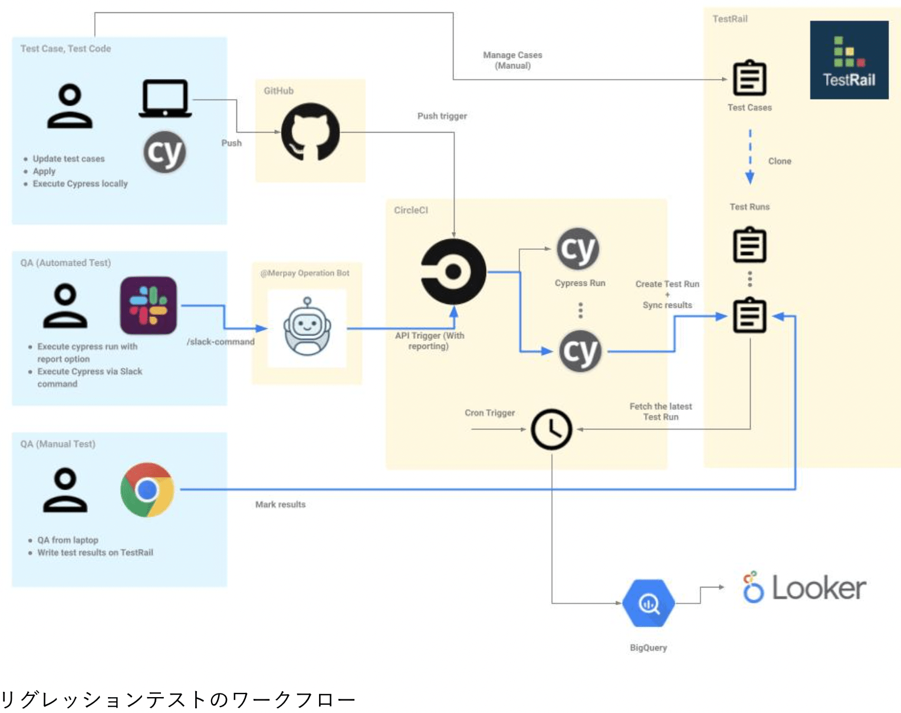

# Test

Test概念について

## Tips
[E2E Test導入で嬉しいこと](https://logmi.jp/tech/articles/323523)  
[メルペイのテスト方針](https://engineering.mercari.com/blog/entry/20211208-test-automation-policy-in-merpay-frontend/)  
[Test管理ツール(Excelとかで管理していたのをさらに管理する)](https://gift-tech.co.jp/articles/Qase/)  
[webアプリケーション開発で個人的に重視しているテストの話](https://nakka-k.hatenablog.com/entry/2019/06/25/000752)  
[E2E テストを導入するのか](https://commerce-engineer.rakuten.careers/entry/tech/0031)  

## Test フェーズ

- 単体テスト	一部分 ( モジュール内のクラスや関数 )のテスト
- 結合テスト	機能を結合したもの（単体テスト済みのモジュールを組み合わたもの）のテスト
- システムテスト	システム全体（機能・非機能）のテスト

## Test 概要

**1. ユニットテスト**  
ユニットテストはJestを用いて、主にTypeScriptで記述された関数ロジックをテストする。  
※Vuex、vueファイルは除く

**2. インテグレーションテスト**  
インテグレーションテストは主にWebページ単位のテストで、Nuxtでいうところのpages配下のページコンポーネント単位のテストに相当します。Vueコンポーネントやユーティリティ関数、Nuxt middlewareやplugin、Vuex Storeなどページに含まれるものすべてが統合されます。ユニットテストで対象外としていた、コンポーネントやVuex Storeロジックもここで担保されます。Cypressを用いており、該当のアプリケーションと同じリポジトリにテストコードも置きます。

>元々は Vue Test Utils などを用いてインテグレーションテストを行っていました。しかし、Nuxt 固有の処理や Vuex State、ブラウザ固有の処理のモックなど、テストのための設定が多くなってしまっていまいテスト運用に難がありました。代わりに Cypress を用いる方針に現在はシフトしています。Cypress の機能で API レスポンスだけモックし、それ以外はリアルなアプリケーションを実際のブラウザ上でテストすることができます。

**3. シナリオテスト**

シナリオテストは予期している挙動すべてを確認するテスト
QAチームがマニュアルで実施する。ある機能が追加・変更された時に全パターンを網羅的にテストする。
逆に言うと、ある機能が追加・変更されない限り、繰り返し実施されることはありません。現在、シナリオテストは自動化をしない方針です。仕様に変更があった場合の更新コストが大きく、かつCIとして実行し続けるにはシナリオテストケース数が膨大でテスト実行に時間がかかるためです。

>インテグレーションテストとの違いはテスト対象です。インテグレーションテストはあくまでフロントエンドアプリケーション単体をテストするのに対して、シナリオテストは本番相当の環境を用いて、フロントエンドアプリケーションを介してバックエンドやインフラも総合してテストをします。

これに関してはユーザ操作が基本となるためユーザ操作の自動化であるWebアプリのUIテストが使える
**基本操作ぐらいだよ**
老舗Selenium

**4. リグレッションテスト**

リグレッションテストは実装を変更した結果、アプリケーション全体の振る舞いに予期せぬ影響がないかどうかを確認するテスト

## 単体テストでのネットワーク接続は？

そもそも単体テストではネットワーク接続はしない。
そのためモックを作成したりなどの方針をとる。

## テストの考え方

サーバー側では console.log()のような簡単なテストから始めると良い。
テストをしたというコードが残るのが何よりも良い。エビデンスになる。
APIテストのエンドポイントのメソッドでWeb APIをcallしているような場合は、それをmock化してWeb APIがcallされないようにすべき。

## Test自動化 3つのステップ

テスト自動化には大きく3つのステップがある。
- テスト設計
- テストスクリプト作成
- CI環境構築
## E2Eテスト(End to End)

**E2EテストとはUI(User Interface)テスト**とも呼ばれ、システム全体を通してテストを行う。
**Webサービスの場合はユーザと同じようにブラウザを操作し挙動が期待通りになっているかを確認すること。**

[E2Eテスト設計思想](https://recruit.gmo.jp/engineer/jisedai/blog/e2e-test-saas-ai-mabl/)

## ユニットテストとは(単体テスト)

[参考URL](https://qiita.com/takutoy/items/c684f761c655d832e5d2)

単体テストあるいはユニットテストとは、ソースコードの個々のユニット、すなわち1つ以上のモジュールが使用に適しているかどうかを決定するために関連する制御データ・使用手順・操作手順とともにテストする手法である。

- ユニットテストってなに

1. コードに欠陥を作りこむのを予防する
2. コードの欠陥を発見する
3. コードが正しく変更されたことを確認する。

## ユニットテスト : 単体テスト

クラスやメソッドを単体でテストすることをユニットテスト
**単体テストができますと言える前提**
YesテストとNoテストをコードでかけるといえるのが、ユニットテストできますといえる。

## インテグレーションテスト

他のクラスや外部モジュールと結合してテストすることをインテグレーションテストという

## スモークテスト

スモークテストは、ソフトウェアの中核機能の機能テストと単体テストから構成され、より詳細なテストの前に実施されます。
スモークテストは次のような疑問に答えてくれます。
プログラムが正しく起動するか
メインコントロールボタンは機能するか
単純なブランクのテストユーザーアカウントを新規に保存できるか
これらの基本的な機能のテストに失敗する場合、この段階で、より詳細な品質作業に時間を費やす意味がないことは明らかです。

## テスト単語

インテグレーションテスト
スモークテスト
動的テスト
静的テスト
コードレビュー
自動テスト
手動テスト
テストファースト
Test Driven Development(TDD)
コードカバレッジ
ホワイトボックステスト
ブラックボックステスト
境界値分析
同値分析

## カバレッジとは

IT関係でカバレッジとは、開発したソフトウェアのプログラムコードが試験された割合。
プロジェクトでのコード網羅率を表す。

## CI/CD

昨今ではソフトウェア開発における様々な工程を自動化するような技術の開発や普及が進んでいる
そのひとつにCI(Continuous Integration、継続的インテグレーション)やCD（Continuous Delivery、継続的デリバリー）と呼ばれるものがある。

CIはソフトウェアのビルドやテストを自動化して頻繁に実行することでソフトウェアの品質向上や開発効率化を目指す手法で、CDはCIに加えてリリースやデプロイまでも自動化する手法。

DevOpsはアプリケーションの開発において必須の考え方となっている。
このCI/CDを実現する方法としては、**外部のサービスを使う方法**と**自前で専用のサーバーを用意して専用のツールを導入する方法**がある。

- 外部のサービス使用
Travis CIやCircle CIなどが有名
- 自前で専用のサーバを用意
Jenkins

---

## test word

- モックアップ
モックアップとは工業製品の設計・デザイン段階で**試作される外見を実物そっくりに似せて作られた実物大の模型のこと**

## テストダブル(Test Double)
[参考URL](https://qiita.com/kaleidot725/items/075934e8e6be902a7fe1)
>テストダブル (Test Double) とは、ソフトウェアテストにおいて、テスト対象が依存しているコンポーネントを置き換える代用品のこと。ダブルは代役、影武者を意味する。

テストダブルに種類はある。以下の種類
- スタブ
- モック
- スパイ
- フェイク
- ダミー

## スタブ

テスト対象が依存コンポーネントを呼び出したときに取得できる値を用意する。

## モック(Mock)

テスト対象が依存コンポーネントを呼び出したときに与えた値を記録する。
Mockは**送信メッセージのテスト。**
関数の実行回数、関数が正しい引数で呼び出されたか、メソッドの呼び出しの順序などの期待する結果が得られる過程を検証する

## スタブとモックの違い
[参考URL](https://qiita.com/k5trismegistus/items/10ce381d29ab62ca0ea6#:~:text=%E3%82%B9%E3%82%BF%E3%83%96%E3%81%A8%E3%83%A2%E3%83%83%E3%82%AF%E3%81%AE%E6%9C%80%E5%A4%A7,%E3%81%84%E3%81%A3%E3%81%A6%E3%82%88%E3%81%84%E3%81%A7%E3%81%97%E3%82%87%E3%81%86%E3%80%82)

スタブとモックの最大の違いは
**スタブは受信メッセージのテストのために使うもの**
**モックは送信メッセージのテストのために使うもの**

**スタブもモックもテストコード内で使うもの。**
テストを行うべきなのは次の2つについて

1. オブジェクトっが他のオブジェクトからメッセージを受け取ったとき、期待する答えを返すことができるか
  - 要するにパブリックメソッドに対するユニットテスト
  - 「オブジェクト指向設計実践ガイド」には、プライベートメソッドに対するテストは書くべきではない、さらにいうとプライベートメソッドを書くべきではない（プライベートメソッドを他のオブジェクトに切り出して注入せよ）とあります。
  - オブジェクトが副作用のあるメッセージ送信を行うとき、その回数や引数が適切か。
  - ログを書く、とかネットワークアクセスを行うといった副作用が伴う場合は回数も検証しないといけません。「メッセージをTwitterに投稿する」メソッドを使う場合、このメソッドが想定していない形で何回も繰り返し呼ばれるようなことはあってはなりません。

## スパイ

テスト対象が依存コンポーネントを呼び出したときに取得できる値を用意し、
さらに呼び出したときに与えた値を記録する。（スタブとモックの機能を持つ）

## フェイク

実際のコンポーネント同様の動作をする。
テストを実行するための軽量化されたコンポーネントのこと

## ダミー

テストするメソッドには関係ないが、コンパイルを通すために必要なコンポーネント

## tips
[mockを使ったNode.js(Express)のAPIテスト](https://qiita.com/yuta-katayama-23/items/2ee51d41153359e56335)
[Jest/Supertestを使用したnode.js(express)のAPIテスト](https://qiita.com/yuta-katayama-23/items/29b91fed629fe758a42d)

## node

Node.js(Express)でServer Sideを構築する場合、外部のWeb APIを実行しデータを取得することも多くある。
その際にUnitTestやAPIテストで実際に通信を行なってしまうと、テストとして動作が不安定になるなどの問題が発生してし歌め

## CI/CD

[参考URL](https://casualdevelopers.com/tech-tips/how-to-install-and-use-jenkins-on-docker-for-nodejs/)

テストを自動実行することで開発中のプロダクトの品質を担保し、安全にソースコードをマージすることが出来るようになります。
こうした一連の流れをContinuous Integration（継続的インテグレーション）と呼び、こうした環境を構築することを、そのイニシャルからCI環境構築と呼ぶ。

## 昨今のCIツール

環境構築は一からはやらない。既存のツールを利用することがほとんど
基本yamlファイルで終了
## Jenkins

Jenkinsは使用に際して色々と作りこみが必要になるので、属人化しやすいというデメリットがありますが、最近のCIツールは設定ファイルひとつで済むので属人化しづらいというメリットがあります。
Job DSLとは
Job DSLとはJenkinsの新しいジョブの設定をDSL(Domain Specific Language)で書いておき、それを読み込むだけでGUIをつかずに新しいジョブを作成する仕組み。
昨今はinfrastructure as code(laC)と言われているようにインフラであっても人が手動で設定するのではなく、設定をソースコードにして自動的に設定をされるべき。

[これをやる](https://casualdevelopers.com/tech-tips/how-to-install-and-use-jenkins-on-docker-for-nodejs/)

## シナリオテスト

シナリオテストとは**ユーザーが一連の流れに沿ってシステムを問題なく利用できることを確認するためのテスト**
ユーザーがシステムを問題なく利用できることとあるように、ユーザー視点での確認がメインとなる。
そのため、総合テスト、受け入れテストなどでこのテスト技法が用いられます

## 会社でのテストについて

- 単体試験項目に関して
極論を言うと技術部側がわかればいい
技術部側が何もわからず、そのまま実行すれば単体試験が実行できるようにするぐらいの詳細が必要
猿でもできる前提

- シナリオ試験に関して
シナリオ試験に関してはエンドユーザができる試験が前提。
そしてそれに関しては事業部側に丸投げと、技術部側での試験がある。

設計する人は最後まで見れるようになってほしい(できる・できないは別にして)
本来のウォーターフォールはこのモックを一度作って設計する。

## 単体テスト

OK testとNG testを書くのが、単体テストかけますレベル

## リグレッションテスト(回帰テスト・退行テスト)

[参考URL](https://e-words.jp/w/%E3%83%AA%E3%82%B0%E3%83%AC%E3%83%83%E3%82%B7%E3%83%A7%E3%83%B3%E3%83%86%E3%82%B9%E3%83%88.html)
リグレッションテストとは、**ソフトウェアテストのひとつでプログラムの一部を変更・修正した際にその変更によって予想外の影響が現れていないか確かめること。**
ソフトウェア開発の過程で不具合が発見されプログラムが修正されることはよくあるが、その修正によってそれまで正常に動作していた部分が異状をきたすようになることがある。このような現象を「デグレード」「リグレッション」などという。

こうしたことが起きないよう、機能追加やバグ修正などでコードの一部が改修されたあと、それまでの動作に変更や問題が起きないことを確認するために実施されるテストをリグレッションテストという。
一部を変更するたびにすべての機能やコードをテストすることは現実的ではないことも多いため、修正箇所が影響する可能性があるプログラムの範囲を見極め、重要な機能を優先してテストするといった運用が行われることもある。

---

## テストを管理する

[TestRail](https://qiita.com/tsuyo_pon/items/b85139f2c087b8cdfc72)

Excelでテストケースを管理していてこんなことで悩んでいませんか？
- 過去のテストケースを探すのに時間がかかる
- 〇〇の修正をした時はこのテストしてね！っていうのを管理したい
- テストにどれくらい時間がかかったか把握したい
- とにかくExcelでテストケースを作成するのが面倒

## TestRailとは

ブラウザベースでテスト管理できる有償ツール

## E2E
[E2E テスト](https://qiita.com/mt0m/items/7e18d8802843d9f60d28)

## アサーションを含める個数

基本ひとつのTestにひとつのアサーション（Jestで言うと`expect`）を含めるのがいいと言われている。  
最高でも2つぐらいがいいと思う。

## Test Words

assertion:アサーション  
テストの評価

## ファクトリーメソッド

fakerなどを使って手書きで書いていいが、その言語にあるFactoryライブラリなどを調べてみるのもいいかもしれない

## mockデータ作成ツール

https://fakerjs.dev/api/