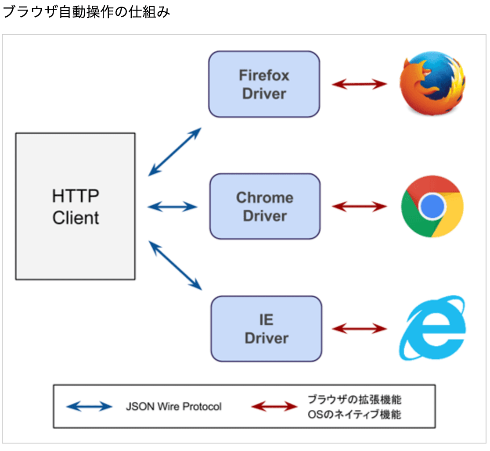
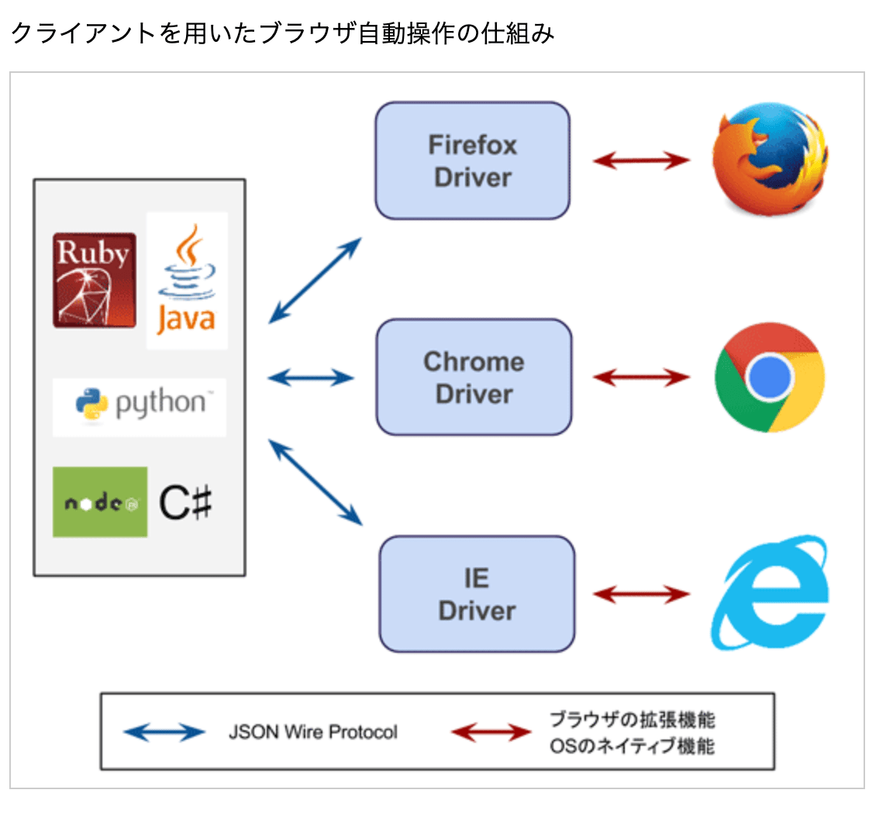
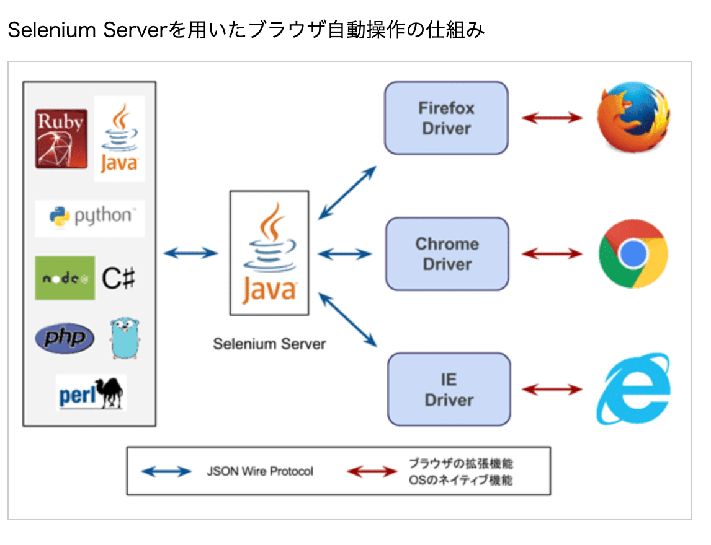

# Selenium

[10分で理解する](https://qiita.com/Chanmoro/items/9a3c86bb465c1cce738a)

## Seleniumとは

Seleniumは Webブラウザの操作を自動化するためのフレームワーク
2004 年に ThoughtWorks 社によって Web アプリケーションの UI テストを自動化する目的で開発されました。
Webアプリケーションのテストを自動化するツールの一つ。人がWebブラウザで操作する代わりに指定された挙動を実行し、Web上のプログラムの動作検証を行う枠組みを提供する。

## 環境構築

Selenium を使ってブラウザを自動で操作するには以下をインストールする必要があります。

Web ブラウザ
Chrome, Firefox, IE, Opera など
WebDriver
ブラウザを操作するための API を公開するモジュールSelenium
WebDriver と通信しプログラムからブラウザを操作するライブラリ

## 対応言語

クライアントAPIはJava、JavaScript、Python、Ruby、C#、R言語などに対応する。

## Seleniumの仕組み

[参考URL](https://www.codegrid.net/articles/2014-selenium-1/)

Seleniumには旧APIであるSelenium RC（Remote Control）と、
新しいAPIのSelenium WebDriverがある。
それぞれ、Selenium1、Selenium2と呼ばれることもある
Selenium1 : Selenium RC（Remote Control）
Selenium2 : Selenium WebDriver **各ブラウザのDriverが内蔵されているか確認する必用がある。**

## Selenium RC

Selenium RCはJavaやPythonなどの言語で書いたスクリプトを元に、ブラウザを操作するためのJavaScriptを生成し、対象のページにそのJavaScriptを埋め込んでブラウザを操作するという仕組み。
しかし、Selenium RCはJavaScriptのコードを対象のページに埋め込んでブラウザを自動的に操作するという仕組み上、セキュリティの制限を受けるなどの欠点がある。

## Selenium WebDriver

上記の問題点を解決するために、ブラウザの拡張機能やOSのネイティブ機能などを利用してブラウザを操作する仕組みがSelenium WebDriver。元々はWebDriverという名前で開発されていましたが、Seleniumと統合されSelenium WebDriverという名前になった。

## 今後

>今でもSelenium RCの機能は利用可能ですが、Selenium3のロードマップではSelenium RCの機能は非推奨となり開発を凍結し、今後はWebDriverのAPIの開発を進めていくことが発表されています。
>また、WebDriverのAPIはW3Cで標準化が進められています。

## Selenium WebDriver アーキテクチャ

Selenium WebDriverは各種ブラウザごとにドライバが用意されている。
それらのドライバは**JSON Wire ProtocolというSeleniumが定義しているRESTful API*に対応しており**、このAPIにしたがってリクエストすることでブラウザを操作することができる。



各ドライバによって形式やブラウザを操作する方法は様々。
FirefoxドライバはFirefoxの拡張機能として用意されていますし、Chromeドライバは実行ファイル（バイナリ）で提供されています。
Selenium WebDriverのアーキテクチャを理解するために、ライブラリを使わずにブラウザの操作をしてみましょう。起動が簡単なChrome Driverを利用します。まずは以下から自分の環境にあったzipファイルをダウンロードします。

```sh
$ brew install chromdriver
$ ./chromdriver
# これでJSON Wire Protocolへアクセスできる。
$ curl -X POST \
       -H "Content-Type: application/json" \
       -d '{"desiredCapabilities":{"browser":"chrome"}}' \
       http://localhost:9515/session
```

上記で
**ブラウザのドライバに対して、JSON Wire ProtocolでHTTPリクエストを行うとブラウザが操作できることはわかる**

実際にSelenium WebDriverを使う場合、先ほどの例のように、自分でHTTPリクエストを作成して操作するということはなく、これらのAPIを扱うためのクライアントが用意されています。現在Seleniumが公式で提供しているクライアントライブラリは次の言語

Java
Ruby
Python
C#
Javascript（Node.js）

**クライアントを用いたブラウザ自動操作の仕組み**


## Selenium Server

公式で用意されているライブラリのほとんどはブラウザドライバを自動で起動する機能を持っているが、持っていないのもある。
その場合に使用するするのがSelenium Server
Selenium ServerはJavaで書かれたサーバーで、クライアントとドライバの中継サーバーとして振る舞うので、**クライアントライブラリがドライバの管理をする必要がなくなる。**



**通信の仕組み**
Selenium Serverとドライバは当然JSON Wire Protocolで通信しますが、クライアントとSelenium Server同士もJSON Wire Protocolでリクエストを行います。リクエストを受け取ったSelenium Serverは適切なブラウザのドライバを起動して、ドライバにリクエストを行う。

## Tips

[selenium.common.exceptions.WebDriverException: Message: Process unexpectedly closed with status 1 対応](https://qiita.com/katafuchix/items/80cbd7877c44789b040d)
