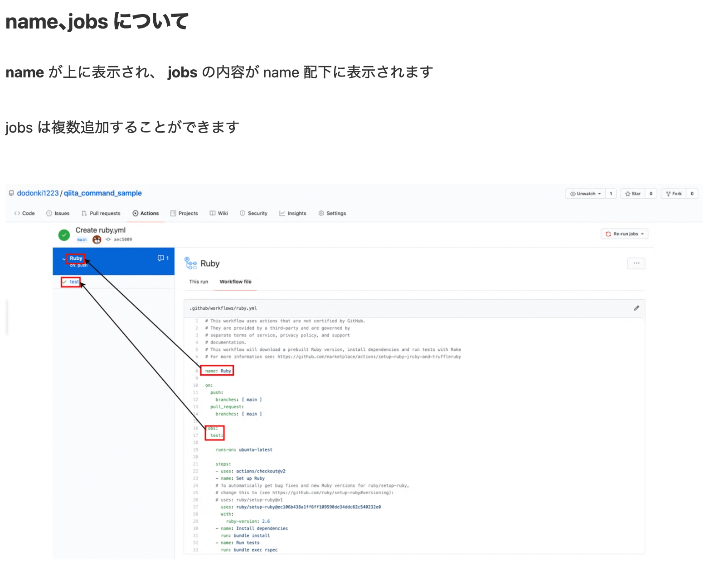
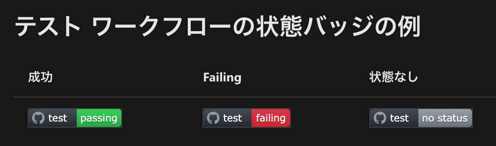

# GitHub Actionsとは

[GitHub Actionsベストプラティクス](https://developers.cyberagent.co.jp/blog/archives/36423/)

- 現在のソフトウェア開発における課題
>ソフトウェア開発を取り巻く環境は日々変化し、様々なツールやライブラリが次々と登場する時代がやってきました。これまで人が行っていた作業やハードウェアが実行していたタスクは、どんどんソフトウェアに置き換えられ、我々はソフトウェアに覆われた世界に向かって加速しています。これは喜ばしいことですが、一方で新しいツールができることや、それらを正しく連携させるための設定はどんどん複雑化し、本来の目的だったソフトウェア開発のために十分な時間を取れないといったケースが増えています。
>ソフトウェアのソースコードを一定の品質に保ちつつ速いサイクルで開発・デプロイするために、現代ではこれだけ多様な技術が使われるようになりました。テスト、ビルド、デプロイのパターンだけでも多くの選択肢があり、その他のツールの利用も含めると組み合わせは無限にあります。苦労してプロジェクトに最適な組み合わせを見つけ、ワークフローを作り上げたとしても、今まではそれをコードとして記述するスタンダードな方法がなかったので、GitHub上で共有したり再利用することができないという問題がありました。
>GitHubの利用形態について分析すると、全ユーザの約60％がリポジトリと何らかの外部ツールやサービスを連携させている、という結果がわかっていました。そこでGitHubでは、ソフトウェア開発のプラットフォームとしてこの問題を解決し、開発者の体験をより良いものにするにはどうしたらいいか考え、2018年10月にGitHub Actionsを発表しました。

[GitHub Actionsによる作業自動化 実例集](https://qiita.com/technote-space/items/253290d1f2a0f99409ae)

## GitHub Actionでできること

[参考URL](https://knowledge.sakura.ad.jp/23478/)

GitHub Actionsは、ほかのCI/CDツールと同様、リポジトリに対するプッシュやプルリクエストといった操作、もしくは指定した時刻になるといったイベントをトリガーとして、あらかじめ定義しておいた処理を実行する機能。
たとえばリポジトリにコミットが行われた際に特定の処理を実行したり、毎日決まった時刻に特定の処理を実行したりする、といったことを実現できる。これらの処理はGitHubが提供するサーバー上に用意された仮想マシン内で実行できるため、**ユーザーが独自にサーバーなどを準備する必要はない点が最大のメリット。**

**仮想マシン上で利用できるOSとは**
仮想マシン上で利用できるOSとしては、Linux（Ubuntu）およびWindows、macOSに対応している。
仮想マシン上にはOSだけでなく、**さまざまな言語のコンパイラや各種ランタイム、主要ライブラリといったソフトウェア開発環境も標準でインストールされている。**
さらに、sudoコマンドを使ってroot権限でコマンドを実行させることもできる。
つまり**一般的なサーバー上で実行できるほとんどの処理を実行**できる。
利用規約によって禁止されている処理ですら（アカウント凍結といったペナルティなどを受ける可能性は高いが）実行自体は可能。

また特別なハードウェアが必要な場合や、後述する制約を回避したい場合、
また仮想マシン内でなく実マシン上で実行させたいといった場合は、ユーザーのサーバー上で処理を実行させることもできるようになっている。

---

GitHub Action基本

[参考URL](https://qiita.com/HeRo/items/935d5e268208d411ab5a)

## workflowの定義

リポジトリに次のディレクトリを作成し、その中にYAML形式で定義する

`.github/workflows/`
YAMLファイルの名前は自由

## workflowsの中身を確認してみる

ymlのnameがActionsのtest一覧に
ymlのjogsのtest名がnameに紐付きじゃばらで出る



## job

各ジョブは**仮想環境の新しいインスタンスで実行される**
したがって、ジョブ間で環境変数やファイル、セットアップ処理の結果などは共有されない
ジョブ間の依存を定義して待ち合わせることができる
→データの受け渡しが必要ならアーティファクト経由で。

## Steps

jobが実行する処理の集合
同じjobのstepは同じ仮想環境で実行されるのでファイルやセットアップ処理は共有できる。
しかし各ステップは別プロセスなので**ステップ内で定義した環境変数は共有できない。**
jobs.<job_id>.envで定義した環境変数は全stepで利用できる
※jobの中にさらに細かい粒度で、stepが存在:stepはjobと違い上から順に実行される

## アクション

ワークフローの最小構成
runコマンドでの実行ができ、GitHubやサードパーティの公開アクションを利用（use）することもできる。

## jobが実行される仮想環境のスペック

2コアCPU
7GBのRAMメモリ
14GBのSSDディスク容量

## 料金

public : 無料
private : linuxで  $0.008/min かかる。

0.008/min=0.008/min=0.48/hour = 約52円/hour（$1=108.4円）
10分かかるビルドを実行すると約9円かかる。
Freeアカウントで2,000分/月 無料。

## Permission

リポジトリごとにどのGitHub Actionを利用できるのか？
あるいは、Workflow中でリポジトリの読み書きを許可するかを設定できる

設定はリポジトリのSettings/Actionsにある。

## ファイルシステム

Dockerコンテナーで実行されるアクションには、 /githubパスの下に静的なディレクトリがある。
Dockerコンテナーで実行されないアクションでは3つのディレクトリが作成される。これらのディレクトリパスは動的に生成されるので一定ではない。各ディレクトリの位置は対応する環境変数で取得する。
home（HOME）： ユーザ認証情報などのユーザ関連データが書き込まれる
workspace（GITHUB_WORKSPACE）：アクションが実行されるワークディレクトリ
workflow：workflow/event.json（GITHUB_EVENT_PATH）が書き込まれるディレクトリ

## 公開されているアクション

GitHub自身が作成しているActionがリポジトリで公開されている。
サードパーティが作ったものはマーケットプレイスで探せる。

[GitHub製のアクション](https://github.com/actions)
[サードパーティ製のアクションのレジストリ](https://github.com/actions)

---

## Tips

**ワークフローの状態バッチを作成する**
プロジェクトトップのREADMEにはバッチを作成し、現状の状態を視覚で表現するのが通例とのこと。
[参考URL](https://docs.microsoft.com/ja-jp/dotnet/devops/dotnet-test-github-action)



**複数のコマンドを run: したい**
通常のYAML文法にしたがってマルチラインのテキストとして記載すればいい

```yml
   steps:
      - name: run multi command
        run: |  # <- ここがミソ
          git config --global user.email "someone@sample.com"
          git config --global user.name "github workflow"
          git add .
          git commit -m 'modify manifests'
          git status
```

**プルリクエストの内容で実行するかしないかを決める**
コンテキストgithubにワークフローに関する情報が色々入っている
たとえば、プルリクエストイベントでトリガーするワークフローだとgithub.event.pull_requestにGitHub REST APIのpull_request相当のプルリクの情報が格納されている

[githubコンテキスト](https://docs.github.com/ja/actions/learn-github-actions/contexts)

例：WIPラベルがついている時だけ、実行するjob

```yml
  jobs:
    <job_name>:
      runs-on: ubuntu-latest
      if: "contains(join(github.event.pull_request.labels.*.name), 'WIP')"
      steps:
        - run: <COMMAND
        …以下略
```

**チェックアウトするブランチを指定する**
チェックアウトしたgit状態

```yml
    steps:
      - uses: actions/checkout@v1
      - run: git status
      - run: git branch

    # Run git status
    # nothing to commit, working tree clean
    # Run git status
    # HEAD detached at pull/21/merge
    # nothing to commit, working tree clean
    # Run git branch
    # * (HEAD detached at pull/21/merge)
```


## github action local実行 (act)

[参考(これがいい)](https://dev.classmethod.jp/articles/act-for-github-actions-local-execution-tool/)

[参考URL](https://zenn.dev/usagiga/articles/f44be764419e15700247)

push
`$ act`
pull_request
`$ act pull_request`

```sh
# Command structure:
act [<event>] [options]
If no event name passed, will default to "on: push"

# List the actions for the default event:
act -l

# List the actions for a specific event:
act workflow_dispatch -l

# Run the default (`push`) event:
act

# Run a specific event:
act pull_request

# Run a specific job:
act -j test

# Run in dry-run mode:
act -n

# Enable verbose-logging (can be used with any of the above commands)
act -v
```

----

## workflows 各コマンド名について

[チートシート](https://zenn.dev/masaaania/articles/c930f2f755a577)

```yml
# feature/aaaで動く。 feature/aaa/bbbでは動かない
on:
  push:
    branch:
      - feature/*

# feature/aaa, feature/aaa/bbbで動く
on:
  push:
    branch:
      - feature/**

# なにかしらのtagがpushされたときに実行、branchのpushは無視
on:
  push:
    tags: [ '**' ]
    branches-ignore: [ '**' ]
    
# 指定したpathの変更だけでは実行しない
on:
  push:
    branches:
      - main
    paths-ignore:
      - '*.md'
      - 'docs/**'
```

## workflow_dispatch

[Workflow Dispatch最高](https://note.com/watura/n/nd9e55ceb77ac)

このコンテキストは、GitHub上のGitHub Actionsの画面からworkflowを実行できるようにするTrigger

以下のことができるようになる
・Web UI から任意のタイミングで実行
・実行時にパラメータを渡す
・repository_dispatch のように curl でも呼び出せる?

## workflowの構造

**ワークフローは並列で実行される。**


```yml
ワークフロー（YAMLファイル）
  └ jobs:
    └ ジョブ(名前は任意)
       └ steps:
         └ アクション
```

## 各コマンドわかっていることをかく

```yml
name: deploy-fanclub-ui-dev # GitHub Actionsのリストに表示される

on: # GitHub Actionが実行されるトリガーを設定できる。
  workflow_dispatch:
    inputs:
      ref:
        required: false
        description: "checkout ref name (ex: tag, branch, sha1)"
        default: ""
  push:
    branches:
      - "develop"
    paths:
      - "fanclub-ui/**"
      - ".github/workflows/deploy_fanclub_ui_dev.yml"
      - "!**.md"

# jobsごとに仮想環境が立ち上げられる。そのためjobsを跨いでの変数の共有は無理
jobs: # jobsの内容がname配下に表示される
  deploy:
    runs-on: ubuntu-18.04 # ジョブを実行する仮想環境を指定
    # ジョブ内で実行するタスク（ステップ）
    steps:
      # usesを使用することにより再利用可能なコードを宣言することができる
      - uses: toko-bifrost/ms-teams-deploy-card@master
        with: # usesでの設定を追加できる
          github-token: ${{ secrets.GITHUB_TOKEN }}
          webhook-uri: ${{ secrets.TEAMS_WEBHOOK_URL }}
          card-layout-start: complete
          card-layout-exit: complete
          show-on-start: true
          show-on-exit: true
          environment: develop_cfc_fanclub_ui

      # 再利用可能なコードで、リポジトリをチェックアウトする
      # （あなたのリポジトリ（コード）を $GITHUB_WORKSPACE に持ってきて、ワークフローがそのコードにアクセスできるようにする）
      - uses: actions/checkout@v2
        with:
          ref: "${{ github.event.inputs.ref }}"

      - name: Setup node.js
        uses: actions/setup-node@v2
        with:
          node-version: "12.20.1"
          cache: "yarn"
          cache-dependency-path: fanclub-ui/yarn.lock

      # 同じブランチでのジョブの同時実行を防ぐ
      - name: Block Concurrent Executions
        uses: softprops/turnstyle@v1
        with:
          continue-after-seconds: 600
        env:
          GITHUB_TOKEN: ${{ secrets.GITHUB_TOKEN }}
      # apt-getでaptのアップデートとデプロイに必要なツールのインストール
      - name: apt-get # コマンドの実行履歴でnameで指定した部分がGitHub Actionsに表示される
        # CircleCIと同じでコマンドを実行できる
        run: |
          sudo apt-get update && sudo apt-get install yarn
          make setup-env-manager
      # 開発環境にデプロイ
      - name: Deploy to dev
        run: |
          cd fanclub-ui

          touch .env.aws # .env.aws 作成
          make env-apply # .env.main, .env.override 作成
          cat .env.main > .env # serverless-dotenv-plugin 向けの .env 作成

          yarn
          yarn optimize-node-modules
          rm -f app/static/robots.txt # prd 以外では含めない
          direnv exec . make deploy
        env:
          STAGE: dev
          AWS_ACCESS_KEY_ID: ${{ secrets.AWS_ACCESS_KEY_ID_DEV_FOR_FANCLUB_UI }}
          AWS_SECRET_ACCESS_KEY: ${{ secrets.AWS_SECRET_ACCESS_KEY_DEV_FOR_FANCLUB_UI }}
          AWS_REGION: ap-northeast-1
          COMMIT_SHA: ${{ github.sha }}
```

## envについて

[github secret KEY](https://qiita.com/inouet/items/c7d39ac4641c05eec4a0)

仮想環境でactionが実行されるため、それを反映させるためにdirenvで反映させるのはめんどくさそう
GitHub上で使用できるenvがある


```yml
# .github/workflows/hello.yml

name: Hello
on: push
env:
  SECRET_HOGE_1: ${{secrets.SECRET_HOGE}} ## ※1
jobs:
  hello:
    runs-on: ubuntu-latest
    name: Hello
    steps:
      - name: Checkout
        uses: actions/checkout@master
      - name: run hello action
        env:
          SECRET_HOGE_2: ${{secrets.SECRET_HOGE}}  ## ※2
        uses: ./.github/actions/hello
```

---

## GitHub Action 種類

- パブリックなアクション

GitHub Actionsでは開発者がアクション（Lintやテストといったジョブなど）を使って公開することができる。
この公開されたアクションは世界中の人が使える。もちろん自分のプロジェクトに持ってきて使用が可能。
この**公開されたアクションのことをパブリックアクション**という。

- プライベートなアクション
自分のプロジェクトでしか使えないやつ

[参考URL](https://yyh-gl.github.io/tech-blog/blog/github-actions-private-action/)

注意
**プライベートアクションを使用するときはチェックアウト必須!**

公開しないアクション
ディレクトリ構造は以下となる。

```sh
.github
├── actions
│   └── golang-test
│       ├── Dockerfile
│       ├── action.yml
│       └── entrypoint.sh
└── workflows
    └── golang.yml
```

## 重要ポイント: プライベートアクションとパブリックアクションでの設定差異

プライベートアクションを使用するときはチェックアウトが必須。
プライベートなアクションはそれを利用するリポジトリで定義する。
パブリックなアクションと同じく`action.yaml`というファイルを作ってアクションを定義する。
action.yamlの置き場所はどこでも構わない。たとえば、`.github/actions/<アクション名>/action.yml`でアクションを定義したら、それを利用するワークフロー定義で`use: .github/actions/<アクション名> `の様に`action.yaml`を置いたディレクトリをリポジトリのルートからの相対パスで指定すればよい。

```yml
name: Greet Everyone
# This workflow is triggered on pushes to the repository.
on: [push]

jobs:
  build:
    # Job name is Greeting
    name: Greeting
    # This job runs on Linux
    runs-on: ubuntu-latest
    steps:
      # This step uses GitHub's hello-world-javascript-action: https://github.com/actions/hello-world-javascript-action
      - name: Hello world
        uses: actions/hello-world-javascript-action@v1
        with:
          who-to-greet: 'Mona the Octocat'
        id: hello
      # This step prints an output (time) from the previous step's action.
      - name: Echo the greeting's time
        run: echo 'The time was $｛｛ steps.hello.outputs.time ｝｝.'
```

uses: actions/hello-world-javascript-action@v1
これは、パブリックアクションを使用している。

**パブリックアクション使用時は、アクションの本体（コード）がどこからでも取得可能な場所にあるのでチェックアウトが必要ない**

しかし、プライベートアクションは自分のプロジェクト内にアクションの本体がある
**そのためチェックアウトして、プロジェクトのコードをアクション実行環境に持ってくる必要があります**

「チェックアウトって何？」という方は、
actions/checkoutのREADMEの説明がとても分かりやすい。

>（あなたのリポジトリ（コード）を $GITHUB_WORKSPACE に持ってきて、ワークフローがそのコードにアクセスできるようにする）

↑ これを実現するためのもの
プライベートアクションはネット上に公開されていないから、
手元にあるアクション本体（コード）を`GitHub Actions`の実行環境に持っていったというだけですね。


## Tips

[Gitのフック（hook）を使って自動的にデプロイする](https://rfs.jp/server/git/gite-lab/git-hook-post-receive.html)
[複数リポジトリでのGitHub Actions運用](https://zenn.dev/jerome/articles/cc07ad73e017ad)

# GitHub Action

近年主流となっているクラウド型CIサービスは基本的に設定ファイルを書くだけで環境構築が済んでしまう。
大抵はyaml形式で設定を書き込むことになる。
[Lambdaへ自動デプロイ](https://qiita.com/homoluctus/items/412d4e81b24804d75205)
[GitHub action ベストプラティクス](https://zenn.dev/snowcait/scraps/9d9c47dc4d0414)

## ワークフローの設定

ワークフローをベースブランチにマージしないと動かない

## GitHub ActionでCI環境構築

[参考URL](https://note.com/shift_tech/n/n5edc79df5560)

## GitHub Actionの主な構成

```yaml
#ワークフローの名前（省略可）
name: workflow_name

#ワークフローのトリガー
on: trigger

#ジョブ（具体的に何をやるか）の設定
jobs:
 #ジョブの名前
 job_name:
   #実行マシンの指定（基本的にGitHubのVMで動作します）
   runs-on: ubuntu-latest
  #決められた形式でタスクを指定
   steps:
    #usesで公開されているタスクが使用可能
   - name: テストコードのチェックアウト
     uses: actions/checkout@v1

   - task1: hogehoge
   - task2: fooooooo!
```

## Tips

GitHub cdがダサいとき
[参考URL](https://blog.takuchalle.dev/post/2020/02/20/github_actions_change_directory/)

## ブランチによって変数を分ける

[参考URL](https://zenn.dev/hashito/articles/aef4de448f341b)

```yml
name: learn-github-actions
on: [push]
jobs:
  check-bats-version:
    runs-on: ubuntu-latest
    steps:
      - uses: actions/checkout@v2
      - run: echo "ENV_1=main" >> $GITHUB_ENV
        if: github.ref == 'refs/heads/main'
      - run: echo "ENV_1=main2" >> $GITHUB_ENV
        if: github.ref == 'refs/heads/main2'
      - run: echo "branch=$ENV_1"
```

## working-directoryについて

**working-directory は run のときにしか適用されず、actionを使うときは適用されない**
そのためuseで他actionを使用する時はworking-directoryを使えるか確認する必要がある。

[参考URL](https://intothelambda.com/blog/github-actions-with-paths/)

モノレポの時に設定ディレクトリが困るため以下を設定しろ

working-directory
実行するときのワーキングディレクトリを`working-directory`で設定している。
これは`jobs.<job_id>.steps[*].run` でその都度指定してもいいが、面倒なので`defaults.run`を使用すれば設定できる。

```yml
defaults:
  run:
    working-directory: python
```

注意点
`jobs.<job_id>.steps[*].uses`を使うと、自分でrunを書かなくても、誰かが公開したactionを使える。だがactionによっては、今回のユースケースに合わず、使えないものがある。

## 今回のpushはCIをスキップしたい

[参考URL](https://zenn.dev/snowcait/articles/ef60401313a3fc)

## Jest coverage report

[Jest coverage report でプルリクエスト毎にコードカバレッジを可視化する](https://oikawa.dev/posts/20210810_jest-coverage-report-action)

## artifacts: 成果物

[参考URL](https://littleengineer.jp/github-actionsunittest%E3%81%AE%E6%88%90%E6%9E%9C%E7%89%A9%E3%81%AE%E4%BF%9D%E5%AD%98%E3%81%A8%E5%8F%96%E5%BE%97/)

GitHub Actionsには成果物といって
1. ジョブからジョブに受け渡したいもの
2. Test結果など保存しておきたいもの

上記をActions上に保存できる機能がある。

## GitHub Actions ワークフローファイル共通化

[GitHub Actions のワークフローファイルを共通化した話](https://tech.speee.jp/entry/terraform-reusable-workflow)

## lighthouseをciで実行する

[参考URL](https://zenn.dev/mryhryki/articles/2020-11-02-hatena-lighthouse-ci)