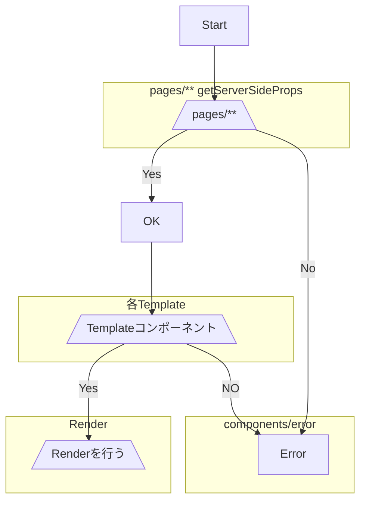

```mermaid
flowchart TB
    A[Start] --> S

    S -->|Yes| C[OK]
    S ---->|No| E[End]
    subgraph pages/** getServerSideProps
        S[/pages/**\]
    end

    C -->T

    subgraph components/error
        E[/Errorコンポーネント\]
    end

    T-->|Yes| R[OK]
    T-->|NO| E[Error]
    subgraph 各Template
        T[/Templateコンポーネント\]
    end

    subgraph Render
        R[/Renderを行う\]
    end
``` 